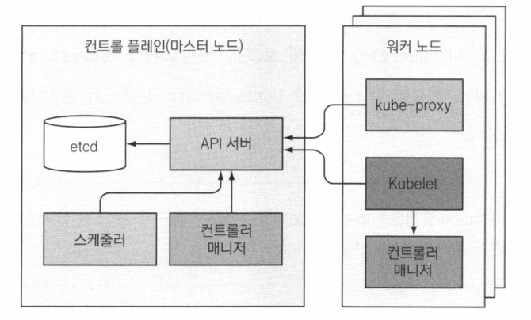
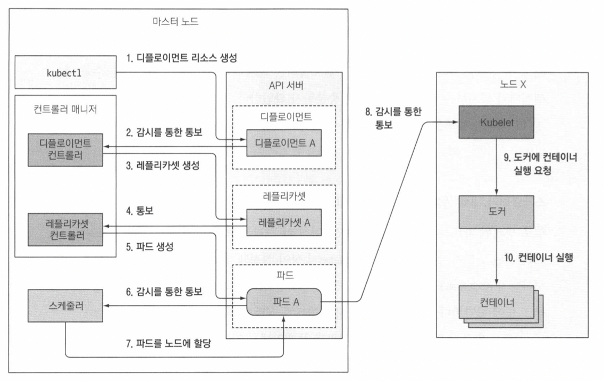
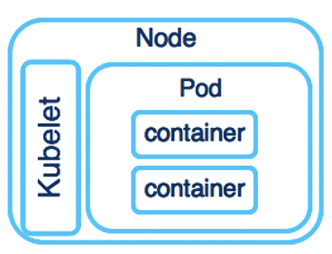

## Kubernetes

```
@author: suktae.choi
- https://kubernetes.io/ko/docs/concepts/
- https://github.com/grepsean/k8skr-study-architecture
- https://github.com/sungsu9022/study-kubernetes-in-action/issues
```

#### Index
- [Networking](networking)
- [Namespace](namespace)
- [Label & Annotation](label-annotation)
- [Policies](policies)
- [HPA](hpa)
- [Helm Charts](helm-charts)
- [Controllers](controllers)
- [Service](service)
- [ConfigMap & Secrets](configmap-secrets)
- [API](api)
- [StatefulSets](statefulsets)
- [Resources](resources)

#### Blog
- [Pod Lifecycle](https://kubernetes.io/ko/docs/concepts/workloads/pods/pod-lifecycle/)

***

**Kubernetes 는 `최대한 바라는 상태` (== spec) 로 컨테이너화된 `앱` (== object) 의 `실제 상태` (== status) 를 조율하는 플랫폼이다.**

### 구성요소


**Node**

컨테이너화된 어플리케이션을 실행하는 단위 (VM and/or PM).

> 어플리케이션의 구성요소인 Pod 을 호스팅한다.



**Master**

클러스터의 상태를 관리하는 단위

- **kube-apiserver**
  - kube api 제공 (ex. kubectl(CLI)/API 통신 & 변경통보)
- kube-controller-manager
  - kube-apiserver 를 통해 클러스터 상태를 감시하고, `최대한 바라는 상태` 로 만드는 event-loop
- kube-scheduler
  - 노드에 pod 을 배치하는 역할 (ex. 신규생성 or 재생성된 Pod 등)
- etcd
  - distributed key-value storage
  - kube-api 는 etcd 의 변경을 감지하여, controller 에게 통보한다

**Worker**

kube-api 에서 CMD 를 전달받아, container 를 실행하는 단위

- **kubelet**
  - kube-api 와 통신
- kube-proxy
  - kube service 의 구현체 이다. (== network-proxy)
  - iptables, port-forwarding 등
- containerd
  - 실제 docker image 를 runtime 실행 

### Objects

영속성을 가지는 객체 (== Persistent Entity). 클러스터의 상태를 표현한다.

즉 하나의 의미가 있는 단위이고 (== 의도), 클러스터는 오브젝트의 `현재 상태`를 체크하여 `최대한 의도한 상태`로 조율한다.

- spec: 의도한 상태
- status: 현재 상태



**Container**

docker image 로 동작하는 실행단위

**Pod**

kube 애플리케이션의 기본 실행 단위. `일반적 시스템에서 1대의 서버단위`로 보면된다.

동일한 pod 내의 container 는 network/disk 을 공유한다.

> Node 는 물리적인 구분이고, 논리적인 구분단위는 Pod 이다.

```java
public class Pod {
  @OneToMany
  private Collection<Container> containers;	
}
```
