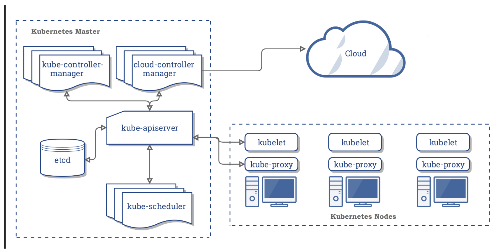
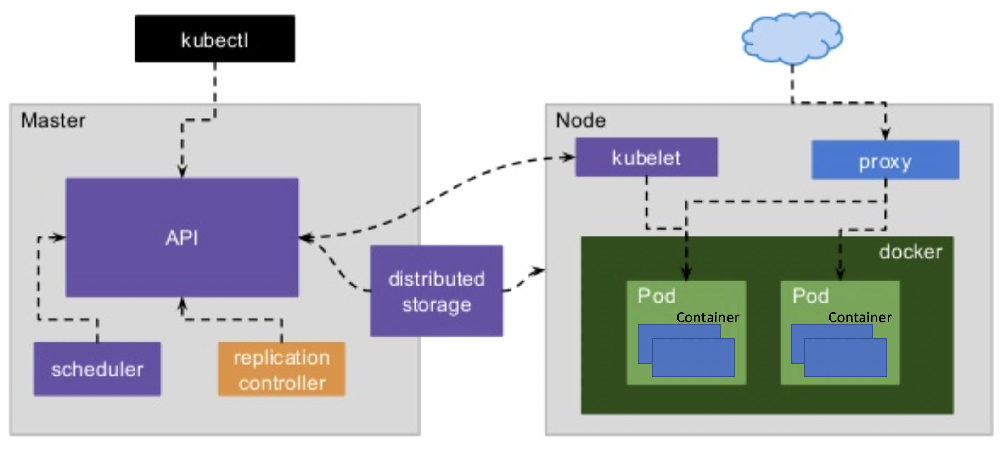
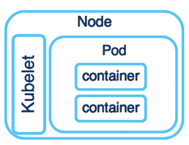

## Kubernetes

```
ㅁ Author: suktae.choi
ㅁ References:
- https://kubernetes.io/ko/docs/concepts/
- https://github.com/grepsean/k8skr-study-architecture
- https://github.com/sungsu9022/study-kubernetes-in-action/issues
```

#### Index

- [Networking](networking)
- [Namespace](namespace)
- [Label & Annotation](label-annotation)
- [Policies](policies)
- [HPA](hpa)
- [Helm Charts](helm-charts)
- [Controllers](controllers)
- [Service](service)
- [ConfigMap & Secrets](configmap-secrets)
- [API](api)

#### Blog

- [Pod Lifecycle](https://kubernetes.io/ko/docs/concepts/workloads/pods/pod-lifecycle/)
- [Dive into managing Kubernetes computational resources](https://hmh.engineering/dive-into-managing-kubernetes-computational-resources-73283c048360)

***

**Kubernetes 는 `최대한 바라는 상태` (== spec) 로 컨테이너화된 `앱` (== object) 의 `실제 상태` (== status) 를 조율하는 플랫폼이다.**




### Master

클러스터를 `최대한 바라는 상태를 유지`하는 책임을 담당한다. 

kubectl (CLI), HTTP 등의 인터페이스를 통한 상호작용은 master 와 통신을 하는 것이다.

> `마스터`는 클러스터 상태를 관리하는 프로세스의 묶음. 주로 단일노드로 구동된다.

- kube-apiserver
  - kube api interface 를 제공 (ex. CLI 와의 통신담당)
- kube-controller-manager
  - kube-apiserver 를 통해 클러스터 상태를 감시하고, `최대한 바라는 상태` 로 만드는 event-loop
- kube-scheduler
  - 노드에 pod 을 배치하는 역할 (ex. 신규생성 or 재생성된 Pod 등)
- etcd
  - key-value storage

### Node

컨테이너화된 어플리케이션을 실행하는 단위 (VM and/or PM).

> 어플리케이션의 구성요소인 Pod 을 호스팅한다.

- kubelet
  - master 와 통신을 담당
- kube-proxy
  - kube service 의 구현체 이다. (a.k.a. network-proxy)
  - iptables, port-forwarding 등



## Terms

### Objects

영속성을 가지는 객체 (== Persistent Entity). 클러스터의 상태를 표현한다.

즉 하나의 의미가 있는 단위이고 (== 의도), 클러스터는 오브젝트의 `현재 상태`를 체크하여 `최대한 의도한 상태`로 조율한다.

- spec: 의도한 상태
- status: 현재 상태



**Container**

docker image 로 동작하는 실행단위

**Pod**

kube 애플리케이션의 기본 실행 단위. `일반적 시스템에서 1대의 서버단위`로 보면된다.

동일한 pod 내의 container 는 network/disk 을 공유한다.

> Node 는 물리적인 구분이고, 논리적인 구분단위는 Pod 이다.

```java
public class Pod {
  @OneToMany
  private Collection<Container> containers;	
}
```

**Service**

Pod 의 endpoint 를 제공합니다.

> Pod 은 자동종료/재시작 될수있어, IP 가 동적으로 변경됨

그래서 Pod 의 외부노출이 필요할때, Service 를 통해 고정된 VIP 를 제공합니다.

```java
public class Service {
  @Getter
  private Collection<Pod> pods;

  private static class Pod {
    @OneToMany
    private Collection<Container> containers;	
  }
}
```

**ConfigMap**

다른 오브젝트에서 사용할 config (== properties) 를 관리.

```bash
$ cat << EOF > boot-configmap.conf
project=boot-deployment
cluster=cluster-name
namespace=alpha
EOF

$ kubectl create configmap boot-configmap --from-file=./boot-configmap.conf
```

코드로 표현하면 이런 느낌이겠지?

```java
public interface ConfigMap {
  String project = "boot-deployment";
  String cluster = "cluster-name";
  String namespace = "alpha";
}
```

**Secret**

ConfigMap 으로 관리하기 어려운 credentials 을 관리하는 별도의 오브젝트.

***

오브젝트는 아래와 같은 yaml 를 통해 생성한다.

```yaml
apiVersion: apps/v1
kind: Deployment
metadata:
  name: 'boot-deployment'
  # object labels
  labels:
    name: api-server
    phase: alpha
spec:
  replicas: 3
  selector:
    matchLabels:
      name: api-server
  template:
    # resource labels
    metadata:
      labels:
        name: api-server
        phase: alpha
    spec:
      # pods 은 N 개의 containers 를 가질 수 있다.
      containers:
        # springboot as container
        - name: 'boot-app'
          image: 'public.registry.com/boot-app'
          imagePullPolicy: Always
          ports:
            - protocol: TCP
              containerPort: 8080
              name: http
        # nginx as container
        - name: 'boot-nginx'
          image: 'public.registry.com/boot-nginx'
          command: ["nginx", "-c", "nginx.conf", "-g", "daemon off;"]
          ports:
            - protocol: TCP
              containerPort: 80
              name: http
            - protocol: TCP
              containerPort: 443
              name: https
```

- apiVersion: kube API version (현재는 v1.x 이므로, v1)
- kind: 오브젝트의 종류
- metadata: 오브젝트의 identifier
- spec: 의도한 상태
