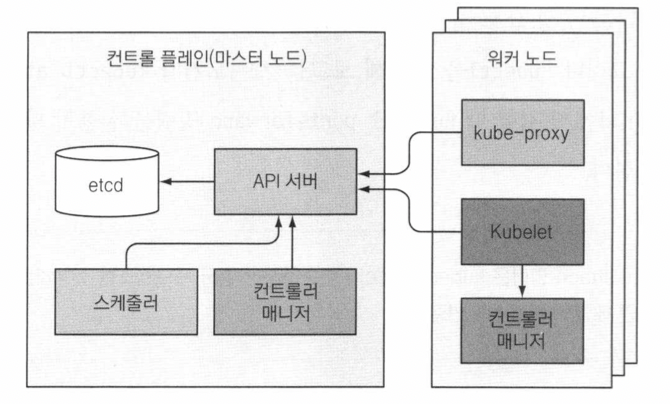
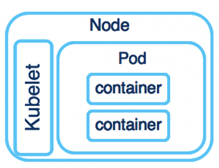
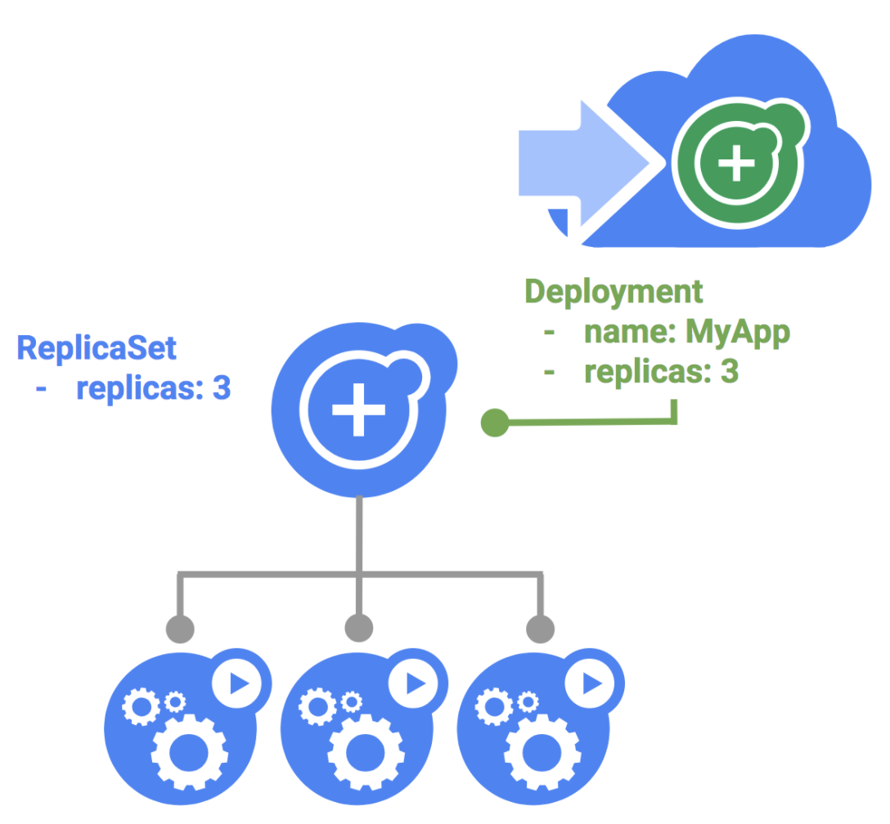
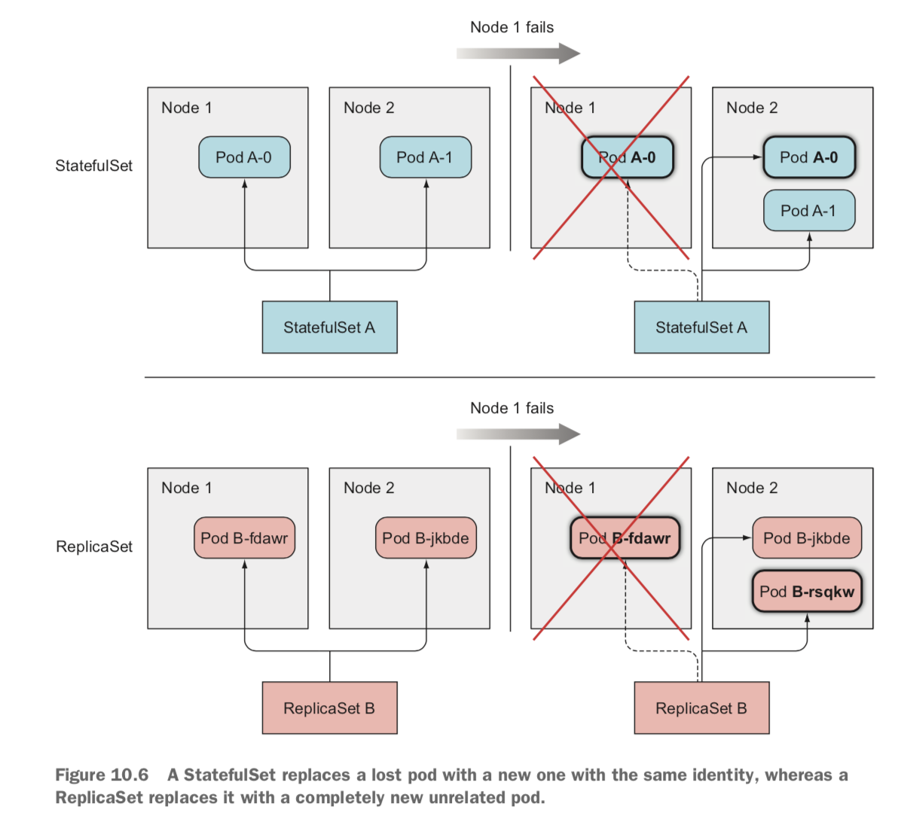
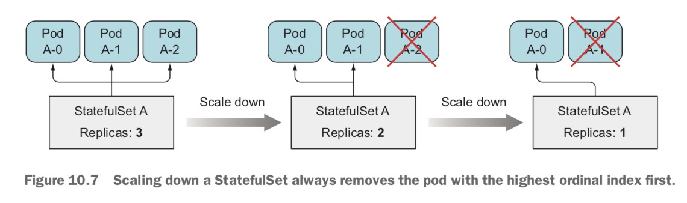
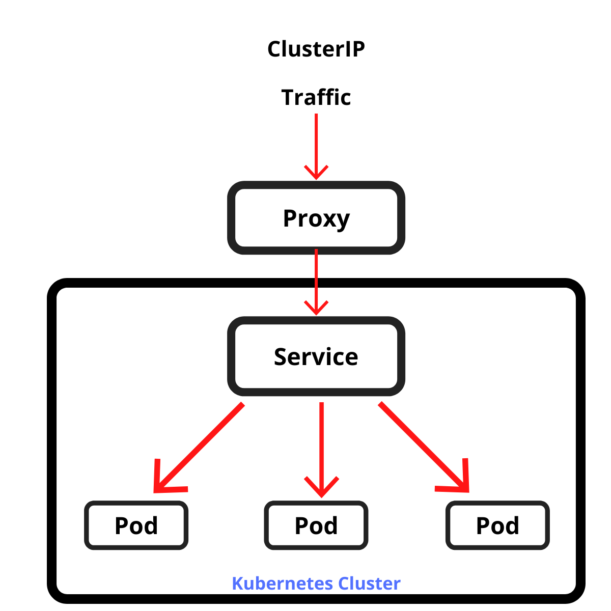

# Kubernetes
```
https://kubernetes.io/ko/docs/concepts/
https://github.com/grepsean/k8skr-study-architecture
https://github.com/sungsu9022/study-kubernetes-in-action/issues
https://github.com/calofmijuck/kubernetes-in-action/tree/main
```

### Blog
- [Pod Lifecycle](https://kubernetes.io/ko/docs/concepts/workloads/pods/pod-lifecycle/)

***
**Kubernetes 는 `최대한 바라는 상태` (== spec) 로 컨테이너화된 `앱` (== object) 의 `실제 상태` (== status) 를 조율하는 플랫폼이다.**

## 구조


### Node
컨테이너화된 어플리케이션을 실행하는 단위 (VM and/or PM).

> 어플리케이션의 구성요소인 Pod 을 호스팅한다.



### Master Node
클러스터의 상태를 관리하는 단위

- **kube-apiserver**
  - kube api 제공 (ex. kubectl(CLI)/API 통신 & 변경통보)
- kube-controller-manager
  - kube-apiserver 를 통해 클러스터 상태를 감시하고, `최대한 바라는 상태` 로 만드는 event-loop
- kube-scheduler
  - 노드에 pod 을 배치하는 역할 (ex. 신규생성 or 재생성된 Pod 등)
- etcd
  - distributed key-value storage
  - kube-api 는 etcd 의 변경을 감지하여, controller 에게 통보한다

### Worker Node
kube-api 에서 command 를 받아 container 실행하는 단위

- **kubelet**
  - kube-api 와 통신
- kube-proxy
  - kube service 의 구현체 이다. (== network-proxy)
  - iptables, port-forwarding 등
- containerd
  - 실제 docker image 를 runtime 실행 

## 구성요소
### Container
Container 는 Pod 내에서 실행되는 프로세스 입니다. (Docker image 를 실행하는 단위)

### Init Containers
Pod 에 속한 다른 모든 Container 가 실행되기 전에 실행되는 특별한 Container 입니다. (ex. DB 초기화, 설정 파일 생성 등)

- 성공
  - Pod 이 시작되고, 다른 Container 가 실행됩니다 
  - Init Container 는 성공 이후 제거됩니다
- 실패
  - Pod 이 종료됩니다 (배포 실패)

```yaml
apiVersion: v1
kind: Pod
metadata:
  name: pod-name
spec:
  initContainers:
    - name: init
      image: image-name
      imagePullPolicy: IfNotPresent
  containers: # container 는 initContainer 가 성공적으로 실행된 후 실행
    - name: app
      image: image-name
      imagePullPolicy: IfNotPresent
    - name: nginx
      image: image-name
      imagePullPolicy: IfNotPresent
    - ...
```

### Pod
Container 의 집합으로, Kubernetes 에서 관리하는 가장 작은 단위 입니다.
- 1개의 Container 는 1개의 Process 만 실행하는 것이 일반적이므로, 여러개의 Container 를 묶어서 배포하는 최소 단위
  - 동일한 pod 내의 container 는 `network/disk` 을 공유 하므로 IPC 등에 제약은 없습니다

> Node 는 물리적인 구분/Pod 은 논리적인 구분

| 항목              | Liveness Probe                              | Readiness Probe                               |
|-------------------|----------------------------------------------|------------------------------------------------|
| 목적              | 컨테이너가 살아있는지 확인                   | 컨테이너가 트래픽 받을 준비가 되었는지 확인    |
| 실패 시 동작      | 컨테이너를 재시작                            | 서비스에서 제외 (트래픽 안 받음)               |
| 재시작 여부       | 예                                           | 아니오                                         |

>### 라이프 사이클
- preStop
  - 컨테이너 종료 전에 실행
- postStart
  - 컨테이너 시작 후에 실행

```yaml
apiVersion: v1
kind: Pod
metadata:
  name: pod-name
spec:
  containers:
  - image: image
    name: kubia
    ports:
    - containerPort: 8080
      protocol: TCP
    lifecycle:
      preStop:            # 컨테이너 종료 전 호출
        command:
          - /preStop.sh
      postStart:          # 컨테이너가 시작 직후 호출
        exec:
          command:
            - sh
            - -c
            - "echo 'hook will fail with exit code 15'; sleep 5; exit 15"
```

### ReplicaSet
- 단순히 Pod 을 복제/유지하는 역할만 수행
- Deployment 를 통해 관리 됩니다

### Deployment
- ReplicaSet 을 관리
- 롤링 업데이트/롤백 기능을 제공 합니다



### DaemonSet
1개의 노드에 최소 1개의 Pod 을 실행하는 역할을 수행 합니다.

> 서비스에선 사용하진 않음. 인프라를 제공하는 곳에서 사용 할듯

### StatefulSet
Deployment (and/or ReplicaSet) 과 유사하지만, `Pod 에 유니크한 식별자가 부여`되어 기존 `PV 를 재사용` 할 수 있어 상태를 유지합니다 




- Identity
  - Deployment: 매번 새롭게 생성되는 식별자 (ex. as7flakjsdhf, 98h34rtsaduh)
  - StatefulSet: 순차적으로 채번되는 유니크 식별자 (ex. web-0, web-1, web-2)
- Storage
  - Deployment: 식별자가 변경되므로 새로운 PV 생성
  - StatefulSet: PersistentVolumeClaim 을 사용하여, 기존 사용했던 PV 재사용

### Job/CronJob
Job 은 일회성 작업을 수행합니다. CronJob 은 주기적으로 Job 을 수행합니다.

> 현업에서 CronJob 은 사용하지 않고 (스케쥴러는 airflow 등 사용) airflow 에서 Job 을 실행하는 형태 적용

### Service
주기적으로 배포/삭제 되는 Pod 은 IP 가 변경될 수 있습니다.

서비스는 ELB 역할을 하며 (기본값: Round-Robin) `외부에 동일한 IP 를 제공하여 외부 접점을 담당`하는 리소스 입니다.



- Session affinity
  - nginx 의 sticky session 과 유사한 기능을 제공하는 옵션입니다
  - TCP 레벨에서의 처리라서 (ClientIP 기반) HTTP 레벨의 쿠키 기반으로는 동작하지 않습니다

| 방식             | 외부 접속 | 포트 사용                        | 확장성       | 특징                                                           |
|------------------|-----------|------------------------------|--------------|--------------------------------------------------------------|
| **ClusterIP**     | ❌        | 클러스터 내부 IP                   | ✅           | 기본값. 클러스터 내부에서만 접근 가능                                        |
| **NodePort**      | ✅        | 각 노드의 IP + 30000~32767 포트 사용 | ✅           | 고정 포트로 모든 노드에 노출. 외부 트래픽 수신 가능                               |
| **HostPort**      | ✅        | 노드의 실제 OS 포트 사용              | ❌           | 직접 노드의 포트 점유 (포트 충돌 위험 있음)                                   |
| **LoadBalancer**  | ✅        | 일반적인 80/443 (L4 라우팅)         | ✅           | 서비스에 IP 가 할당되어 외부노출 (L4)                                     |
| **Ingress**       | ✅        | 일반적인 80/443 (L7 라우팅)         | ✅           | 서비스에 IP/도메인이 할당되어 외부노출 (L7) |
| **Headless Service** | ❌    | ✅                            | ✅       | `clusterIP: None`. 각 Pod에 고유 DNS 부여. StatefulSet에서 자주 사용     |

### Istio
k8s 환경에서 서비스 메쉬를 구현하는 플랫폼 입니다
- Envoy Proxy: 모든 서비스에 붙는 사이드카 프록시, 트래픽 관찰/제어/보안 수행
- Ingress: 외부 -> 내부로의 트래픽 제어
- Egress: 내부 -> 외부로의 트래픽 제어

### Volume
Pod 의 관점에서 PVC 을 생성하면, 쿠버네티스가 적당한 크기와 접근모드의 PV를 찾아서 PVC를 PV에 바인딩 시켜주어 실제 볼륨을 할당 합니다

> 개발자는 물리적 저장소에 대한 정보를 몰라야 한다! 그것은 클러스터 관리자가 할 일이다

#### PVC (PersistentVolumeClaim)
필요한 스토리지에 대한 사용 선언
```yaml
apiVersion: v1
kind: Pod
metadata:
  name: mongodb
spec:
  containers:
    - image: mongo
      name: mongodb
      volumeMounts:
        - name: mongodb-data
          mountPath: /data/db
      ports:
        - containerPort: 27017
          protocol: TCP
  volumes:
    - name: mongodb-data                # PVC 로 볼륨 참조
      persistentVolumeClaim:
        claimName: mongodb-pvc
---
apiVersion: v1
kind: PersistentVolumeClaim
metadata:
  name: mongodb-pvc
spec:
  resources:
    requests: # 1GB 스토리지 정의
      storage: 1Gi
  accessModes:
    - ReadWriteOnce                   # 단일 클라이언트를 지원하는 읽기/쓰기
  storageClassName: "XYZ"
```

#### PV (PersistentVolume)
실제 정의된 스토리지 리소스
```yaml
apiVersion: v1
kind: PersistentVolume
metadata:
  name: mongodb-pv
spec:
  capacity: 
    storage: 1Gi
  accessModes:
    - ReadWriteOnce                                       # 단일 클라이언트의 읽기/쓰기용으로 마운트
    - ReadOnlyMany                                        # 여러 클라이언트의 읽기 전용으로 마운트
  persistentVolumeReclaimPolicy: Retain    # 클레임이 해제된 후 퍼시스턴트볼륨을 유지한다.
  hostPath:                                                     # ohstPath 볼륨 (minikube)
    path: /tmp/mongodb
```