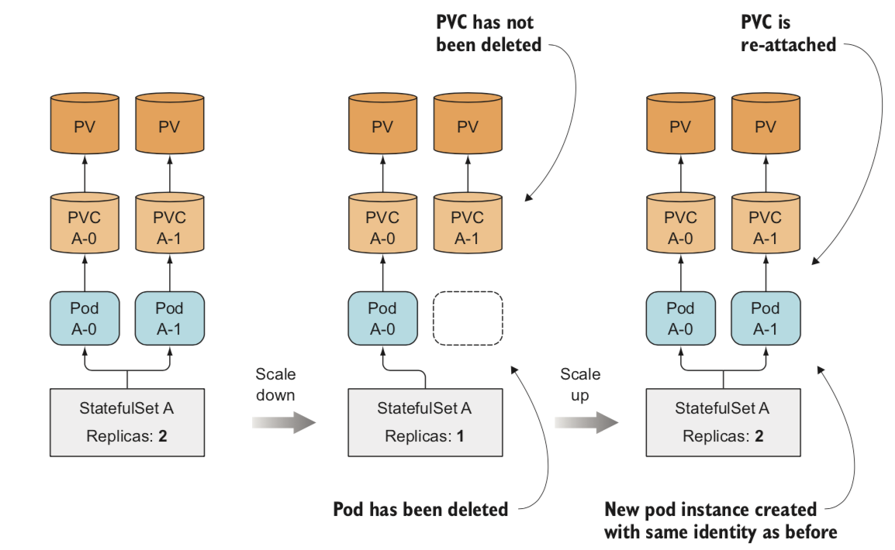

# Kubernetes
```
https://kubernetes.io/ko/docs/concepts/
https://github.com/grepsean/k8skr-study-architecture
https://github.com/sungsu9022/study-kubernetes-in-action/issues
https://github.com/calofmijuck/kubernetes-in-action/tree/main
```

### Index
- [Network](network)
- [Namespace](namespace)
- [Label & Annotation](label-annotation)
- [Policies](policies)
- [HPA](hpa)
- [Helm Charts](helm-charts)
- [Service](service)
- [ConfigMap & Secrets](configmap-secrets)
- [API](api)
- [Isolations](isolations)

### Blog
- [Pod Lifecycle](https://kubernetes.io/ko/docs/concepts/workloads/pods/pod-lifecycle/)

***
**Kubernetes 는 `최대한 바라는 상태` (== spec) 로 컨테이너화된 `앱` (== object) 의 `실제 상태` (== status) 를 조율하는 플랫폼이다.**

## 구조


### Node
컨테이너화된 어플리케이션을 실행하는 단위 (VM and/or PM).

> 어플리케이션의 구성요소인 Pod 을 호스팅한다.


### Master Node
클러스터의 상태를 관리하는 단위

- **kube-apiserver**
  - kube api 제공 (ex. kubectl(CLI)/API 통신 & 변경통보)
- kube-controller-manager
  - kube-apiserver 를 통해 클러스터 상태를 감시하고, `최대한 바라는 상태` 로 만드는 event-loop
- kube-scheduler
  - 노드에 pod 을 배치하는 역할 (ex. 신규생성 or 재생성된 Pod 등)
- etcd
  - distributed key-value storage
  - kube-api 는 etcd 의 변경을 감지하여, controller 에게 통보한다

### Worker Node
kube-api 에서 CMD 를 전달받아, container 를 실행하는 단위

- **kubelet**
  - kube-api 와 통신
- kube-proxy
  - kube service 의 구현체 이다. (== network-proxy)
  - iptables, port-forwarding 등
- containerd
  - 실제 docker image 를 runtime 실행 

## 구성요소
### Container
Container 는 Pod 내에서 실행되는 프로세스 입니다. (Docker image 를 실행하는 단위)

### Pod
Container 의 집합으로, Kubernetes 에서 관리하는 가장 작은 단위 입니다.
- 1개의 Container 는 1개의 Process 만 실행하는 것이 일반적이므로, 여러개의 Container 를 묶어서 배포하는 최소 단위
  - 동일한 pod 내의 container 는 network/disk 을 공유 하므로 IPC 등에 제약은 없습니다.

> Node 는 물리적인 구분/Pod 은 논리적인 구분

| 항목              | Liveness Probe                              | Readiness Probe                               |
|-------------------|----------------------------------------------|------------------------------------------------|
| 목적              | 컨테이너가 살아있는지 확인                   | 컨테이너가 트래픽 받을 준비가 되었는지 확인    |
| 실패 시 동작      | 컨테이너를 재시작                            | 서비스에서 제외 (트래픽 안 받음)               |
| 재시작 여부       | 예                                           | 아니오                                         |

## ReplicaSet
replicas 로 명시된 Pod 개수를 유지하는 역할을 담당한다. (label & label-selector 을 통해 pod 제어)
- (RC) label-selector 에서 1개의 label 만 지정가능
- (RS) N 개의 label 지정가능

> A group of pods

하지만 rs 를 직접 생성하진 않고, 상위개념인 `Deployment 을 통한 rs 생성`으로 사용한다.

## Deployment
ReplicaSet 을 포함하는 개념으로, Replication & Pod 업데이트 & 스케일링 & Canary 배포 등을 지원하는 그룹이다.

> A group of pods with functionalities


## DaemonSet
replicas 로 명시된 Pod 개수를 유지하는 역할을 담당한다. (ReplicaSet 과의 차이점: 클러스터 모든(또는 일부) 노드에 1개의 POD 생성 보장)

## StatefulSet
Deployment 와 같지만, pod 의 배포/삭제 순서 보장 and/or 상태를 가지는 인프라의 성격이다.

- 배포(생성): 0 -> 1 -> 2
- 삭제: 2 -> 1 -> 0
- jenkins, elasticsearch, airflow 등




## Job/CronJob
`crontab`과 유사하게 지정된 시간/일자에 실행되는 Job 을 생성한다.

> 시간은 master:kube-controller-manager 의 시간대를 사용한다.

Job 은 하나 이상의 Pod 을 생성하고, 명령을 수행한 후 종료된다. 배치작업이나 간단한 lambda 작업을 수행하는데 적합하다.
