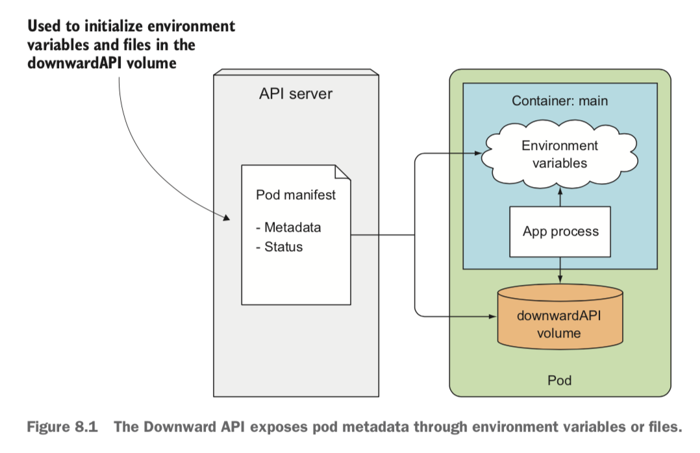

# API

```
@author: suktae.choi
- https://kubernetes.io/docs/concepts/workloads/pods/downward-api
- https://coffeewhale.com/apiserver
```

## Downward API
기본적인 k8s metadata 는 downwardAPI 로 제공되고 pod 은 `resourceFieldRef` 을 통해 가져올 수 있다



```yaml
apiVersion: v1
kind: Pod
metadata:
  name: test-pod
spec:
  containers:
  - name: main
    image: busybox
    command: ["sleep", "999"]
    env:
    - name: POD_NAME 
      valueFrom:
        fieldRef:
          fieldPath: metadata.name
    - name: POD_IP
      valueFrom:
        fieldRef:
          fieldPath: status.podIP
```

## Kubernetes API
https://kubernetes.io/docs/concepts/overview/kubernetes-api/ 에 정의된 명세대로 kube-api 서버와 rest 통신

## kubectl
shell client

## SDK
programmatic client