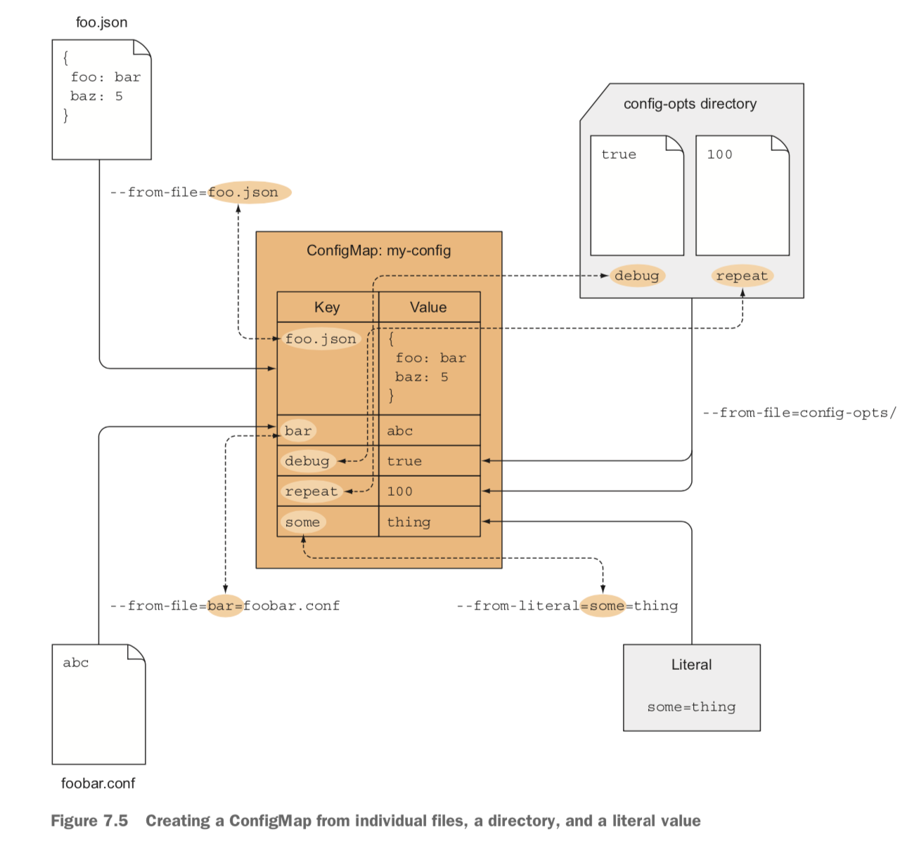

## ConfigMap & Secrets

```
@author: suktae.choi
- https://kubernetes.io/docs/concepts/configuration/configmap
- https://kubernetes.io/docs/concepts/configuration/secret
```

### ConfigMap
key-value resource

```yaml
apiVersion: v1
kind: ConfigMap
metadata:
  name: fortune-config
data:
  sleep-interval: "25"
```

```shell
# from args
kubectl create configmap myconfigmap --from-literal=foo=bar --from-literal=bar=baz --from-literal=one=two

# from file 
kubectl create configmap my-config --from-file=config-file.conf

# from directory
kubectl create configmap my-config --from-file=/path/to/dir
```

```yaml
spec:
  containers:
  - image: some-image
    envForm:
    - prefix: CONFIG_ # 모든 환경변수는 CONFIG_ prefix로 설정됨.
        configMapRef: # my-config-map 이름의 컨피그맵 참조
          name: my-config-map
```



### Secrets
configmap 과 동일하지만 credentials 처럼 민감정보 저장하는 key-value resource