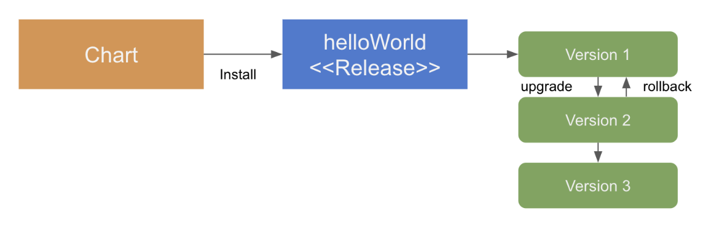

# Helm Charts

```
@author: suktae.choi
- https://helm.sh/docs/intro/quickstart/
- https://cloud.ibm.com/docs/containers?topic=containers-helm&locale=ko
- https://www.slideshare.net/skanddh/kubernetes-helm
```

**The package manager for Kubernetes.**

하나의 Kubernetes 앱을 정의할때 아래와 같은 작업들이 필요합니다.

- resource.yaml 정의
- (Optional) 생성 전/후 hook 을 통한 scripts 실행
  - postStart, preStop 등
- Deployment 의 버전관리
  - 20200320 에 작업했던 command 및 resource.yaml 파일의 형상관리

이러한 Kubernetes 리소스 작업을 Helm 을 통해 자동으로 적용하고, 버전관리를 할 수 있습니다.



즉 Helm 은 아래의 역할을 수행합니다:

- Charts 에 정의된 scheme 에 따라 Pod 을 구성할 Container 스펙 정의
- Helm 실행시 k8s resource 를 만드는 yaml 파일 생성
- 최종적으로 만들어진 {resource}.yaml 은 아래 명령을 통해 Pod 으로 생성

```bash
$ kubectl apply -f {resource}.yaml
```

## QuickStart

Charts 의 디렉토리 구조는 아래와 같습니다.

```bash
$ helm create boot-app
```

```bash
.
├── Chart.yaml		# Charts manifest
├── charts				# Other charts as dependencies
├── templates			# k8s resource template
│   ├── NOTES.txt
│   ├── _helpers.tpl				# k8s macro manifest
│   ├── deployment.yaml			# k8s deployment manifest
│   ├── ingress.yaml				# k8s ingress manifest
│   ├── service.yaml				# k8s service manifest
│   ├── serviceaccount.yaml	# k8s serviceaccount manifest
│   └── tests
│       └── test-connection.yaml
└── values.yaml		# The default configuration values for this chart

3 directories, 9 files
```

templates 하위에 있는 {resource}.yaml 을 참조하여, 아래 명령어로 Kubernetes 를 deployment 를 생성합니다.

```bash
$ helm install ./boot-app boot-app
```

Chart 에 기술한 내용으로 Pod 이 생성되고, helm 을 통해서도 형상관리가 됩니다.

```bash
$ kubectl get pods
NAME        READY    STATUS    RESTARTS   AGE
boot-app-0   2/2     Running   1          38d

$ helm ls
NAME     REVISION        UPDATED               STATUS      CHART   APP VERSION    NAMESPACE
boot-app    3     Mon Mar 16 23:10:38 2020    DEPLOYED    app-0.9.1                default
```

## Deployment.yaml

```yaml
apiVersion: apps/v1
kind: Deployment
metadata:
  name: 'boot-app'
spec:
  replicas: {{ .Values.hpa.replicas }}
  template:
    # pods 은 N 개의 containers 를 가질 수 있다.
    spec:
      restartPolicy: Always
      terminationGracePeriodSeconds: 30
      containers:
        # springboot as container
        - name: '{{ .Values.app.name }}-app'
          image: '{{ .Values.app.image }}'
          {{- if eq .Values.profile "dev" }}
          imagePullPolicy: Always
          {{- end }}
          ports:
            - protocol: TCP
              containerPort: 8080
              name: http
        # nginx as container
        - name: '{{ .Values.nginx.name }}-nginx'
          image: '{{ .Values.nginx.image }}'
          command: ["nginx", "-c", "{{ .Values.nginx.conf }}/nginx.conf", "-g", "daemon off;"]
          ports:
            - protocol: TCP
              containerPort: 80
              name: http
            - protocol: TCP
              containerPort: 443
              name: https
```

Kubernetes 의 배포단위인 deployment 를 구성하는 Pod - Containers 를 정의합니다.

Pod 은 N 개의 Container 로 구성됩니다. 여기서의 Pod 은 nginx & boot-app.jar 로 구성됩니다.

- containers.name: container 이름
- containers.image: docker image url
- containers.ports: container 에서 통신할 포트 지정
- ...

## Syntax

### Build-in Objects

- Release

```yaml
{{ .Release.Name }}

{{ .Release.Namespace }}
```

- Values

```yaml
{{ .Values.xxx }}
```

- Chart

```yaml
{{ .Chart.Name }}

{{ .Chart.Version }}
```

- Template

```yaml
{{ .Template.Name }}

{{ .Template.BasePath }}
```

### Functions

- Comments

```yaml
{{ /* comments */ }}
```

- Condition

```yaml
{{ if statement }} T0 {{ else }} T1 {{ end }}

{{ if statement }} T0 {{ end }}

{{- if or (eq .Values.profile "prod") (eq .Values.profile "stage") }}real.{{ end }}{{ .Values.app.image}}:{{ .Values.app.tag }}
```

- Iteration

```yaml
# values.yaml
pizzaToppings:
  - mushrooms
  - cheese
  - peppers
  - onions

# deployment.yaml
data:
toppings:
  {{- range .Values.pizzaToppings }}
  - {{ . | quote }}
  {{- end }}

# rendered
data:
toppings:
  - "mushrooms"
  - "cheese"
  - "peppers"
  - "onions"
```

> 더 자세한 Charts scheme 은 레퍼런스 확인: https://helm.sh/docs/chart_template_guide/control_structures/

### Scheme
#### label & annotation

쿠버네티스 오브젝트에서 사용할 metadata 를 지정하는 방법이다. 기본적으로 key-value 형식이다.

- label - label 지정. 오브젝트를 선택 (특정조건 만족하는) 하는 단위로 사용
- labelSelector - 오브젝트 선택
- annotation - 오브젝트 선택/식별에 사용되지 않는, key-value context 를 저장할때 사용

```yaml
apiVersion: apps/v1
kind: Deployment
metadata:
  name: '{{ .Values.ncc.instance }}-{{ .Values.ncc.installation }}'
  labels:
    phase: prod
    name: api-server
```

