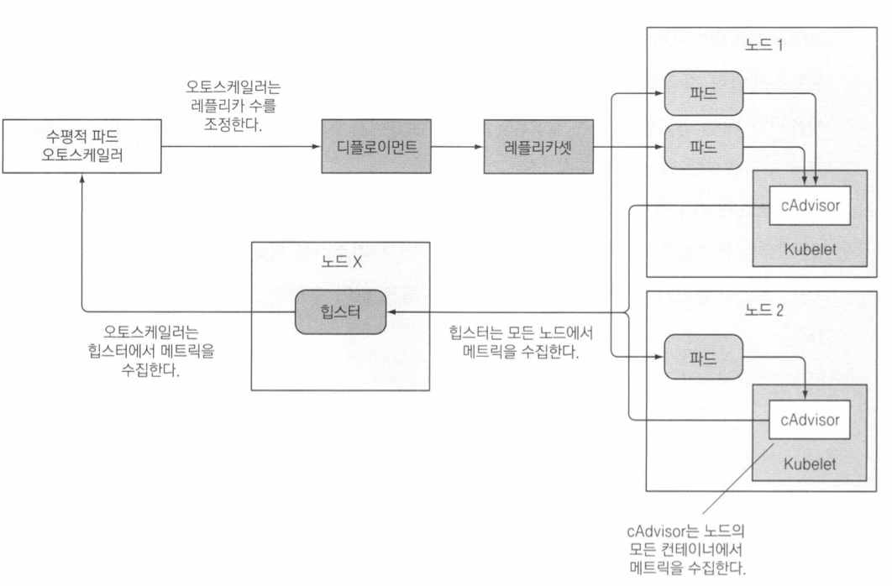
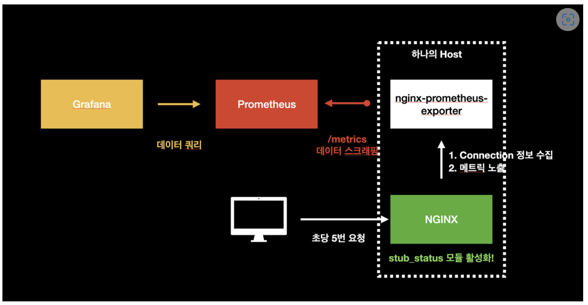

# HPA (Horizontal Pod Autoscaler)

```
@author: suktae.choi
- https://kubernetes.io/ko/docs/tasks/run-application/horizontal-pod-autoscale/
- https://github.com/kubernetes-sigs/metrics-server
```



- (HPA controller) `--horizontal-pod-autoscaler-sync-period=15s` 주기적으로 메트릭을 가져옴 
- (kubelet) 응답
- (HPA controller) 계산값이 설정한 scale-out 기준에 맞으면 deployment 에 명령을 내린다
  - deployment, replicaSet, statefulSet 이 대상 (daemonSet 은 안됨, node 당 1개만 존재해야하므로)

## springboot
`springboot-actuator` (micrometer 의존 포함) + prometheus 의 format 으로 export 하는 `micrometer-registry-prometheus` 을 사용합니다

```groovy
// micrometer-metrics
implementation 'org.springframework.boot:spring-boot-starter-actuator'
implementation 'io.micrometer:micrometer-registry-prometheus'
```

그후 prometheus expose 설정

```yaml
# spring-actuator
management:
  endpoints:
    prometheus:
      enabled: true
    web:
      exposure:
        include: prometheus
```

## nginx


nginx 의 connection 을 보여주는 `stub_status` module 을 설치후, 해당 정보를 prometheus format 으로 노출하는 nginx-prometheus-exporter 를 설정합니다

```groovy
location /stub_status {
    stub_status on;

    allow 10.0.0.0/8;
    allow 127.0.0.1;
    deny all;
    access_log off;
}
```

nginx-prometheus-exporter 는 nginx 에서 공식적으로 제공합니다.

```yaml
- name: nginx-prometheus-exporter
  image: xxx/nginx-prometheus-exporter:latest
  imagePullPolicy: IfNotPresent
  args:
    - -nginx.scrape-uri=http://localhost:80/stub_status
```

`-nginx.scrape-uri` 으로 stub_status 의 location_url 을 지정합니다