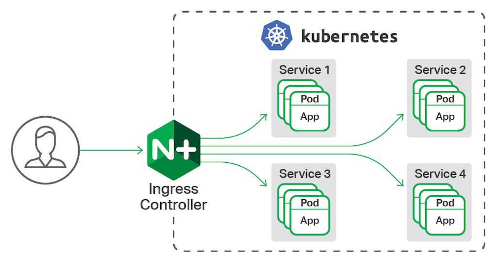

## Ingress

```
ㅁ Author: suktae.choi
ㅁ References:
- https://kubernetes.io/ko/docs/concepts/services-networking/ingress/
```

Cluster 외부에서 내부의 서비스로 트래픽 라우팅을 담당합니다.



> 서비스는 Deployment 단위의 라우팅, Ingress 는 Cluster 단위를 라우팅을 의미한다.

클러스터 단위의 전체 라우팅을 담당하므로, 앞단에서의 로드밸런싱/circuit-breaker 등의 기능을 수행한다.

```java
@Component
public class Ingress {
  private Collection<Deployment> deployments;

  /**
   * entry point
   */
  @HystrixCommand(fallbackMethod = "routeFallback")
  public RouteResult process(Metric metric) {
    return getDeployment(metric)
      .route();
  }

  private Deployment getDeployment(Metric metric) {
    // metrics & circuit 상태를 보고, routing 할 deployment 선택 
    return deployments.get(0);
  }

  private RouteResult routeFallback() {
    // logging, alarm 등 적절한 처리
    throw new NoProperDeploymentException();
  }
}
```
