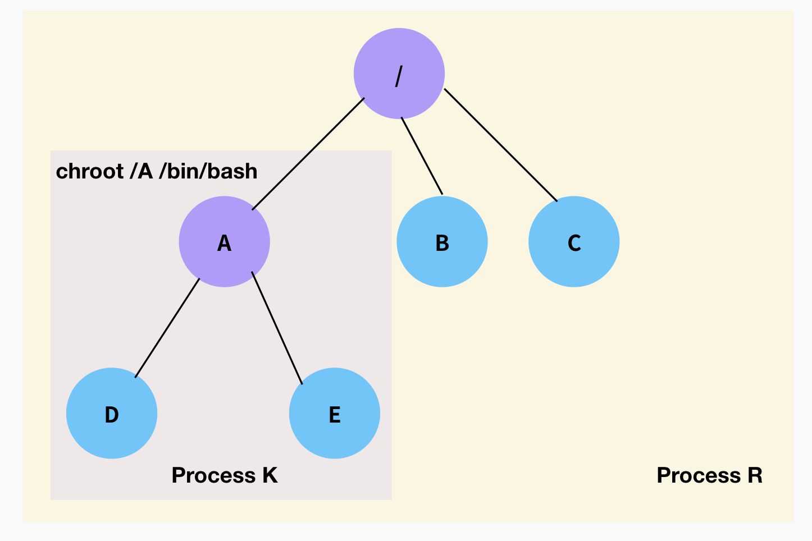
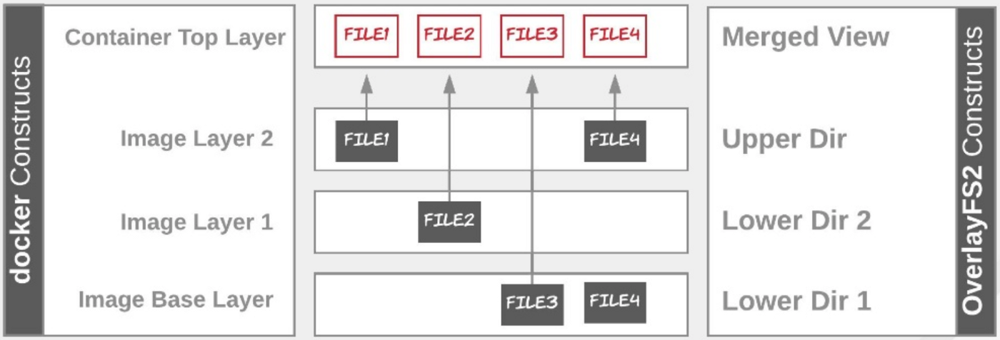
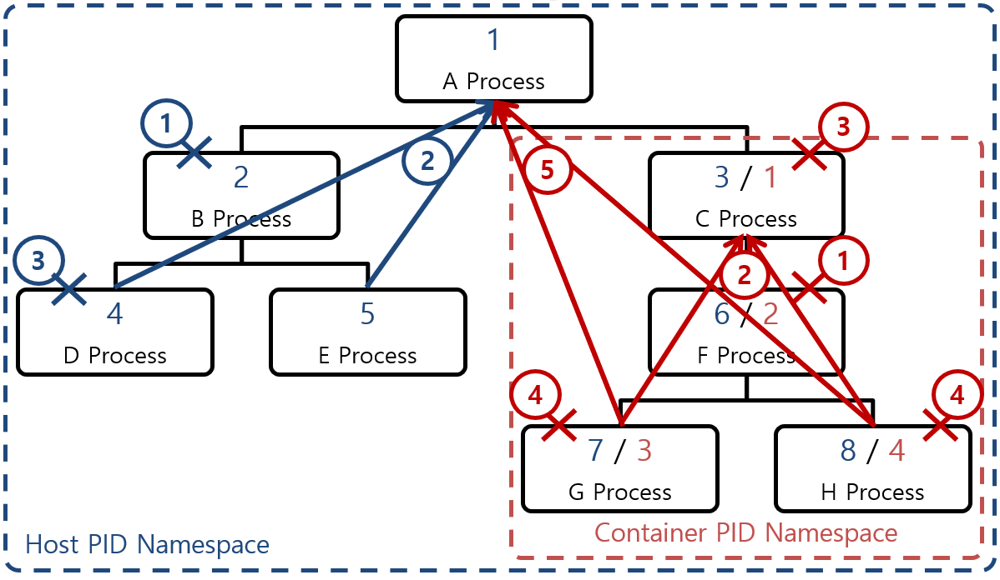
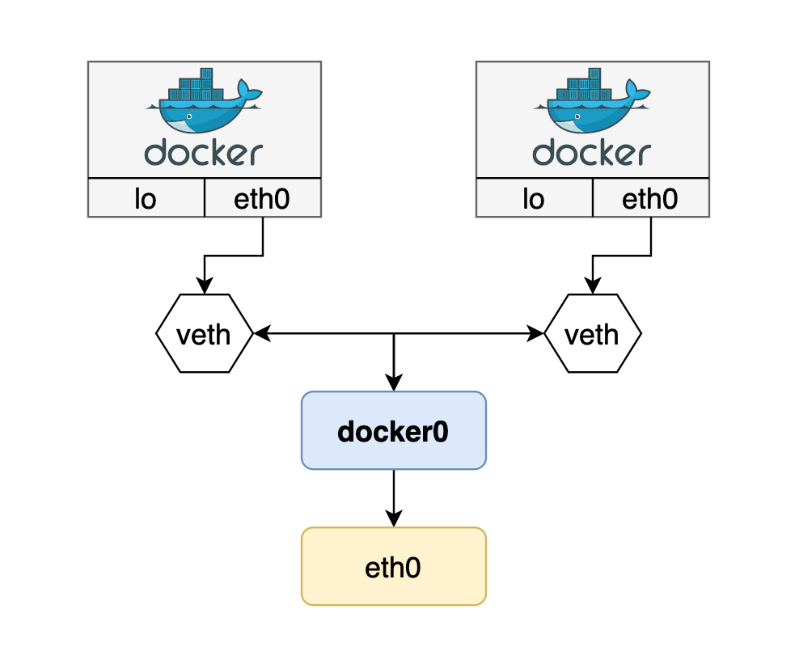

# Isolations

```
@author: suktae.choi
- https://itnext.io/chroot-cgroups-and-namespaces-an-overview-37124d995e3d
```

container 는 격리된 환경에서 실행되는 `process` 이다

## chroot
루트 디렉토리를 변경해서 격리



## namespace
`unshare` cmd 를 통해 system-call 로 namespace 를 격리한다

```bash
# mount namespace 를 격리하는 cmd
$ unshare -m /bin/bash
```

### mount namespace + overlayFS


### pid namespace


### ipc namespace 를 공유하는 단위
- shared memory
- semaphore
- POSIX message queue

### network namespace


### uts (unix time-sharing) namespace
- hostname
- domainname 

### user namespace
uid 의 격리레벨 단위
- pid, network namespace 격리와의 호환성
- uid mapping 을 지원하지 않는 driver 와의 호환성

의 문제가 있어, docker container & kubernetes 는 user namespace 를 격리하지 않는다

## cgroup
- cpu
- memory
- netowrk
- disk

등의 리소스 할당을 제한/격리 하는 기능