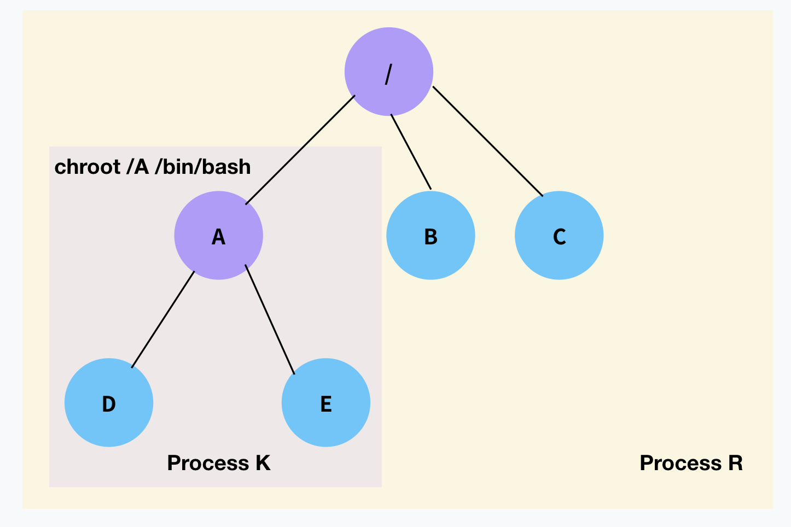
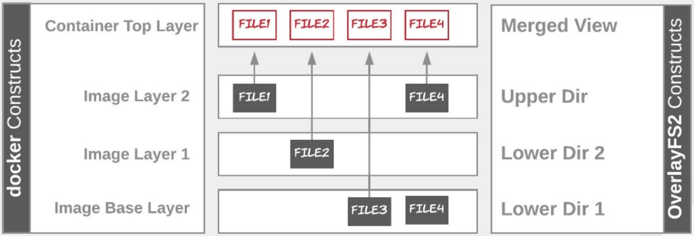
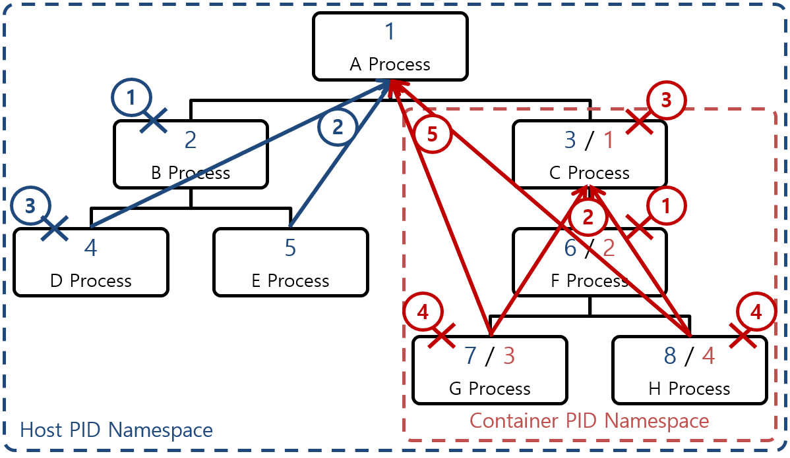
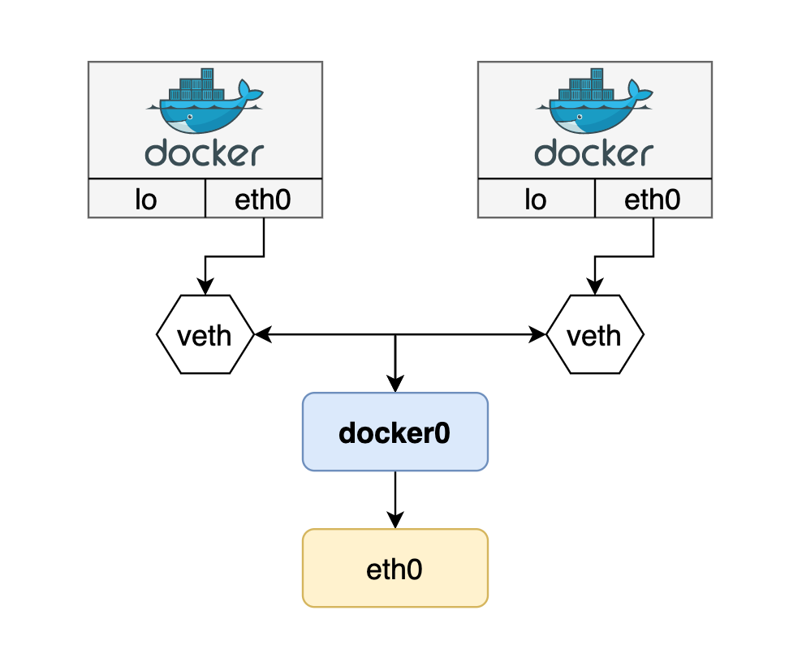

# Isolations
```
https://itnext.io/chroot-cgroups-and-namespaces-an-overview-37124d995e3d
```

## Container vs Virtual Machine
Docker 는 `container engine` 을 통해 동일 OS 위에서 격리된 환경으로 (cgroup, namespace) 실행됩니다.

VM 은 `hypervisor`를 통해 하드웨어 레벨에서부터 구분되어 개별 OS 를 실행됩니다. (os)

| 항목 | VM (Virtual Machine) | Container |
| :--- | :--- | :--- |
| **구조** | 하드웨어 위에 **Hypervisor** 실행, 그 위에 **Guest OS** 설치 | OS 위에 **Container Engine** 실행, **OS 커널 공유** |
| **격리 수준** | **완전한 격리** (OS 레벨) | **프로세스 수준 격리** (Namespaces, Cgroups) |

격리수준은 VM 이 높지만, OS 를 개별로 포함하므로 빠르고/가볍게 실행되지 않습니다. 그래서 Docker 을 MSA 에서 사용합니다.

## `cgroup`
`물리적인 리소스` 제한
- cpu
- memory
- network
- disk

## `namespace`
`논리적인 리소스` 격리
- pid
- net (네트워크)
- mount (파일시스템)
- user (root 로 보이지만 Node 의 root 는 아님)

## chroot
루트 디렉토리를 변경해서 격리



### mount namespace + overlayFS


### pid namespace


### ipc namespace 를 공유하는 단위
- shared memory
- semaphore
- POSIX message queue

### network namespace


### IPC (inter process communication) namespace
- semaphore
- POSIX queue

### UTS (unix time-sharing) namespace
- hostname
- domainname 

### user namespace
uid 의 격리레벨 단위
- pid, network namespace 격리와의 호환성
- uid mapping 을 지원하지 않는 driver 와의 호환성

의 문제가 있어, docker container & kubernetes 는 user namespace 를 격리하지 않는다