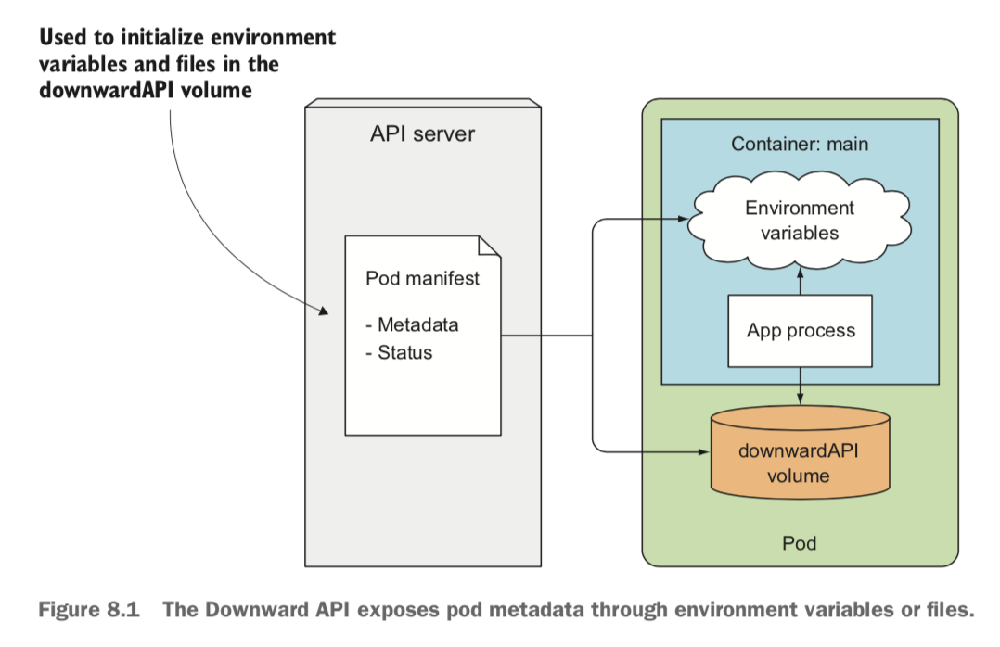

# Metadata
```
https://kubernetes.io/docs/concepts/workloads/pods/downward-api
https://coffeewhale.com/apiserver
```

K8S 메타데이터를 조회/수정하는 방법을 기술합니다:

## Downward API
기본적인 Metadata 는 Downward API 을 통해 제공하고 `resourceFieldRef` 을 통해 가져올 수 있습니다



```yaml
apiVersion: v1
kind: Pod
metadata:
  name: test-pod
spec:
  containers:
  - name: main
    image: busybox
    command: ["sleep", "999"]
    env:
    - name: POD_NAME 
      valueFrom:
        fieldRef:
          fieldPath: metadata.name
    - name: POD_IP
      valueFrom:
        fieldRef:
          fieldPath: status.podIP
```

## Kubernetes API
https://kubernetes.io/docs/concepts/overview/kubernetes-api/ 에 정의된 명세대로 kube-api 의 API 를 호출해서 조회/수정도 가능합니다

## kubectl
CLI 를 통해서도 조회/수정이 가능합니다

## SDK
제공되는 SDK 를 통해서도 조회/수정이 가능합니다