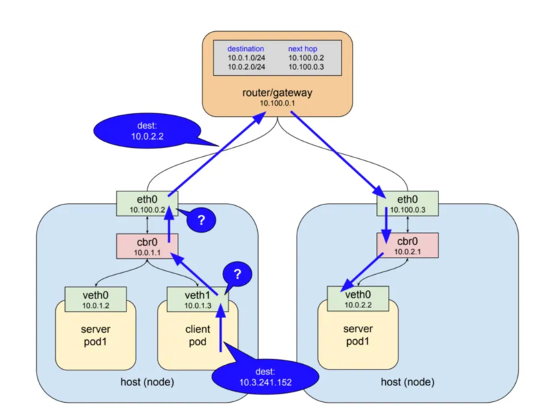

# Network

```
@author: suktae.choi
- https://yozm.wishket.com/magazine/detail/2251/
```

### Blog
- [쿠버네티스 네트워킹 이해하기](https://coffeewhale.com/k8s/network/2019/04/19/k8s-network-01/)
- [\[번역\]쿠버네티스 패킷의 삶](https://coffeewhale.com/packet-network1)

***

## kube-dns
https://mrkaran.dev/posts/ndots-kubernetes/

DNS resolution is configured in Kubernetes cluster through CoreDNS. The kubelet configures each Pod's /etc/resolv.conf to use the coredns pod as the nameserver. You can see the contents of /etc/resolv.conf inside any pod, they'll look something like:

```
search hello.svc.cluster.local svc.cluster.local cluster.local
nameserver 10.152.183.10
options ndots:5
```

- nameserver
  - lookup 할 DNS 서버
- search
  - ndots 를 충족하지 못할경우, 순차적으로 suffix 로 검색할 패턴
  - {domain}.hello.svc.cluster.local -> {domain}.svc.cluster.local -> {domain}.cluster.local 정의순서대로 검색한다
- options ndots:5
  - FQDN (fully qualified domain name) 을 충족하기 위한 최소 `.` 의 개수
  - 다만 FQDN 은 domain 이 . 으로 끝날경우 FQDN 으로 인지한다 (ex. **naver.com.** 은 ndots:1 이지만 . 으로 끝나므로 FQDN)

## Internal (== Pod) to Service


### kube-proxy
kube-proxy 는 (노드의) service 와 pod 을 연결합니다. (POD 이 N 개인 경우 LB 의 역할도 수행)

> 서비스는 가상의 ip:port 를 할당받지만 실질적으로는 더미. 즉 아무일도 하지 않음

서비스가 생성되면 kube-apiserver 는 (모든 워커노드의) kube-proxy 에 해당 서비스의 ip:port 를 통보하고, kube-proxy 는 iptables 에 해당 서비스의 ip:port 를 등록한다
- 서비스의 ip:port 가 목적지로 packet sent
- (이미 워커노드의 kube-proxy 에 의해 갱신된 iptables 을 통해) 목적지가 해당 서비스의 matchLabel 에 해당하는 무작위 POD IP:PORT 로 치환
- 실질적으로 해당 POD 으로 dest ip:port 가 네트워크로 sent

> kernel-space 기능인 netfilter 와 user-space 에 존재하는 (인터페이스) iptables 으로 패킷 흐름을 제어

하지만 user-space 모드로의 동작은 아래의 단점이 존재합니다:
- SPOF
- kernel/user-space 로의 패킷 전환으로 비효율

그래서 k8s 1.2 이상부터는 user-space 모드가 아닌 iptables mode 로 동작합니다:
- kube-proxy가 직접 proxy의 역할을 수행하지 않고 그 역할을 전부 netfilter 에게 위임
- kube-proxy 는 단순히 netfilter 규칙을 수정하는 역할만 수행

## External to Service
[Service](../service)