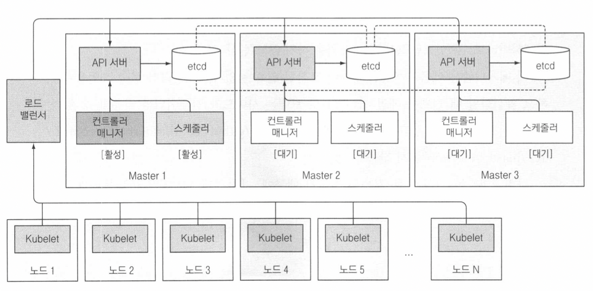
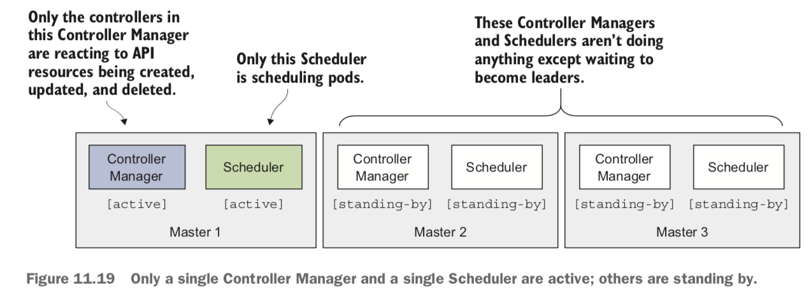

## Resources

```
@author: suktae.choi
- https://hmh.engineering/dive-into-managing-kubernetes-computational-resources-73283c048360
```

### 가용성


- kube-api
  - 상태가 없는 api 서버이므로 N 개를 운영해도 됨 
- etcd
  - raft protocol 을 통한 consensus
  - 1개의 리더가 CUD 처리 (write-concern: majority) (replicas 는 R 대응)
  - 과반수를 위한 홀수대 운영
- controller, scheduler
  - cluster 내 에서 1개의 controller, scheduler 만 active
  - 나머지는 standby

