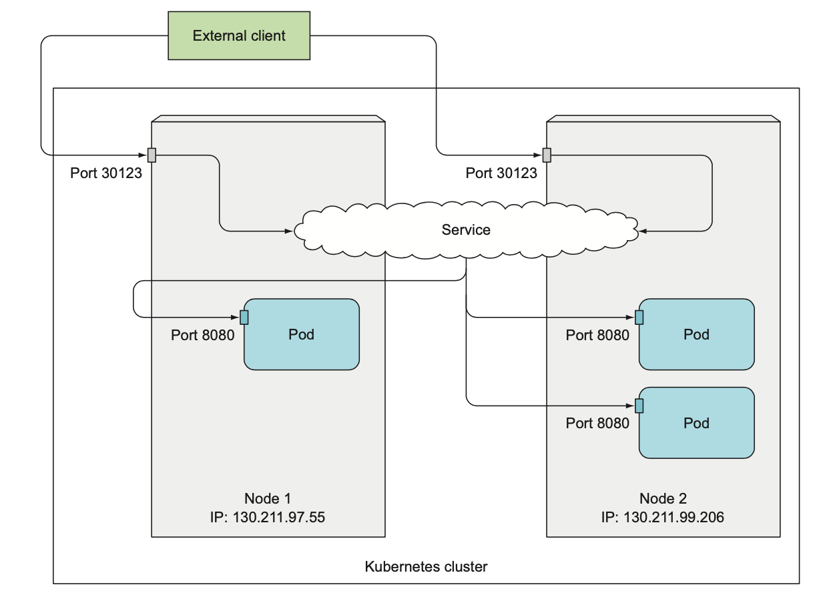
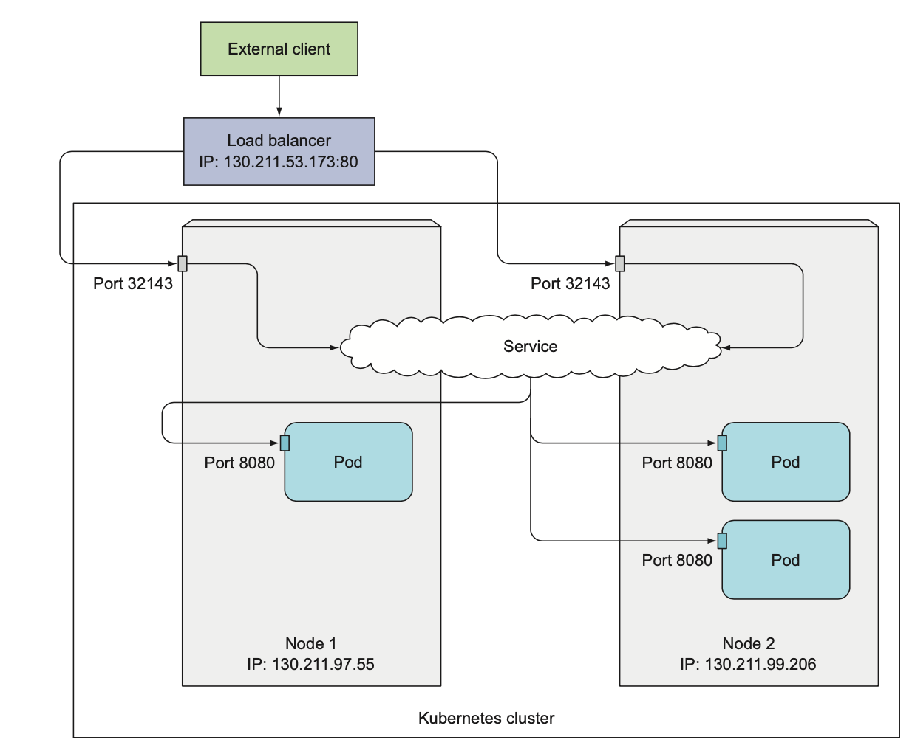
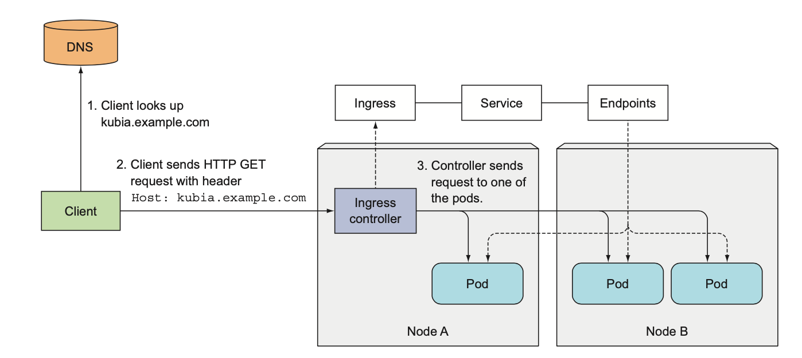
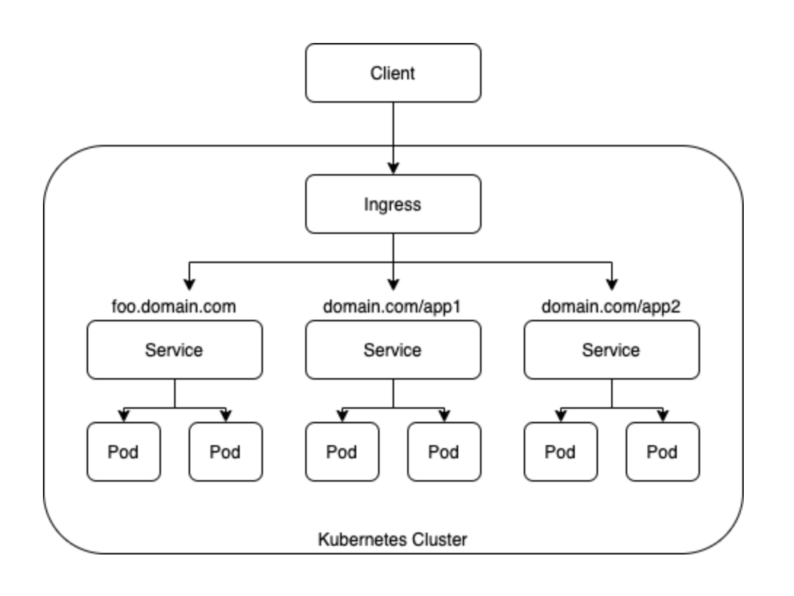

## Service

```
@author: suktae.choi
- https://kubernetes.io/docs/concepts/services-networking/service/
- https://kubernetes.io/docs/concepts/services-networking/ingress/
```

### NodePort


```yaml
apiVersion: v1
kind: Service
metadata:
  name: kubia-nodeport
spec:
  type: NodePort
  ports:
  - port: 80 # 서비스 클러스터 IP 포트
    targetPort: 8080 # 서비스 대상 파드의 포트
    nodePort: 30123 # 각 클러스터 노드의 포트 30123을 통해 서비스에 엑세스 할수 있음.
  selector:
    app: kubia
```

### LoadBalancer
L4 LB

```yaml
apiVersion: v1
kind: Service
metadata:
  name: kubia-loadbalancer
spec:
  type: LoadBalancer
  ports:
    - port: 80 # 서비스 클러스터 IP 포트
      targetPort: 8080 # 서비스 대상 파드의 포트
  selector:
    app: kubia
```



```yaml
spec:
  externalTrafficPolicy: Local (ClientIP)
```

### Ingress
L7 LB (Ingress Controller 가 필요함)

- Ingress: 정책 resource
- Ingress Controller: Ingress (정책) 을 참조하여 동작하는 구현체 (ex. ingress-nginx)




```yaml
spec:
  rules:
    - host: foo.example.com
      http:
        paths:
          - path: /
            backend: # foo.example.com -> foo-service
            serviceName: foo
            servicePort: 80
    - host: bar.example.com
      http:
          paths:
            - path: /
              backend: # bar.example.com -> bar-service
              serviceName: bar
              servicePort: 80
```

- headless: service 의 단일 IP 를 노출하는게 아닌, 서비스에 연결된 (label-selector 통해) pod IP 를 직접 전달 (일반적인 A record DNS 처럼 동작)
  - endpoint 연동된 pod 에 직접 connection 을 맺어하는 경우 필요
  - 쿠버네티스 서비스에 클러스터 IP가 필요하지 않다면 ClusterIP 필드를 None으로 설정하여 DNS 서버는 하나의 서비스 IP 대신 파드 IP 목록들을 반환한다.
  - 이때 각 레코는 현재시점 기준으로 서비스를 지원하는 개별 파드의 IP를 가리킨다.
  - 따라서 클라이언트는 간단한 DNS A 레코드 조회를 수행하고 서비스에 포함된 모든 파드의 IP를 얻을 수 있다.

```yaml
apiVersion: v1
kind: Service
metadata:
  name: kubia-headless
spec:
  clusterIP: None # 헤드리스 서비스로 만드는 spec 옵션
  ports:
  - port: 80
    targetPort: 8080
  selector:
    app: kubia
```

### Istio
L7 LB + 필요한 부가적인 resources 를 번들로 묶은 CR 로 통합 제공

- istio <- ingress 대체 (ingress)
- envoy <- nginx 대체 (ingress controller)
- Virtual Service <- Service 대체 (endpoint)

> envoy 에 대한 설정을 nginx.conf 와 달리, k8s resource.spec 으로 정의

Istio 는 아래의 역할들을 처리할 수 있음

- canary 배포 (A/B)
- L7 기반 route (path, cookie)
- discovery (weight)
