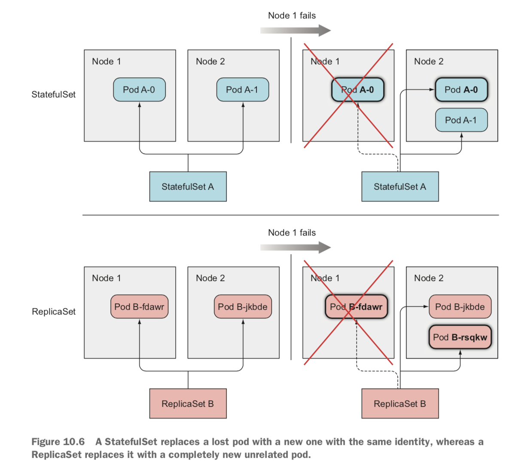
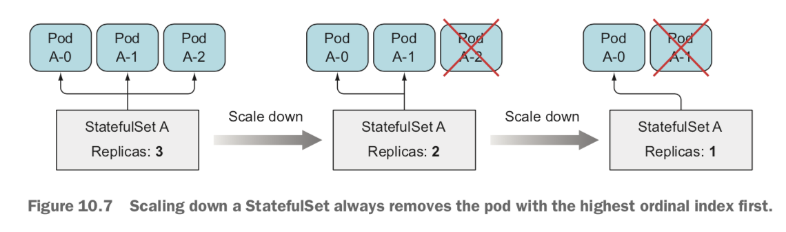
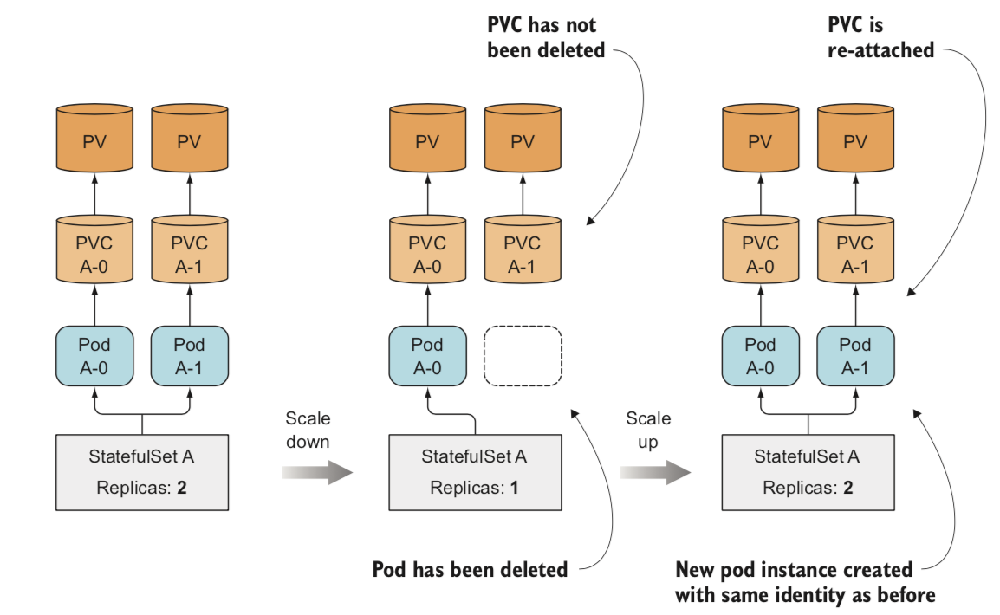

## StatefulSets

```
ㅁ Author: suktae.choi
- https://kubernetes.io/docs/concepts/workloads/controllers/statefulset/
```

StatefulSet is the workload API object used to manage stateful applications.

Manages the deployment and scaling of a set of Pods, and provides `guarantees about the ordering and uniqueness of these Pods.`

Like a Deployment, a StatefulSet manages Pods that are based on an identical container spec. Unlike a Deployment, `a StatefulSet maintains a sticky identity for each of their Pods.` These pods are created from the same spec, but are not interchangeable: each has a persistent identifier that it maintains across any rescheduling.

If you want to use storage volumes to provide persistence for your workload, you can use a StatefulSet as part of the solution. Although individual Pods in a StatefulSet are susceptible to failure, the persistent Pod identifiers make it easier to match existing volumes to the new Pods that replace any that have failed.

- replicaset vs statefulset
 


- scale-down (up) is processed in order
 


- sticky identity (PV remains, use the same PVC)

