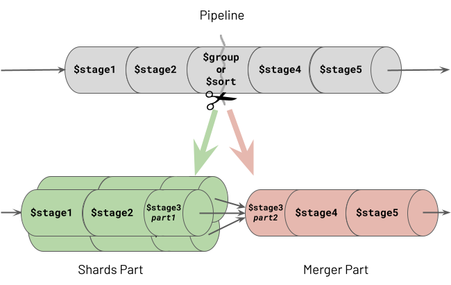
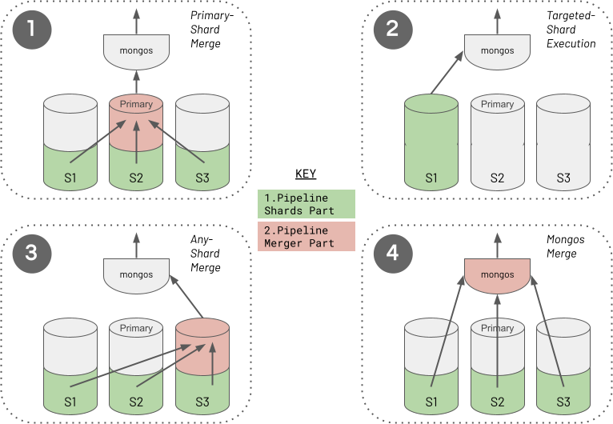

# Aggregation

```
@author: suktae.choi
- https://docs.mongodb.com/manual/aggregation/
- https://www.practical-mongodb-aggregations.com/guides/sharding.html
```



- 몽고 쿼리는 (include aggregation) 메모리 `100MB` 이상 사용시, 무조건 exception
- aggregation pipeline 은 shardPart (shard 에서 직접 수행하는 part) mergePart (그 결과를 조합하는 part) 로 구분됩니다
- mergePart 의 수행은 decision tree 에 의해 결정됩니다. (ex. $group, $sort 등이 포함된 pipeline)
  - primaryShard: unsharded collection $lookup (join) 이 포함된 경우 (unsharded collection 은 primary shard 에 존재)
  - targetedShard: aggregation pipeline 대상 shard key 가 특정 샤드에만 존재할 경우
  - anyShard: `allowDiskUse:true` 인 경우
  - mongos: 나머지 (mongos 는 DISK 를 사용하지 않는 순수 router)



  
| SQL      | Aggregation          |
|----------|----------------------|
| select   | $project             |
| where    | $match               |
| group by | $group               |
| order by | $sort                |
| limit    | $limit               |
| count    | $sum -> $sortByCount |
| sum      | $sum                 |
| join     | $lookup              |
| flatten  | $unwind              |

- 일반적인 사용
```json
{
  "_id": "10280",
  "city": "NEW YORK",
  "state": "NY",
  "pop": 5574,
  "loc": [
    -74.016323,
    40.710537
  ]
}

db.zipcodes.aggregate([
  {$match: {totalPop: {$gte: 10 * 1000 * 1000}}}
  {$group: {_id: "$state", totalPop: {$sum: "$pop"}}},
])
```

- $unwind
```json
{
  _id : "jane",
  joined : ISODate("2011-03-02"),
  likes : ["golf", "racquetball"]
}

db.users.aggregate([
  {"$unwind": "$likes"},
  {"$group": {"_id": "$likes","number": {"$sum":1}}},
  {"$sort": {"number": -1}},
  {"$limit": 5}
])
```

```json
{
  _id : "jane",
  joined : ISODate("2011-03-02"),
  likes : "golf"
}
{
  _id : "jane",
  joined : ISODate("2011-03-02"),
  likes : "racquetball"
}
```

