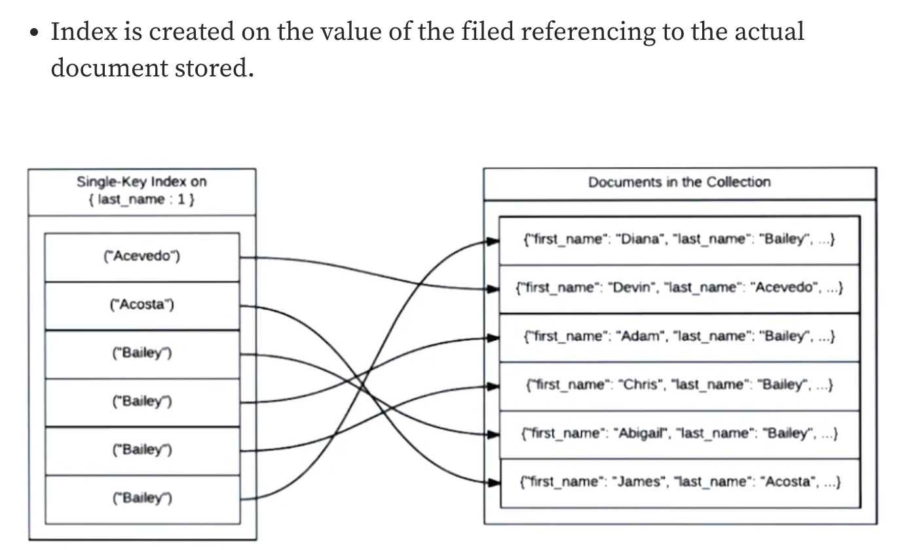

# Index

```
@author: suktae.choi
- https://docs.mongodb.com/manual/indexes/
- https://www.mongodb.com/docs/manual/core/index-creation/
- https://medium.com/swlh/mongodb-indexes-deep-dive-understanding-indexes-9bcec6ed7aa6
```

- `_id` 는 무조건 primary-index, 나머지는 secondary-index 
- 하나의 Collection 은 `최대 64개`의 인덱스 설정 가능
- _id 는 최대 `1KB`, 나머지는 `768 Bytes`
- 하나의 Document 는 최대 `16MB`

## Types
### Single Field Indexes
```json
db.user.createIndex({name:1});
db.user.getIndexes();
```

### Compound Indexes
```json
db.user.createIndex({name: 1, age: -1});
```

생성된 Index 에 따른 정렬방향이 중요하다

> Sort 방향은 index pattern and/or inverse index pattern 과 일치해야함

```json
db.user.createIndex({name:1, age:1, createDate:1})

- db.user.find({}).sort({name: 1, age: 1}) :: hit
- db.user.find({}).sort({name: -1, age: -1}) :: hit

- db.user.find({}).sort({name: 1, age: -1}) :: nope
- db.user.find({}).sort({name: -1, age: 1}) :: nope
```

### Multikey Indexes
```json
db.user.insert{ _id: 1, item: "ABC", ratings: [
  {name: "XXX", score: 100},
  {name: "YYY", score: 99}
]};

db.user.createIndex({ratings.score: 1});
```

### Wildcard Indexes
```json
db.user.createIndex({user.additionalAttributes.$** : 1});
```

추가속성처럼 어떤 유형이 들어갈지 알수없고 (schemaless 이므로) 각각의 sub-document 단위의 모든 필드를 index 지정하는 부담이 있을때 wildcard 사용

### Hashed Indexes
hashed index 로 지정된 field 의 인덱스로 해싱방식의 인덱스 사용가능

```json
db.user.createIndex({name: "hashed"});
```

### Clustered Indexes
기존에는 clustered-index 가 존재하지 않았고, 모든 인덱스는 실제 document address 를 직접 가지고 있었다.



5.3 버전 이후부터 clustered 가 지원된다.

```json
db.createCollection("stocks", 
  {clusteredIndex: {"key": {_id: 1}, "unique": true}}
)
```

## Properties
### Unique Indexes
```json
db.user.createIndex({ "name": 1}, {unique: true})
```

대신 shared-cluster 에서는 샤드키가 선행되어 포함되어야 생성가능

### Partial Indexes
```json
db.user.createIndex(
   {name: 1, age: 1},
   {partialFilterExpression: {age: {$gt: 19}}}
)
```
Partial indexes should be preferred over sparse indexes. Partial indexes provide the following benefits:
- Greater control over which documents are indexed.
- A superset of the functionality offered by sparse indexes.

### Sparse Indexes
nullable field 에 대한 인덱스 지정이 필요할때 사용한다

```json
db.user.createIndex({name: 1},  sparse: true})
```

위의 sparse index 는 동등한 partial indexes 로 아래와 같이 작성 가능합니다.

```json
db.user.createIndex(
   { name: 1 },
   { partialFilterExpression: {name: {$exists: true}}}
)
```

### TTL Indexes
```json
db.user.createIndex({"modDate": 1}, {expireAfterSeconds: 3600})
```

The background task that removes expired documents runs every 60 seconds.

- TTL indexes are single-field indexes. Compound indexes do not support TTL and ignore the expireAfterSeconds option.
- The _id field does not support TTL indexes.

## Index Builds
