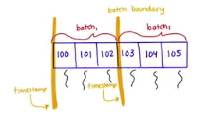

# Non-blocking Secondary Reads

```
@author: suktae.choi
- https://www.mongodb.com/blog/post/secondary-reads-mongodb-40
- https://medium.com/geekculture/mongodb-read-from-secondary-to-boost-performance-dca938a680ac
```

mongo 4.x 부터 primary --(replication)-- secondary 동안 read 는 non-blocking 입니다. 
 
- primary 의 oplog collection 을 secondary 는 주기적으로 가져옴
  - 그 기간동안 (데이터 무결성을 위해) read 도 blocking 됨
- 그래서 주기적으로 높은 `Global Lock` 이 발생하여 read 성능이 저하됨
- MongoDB 4.0 이상부터 timestamp와 consistent snapshot을 이용해서 이 이슈를 해결함
  - 즉(MVCC 한다는 의미임

