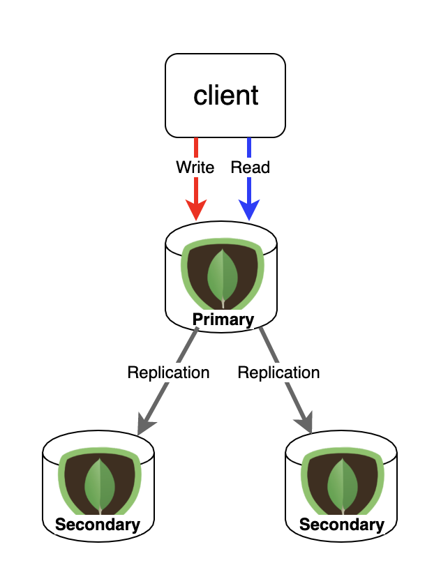

### Read Concern

```
ㅁ Author: suktae.choi
ㅁ References:
- https://docs.mongodb.com/manual/reference/read-concern/
```



### Prerequisites

#### Read Preferences

- ##### Primary

Read from primary.

If primary is unavailable, then failed

> Multi-Document transaction only works on this mode.

- ##### PrimaryPreferred

Read from primary.

If primary is unavailable, then read from secondary

- ##### Secondary

Read from secondary.

If secondary is unavailable, then failed

- ##### SecondaryPreferred

Read from secondary.

If secondary is unavailable, then read from primary

- ##### Nearest

Read from the lowest network latency node.

Choose candidates that has less latency than maxStalenessSeconds randomly

### Overview

#### local

현재 readPreference 로 지정된 node 의 recent document 를 가져온다. (== not major)

Default in:

- read from primary
- read from secondary if it is associated with casual consistent

#### available

> orphan document 에 대한 정리필요

지정된 replicaSets 에서 먼저 응답으로 온 document 를 가져온다. (== not major)

Default in:

- read from secondary if is not associated with casual consistent

> Replica sets behave `local` and `available` identically

#### majority

지정된 replicaSets 에서 majority 를 만족하는 document 를 가져온다.

PSA (Primary-Secondary-Arbiter) 모델사용시, majority 를 사용하면안됨

> Arbiter 는 투표만 할뿐이므로, PS 중 1대가 응답지연시 majority 를 항상 달성하지 못함

#### linearizable

#### snapshot