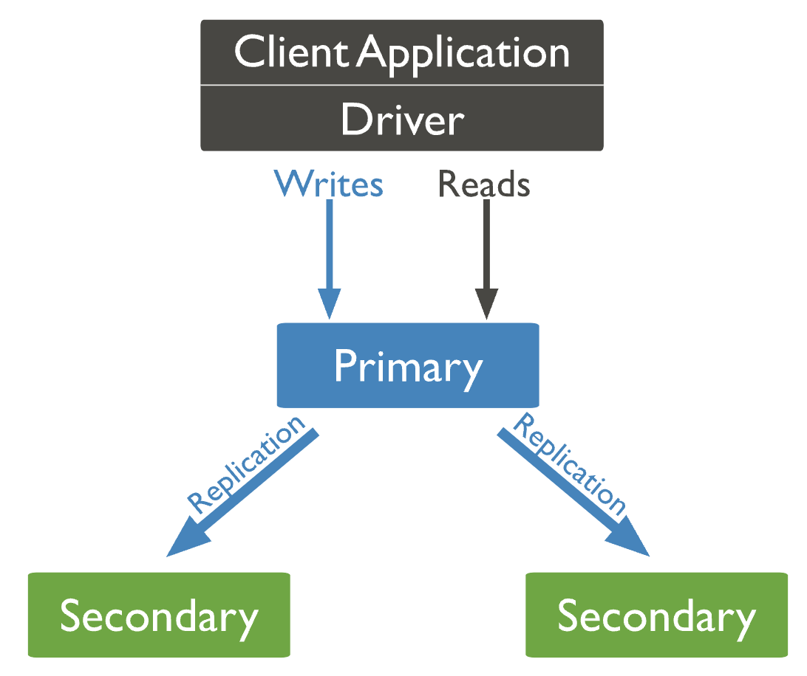

# ReplicaSet

```
@author: suktae.choi
- https://docs.mongodb.com/manual/replication/
```

### Index
- [Elections](elections)
- [Oplog](oplog)

***



## Members
### Primary
- 모든 write 연산은 primary 에서만 수행

### Secondary
- oplog 를 받아서 데이터 복제 (replication)
- read 연산은 secondary 에서도 가능

### Arbiter
- replication 은 하지 않고 election 에만 참여

### Multiple Arbiter
arbiter 가 election 에 참여할때 secondary 는 본인의 latest offset 을 기준으로 next-primary 를 선정하는데 arbiter 는 그냥 무조건 먼저온 응답에 대해 OK 합니다.

따라서 뒤쳐진 secondary 가 primary 로 선정될수 있고 이는 rollback 을 야기합니다. 이를 방지하기 위해 arbiter 는 최대1개만 유지하는게 좋습니다.

## Synchronization
MongoDB uses two forms of data synchronization: initial sync to populate new members with the full data set, and replication to apply ongoing changes to the entire data set.

### Initial Sync
replicaSet 의 member 에서 전체 데이터를 복사 하는 개념이다 (설정으로 `initialSyncSource` 지정가능)

- initialSourceSync 로 지정된 member 로 부터 모든 collection 을 카피
- index 카피
- initial sync 가 진행되는 동안 변경된 내역은 oplog 를 통해 catch-up

대신 traffic 을 받는 member 의 성능이 저하되므로, 백업파일을 통해 initial sync 수행후 oplog 를 catch-up 하는 방식이 추천됩니다

### Replication
Initial Sync 가 완료된 이후 ongoing changes 를 가져오는 방식을 의미합니다 (secondary 에서 async/pull 해서 가져옴)

(periodic 으로 or initial sync 이후) primary oplog collection 을 조회해서 delta 를 가져옵니다
