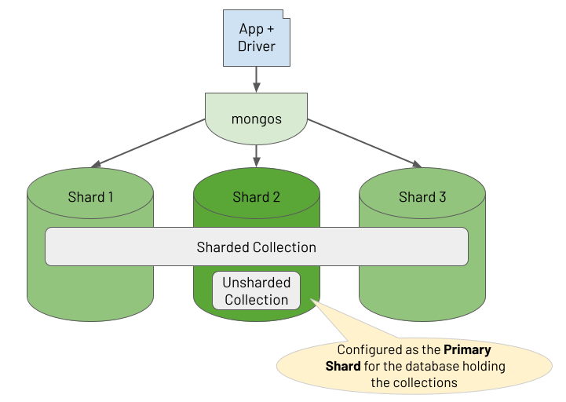

# Sharded Cluster

```
@author: suktae.choi
- https://docs.mongodb.com/manual/sharding/
- https://docs.mongodb.com/manual/core/sharding-shard-key/
- https://docs.mongodb.com/manual/tutorial/migrate-chunks-in-sharded-cluster/
- https://docs.mongodb.com/manual/core/sharding-data-partitioning/
```

### Index
- [Sharded Cluster Balancer](sharded-cluster-balancer)
- [Shard Keys](shard-keys)

***


## Components
### mongos (router)
applications 과 the sharded cluster 의 `routing` 을 처리합니다. 만약 load balancer 가 사이에 존재한다면 `client affinity` 설정 등을 통해 client -- mongod 간의 동일 connection 이 유지되도록 설정해야 합니다.

mongos 에 대한 개수 제한은 없지만 (즉 stateless 이고 많을수록 availability 높아짐) config servers 와 많은 통신이 발생하므로 config server 의 지표 확인이 더 중요합니다.

#### [Routing And Results Process](https://www.practical-mongodb-aggregations.com/guides/sharding.html)
mongos 는 routing 한 쿼리의 결과를 merge 해서 application 에 전달하는 역할을 합니다.

#### Targeted Operations
query 에서 shard key or prefix or compound shard key 가 포함된경우, 해당 shard 로만 쿼리가 라우팅됩니다

#### Broadcast Operations
mongos 가 어느 shard 에 데이터가 존재하는지 판단하지 못할경우 모든 shard 로 쿼리가 라우팅됩니다

### config servers
Config servers store metadata and configuration settings for the cluster.

#### Writes to Config Servers
의도적으로 config server 에 write 를 할수는 없고, chunk split/migration 이 진행되면 내부적으로 `w: majority` 로 write 가 발생합니다

#### Reads from Config Servers
mongo 가 start or metadata 변경이 있을때 (ex. chunk split/migration) `read: majority` 한후 cache 에 저장합니다.

### shard
Each shard contains a subset of the sharded data

#### Primary Shard
Shard Cluster 에서 샤딩하지 않은 collection 은 primary shard 에 저장됩니다



## Shard Keys
### Hashed Sharding
ShardKey 를 Hash 해서 샤딩하는 방식이다.

샤드키의 갯수만큼 해시의 테이블이 관리된다.

> 즉 데이터가 많아지면 Config 서버의 데이터도 linear 하게 증가하므로, 성능이 같이 느려진다.

### Ranged Sharding
해시를 하지않고, 범위로 짤라서 샤딩한다.

즉 샤드키가 close 한 document 일수록 동일 샤드에 있는 확률이 높다.

대신 부하가 특정샤드에만 집중될 수 있다. (분산되지 않음)

- linear 하게 증가하는 값이 샤드키라면, 일정범위까지 동일 샤드 (청크) 로 몰릴것이다.
- 즉 write 가 특정샤드로만 집중된다.

## Zones