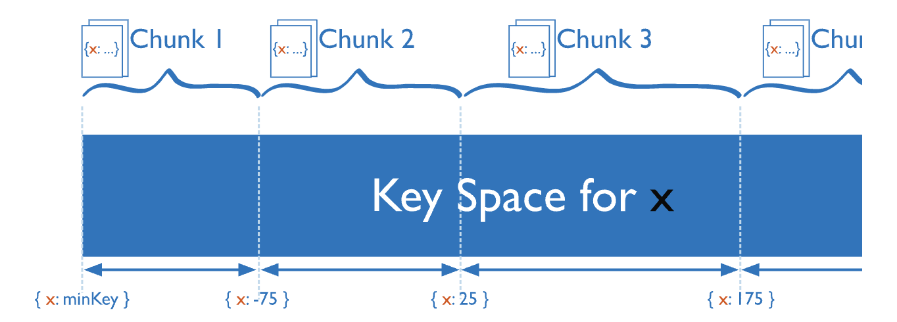

# Shard Keys

```
@author: suktae.choi
- https://www.mongodb.com/docs/manual/core/sharding-shard-key/
```

shard key 는 single or multiple field covered by compound index 로써 document 가 어느 shard 에 있는지 판단하는 식별자 이다



만약 샤드키가 지정되지 않는 쿼리가 요청온다면, 내부적으로 null 로 처리된다

- shard key: { x: 1, y: 1 }

| input            | treated                   |
|------------------|---------------------------|
| { x: "hello" }   | { x: "hello", y: null }   |
| { y: "goodbye" } | { x: null, y: "goodbye" } |
| { z: "oops" }    | { x: null, y: null }      |

