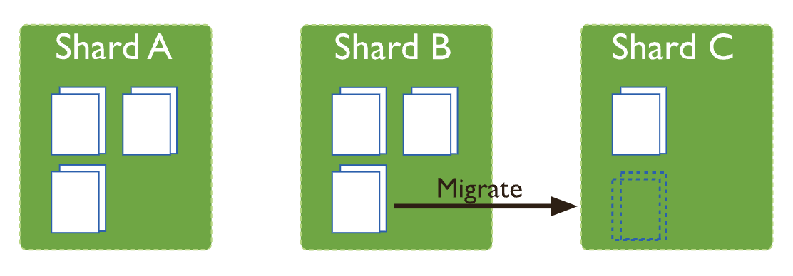

# Sharded Cluster Balancer

```
@author: suktae.choi
- https://www.mongodb.com/docs/manual/core/sharding-balancer-administration/
- https://hyunki1019.tistory.com/157
```

샤드에 데이터 (== chunk) 가 threshold 이상으로 누적되면 balancer 는 chunk migration 을 시도합니다. (background 로 동작)

> The balancer runs on the primary of the config server



## Chunks
### Chunk Migration
1개의 Chunk 는 최대 `64MB` (by default) 입니다

- Balancer 는 청크 불균형이면 (threshold 판단) 마이그레이션을 수행합니다
  - 절반으로 잘라서 다른 샤드로 분배
  - 마이그 도중 CUD 는 Source 가 처리
- Target 은 들어오는 Chunk 에 대한 인덱스 생성
- 복사시작
- 복사가 완료되면, 그동안의 변경분 delta 를 적용 by oplog (sync)
  - Blocking?
- 완료후 Source 는 config 에 접근해서 shard-key 정보 갱신 (이젠 target 으로 라우팅되도록)
- migration 완료된 청크는 삭제 (async)
  - source-secondary 에서는 `불일치 (== Orphan Document)` 가 발생 할 수 있다.

### Chunk Split
샤드 내 청크의 사이즈가 커지면 chunk split 이 발생합니다

- CUD 발생시 size/count 가 threshold 를 넘어서면 split

#### Jumbo Chunks
split 할 수 없는 chunk 를 Jumbo Chunks 라고 합니다

> 1개의 document size 가 chunk size threshold 를 차지는 경우는 split 하지 못함

MongoDB 는 chunk 단위로 data 를 가져오기 때문에 (== RDB 의 Page 개념) chunk 에 1개의 document 만 있다면 성능상 bottleneck 이 될 수 있습니다