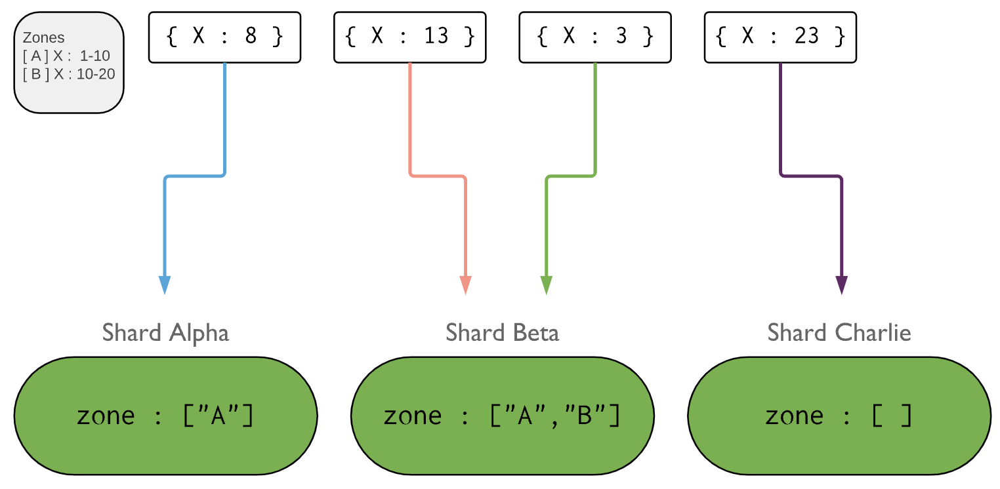

# Zone Sharding

```
@author: suktae.choi
- https://www.mongodb.com/docs/manual/core/zone-sharding/
```



shard key 를 기반으로 논리적인 그룹단위인 zone 을 생성 할 수 있습니다. (shard --1:N-- zone)

zone 을 통해 특정 dataset 의 위치를 지정 할 수 있습니다.

- Zone A
  - [alpha, beta] 에 존재
  - 미러링을 통해 `데이터 안정성` 확보
  - 그리고 alpha zone 을 특정 region 에 가까운 위치라고 본다면 `성능상 이점`이 있음