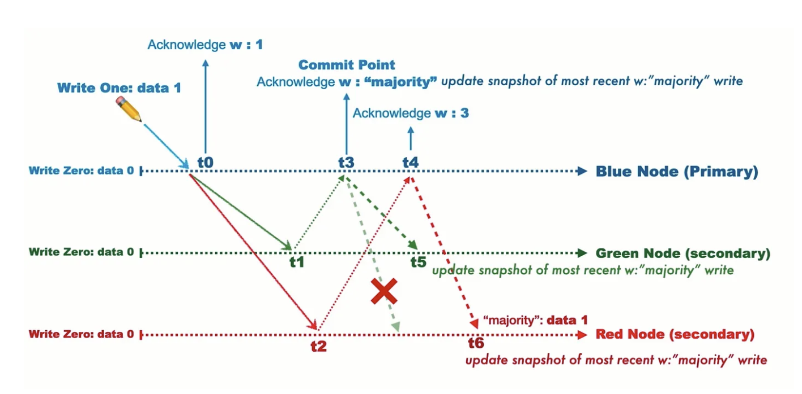

# Write Concern

```
@author: suktae.choi
- https://docs.mongodb.com/manual/reference/write-concern/
```


```json
db.collection.insert({...},
  {writeConcern: {
    w: 3,
    wtimeout: 150,
    j: false
  }
})
```

## w
The number of nodes that must be written before returning success

- 1 (default): primary only
- 2: primary + any of one secondary
- majority: members more than half



## j
The committed should be written in journal (a.k.a disk) not only in-memory

- true/false