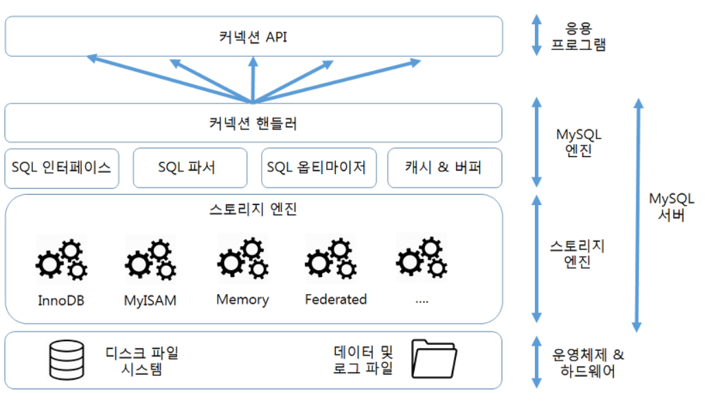
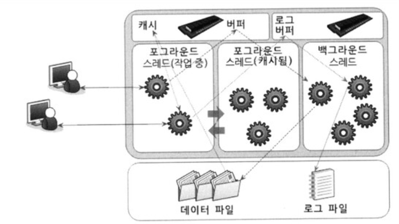
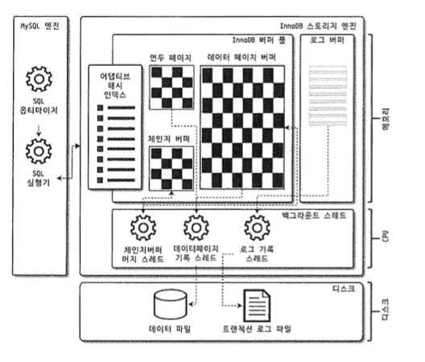
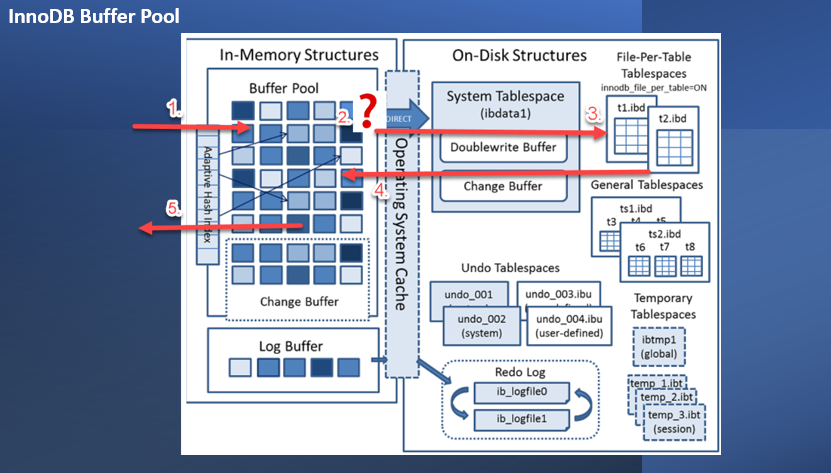

# MySQL
```
https://dev.mysql.com/doc/refman/8.0/en/
https://velog.io/@kmw89891/%EC%95%84%ED%82%A4%ED%85%8D%EC%B2%98
```

### Index
- [Optimizer](optimizer)
- [Execution Plan](execution-plan)
- [Isolation](isolation)
- [Locks](locks)
- [Index](index)
- [Join](join)
- [Replication](replication)
- [Prepared statement](prepared-statement)
- [MVCC](mvcc)
- [테이블 복제](insert-into-select)
- [중복 레코드 관리](duplicated-record)

### Blog
- [https://use-the-index-luke.com/sql/preface](https://use-the-index-luke.com/sql/preface)
- [Index Dive 비용 최적화](https://medium.com/daangn/index-dive-%EB%B9%84%EC%9A%A9-%EC%B5%9C%EC%A0%81%ED%99%94-1a50478f7df8)
- [EXISTS vs IN](https://velog.io/@emawlrdl/Oracle-IN-vs-EXISTS)
- [late row lookups](https://explainextended.com/2009/10/23/mysql-order-by-limit-performance-late-row-lookups/)

***


- MySQL
  - 커넥션 관리 (foreground thread)
  - 쿼리 실행 (파싱/전처리/옵티마이저 -> 실행계획 작성)
- Storage (InnoDB)
  - MySQL 엔진의 명령에 의해 실제 데이터의 read/write 담당

## Engine
### MySQL 엔진


- Foreground
  - 실제 client 요청을 받는 thread
  - 쿼리파싱/전처리/옵티마이징/실행계획 -> 최종적으로 실행할 SQL 을 결정합니다
  - 결정된 SQL 대로 스토리지 엔진을 호출해서 데이터를 조회/수정 합니다


### InnoDB 스토리지 엔진


- Background
  - MySQL 엔진을 통해 전달된 SQL 을 수행합니다
  - 버퍼갱신/로그/인덱스갱신/쓰기지연 ...

## Buffer
### Read Buffer (조회캐시)


Buffer 를 이용한 조회는 아래의 흐름으로 처리됩니다

- 버퍼검색
  - hash index 검색
  - B+Tree index 검색
  - 조회되었다면 MRU 방향으로 승급
- 디스크 조회후 LRU 에 추가
  - bulk 조회의 경우 Buffer 에는 올라가지만, MRU 로 승격은 되지않음
- 자주 조회 된다면, Hash index 에 추가

### Write Buffer (쓰기지연)
변경된 페이지를 (dirty pages) 메모리 buffer 에 임시 저장합니다
- 디스크로 바로 쓰지 않고 **변경된 페이지(dirty pages)**를 먼저 메모리에 유지합니다
  - 나중에 **백그라운드 쓰레드(flush thread)**가 디스크로 쓰는 구조
- `Redo 는 복원`을 위해 변경 내역을 영속화 해서 저장합니다 (Write-Ahead Log == WAL)

### Change Buffer (인덱스지연)
**보조 인덱스에 대한 DML**을 메모리 buffer 에 임시 저장합니다
- Secondary index 의 변경이 발생한 경우 > change buffer 에만 내용을 반영합니다 (메모리 인덱스 갱신)
- 이후 주기적/조회시점에 영속화 합니다

> Primary/Unique index 에는 해당되지 않음 (디스크 즉시 반영)

## Collation
`utf8mb4_0900_ai_ci` 기본값을 사용합니다

- utf8mb4
  - 4byte 문자셋 (emoji 지원)
- 0900
  - unicode 9.0
- ai
  - accent insensitive (대소문자 구분 없음)
- ci
  - case insensitive (대소문자 구분 없음)

## DataType
### 문자
| 타입        | 용량 제한                                | 길이    | 저장 방식            | 사용 용도                      |
|-------------|--------------------------------------|-------|------------------|-------------------------------|
| `CHAR(n)`   | 최대 255 **바이트**                       | 고정 길이 | 공백(0x00) 패딩하여 저장 | 짧고 정해진 길이 문자열        |
| `VARCHAR(n)`| 최대 65,535 **바이트** (전체 row 제한 포함)     | 가변 길이 | 길이 정보 + 데이터 저장   | 대부분의 가변 문자열 데이터   |
| `TEXT`      | 최대 4GB (== LONGTEXT) | 가변 길이 | 별도 LOB 저장        | 대용량 텍스트 (예: 본문, 설명) |

### 바이너리
| 타입          | 용량 제한                                | 길이    | 저장 방식                     | 사용 용도                     |
|---------------|--------------------------------------|-------|------------------------------|------------------------------|
| `BINARY(n)`   | 최대 255 **바이트**                       | 고정 길이 | 공백(0x00) 패딩하여 저장       | 고정 크기 바이너리 데이터     |
| `VARBINARY(n)`| 최대 65,535 **바이트** (전체 row 제한 포함)     | 가변 길이 | 길이 정보 + 데이터 저장       | 파일 이름, 해시 값 등         |
| `BLOB`        | 최대 4GB (== LONGBLOB) | 가변 길이 | 별도 LOB 저장            | 이미지, 동영상, 파일 바이너리 |
