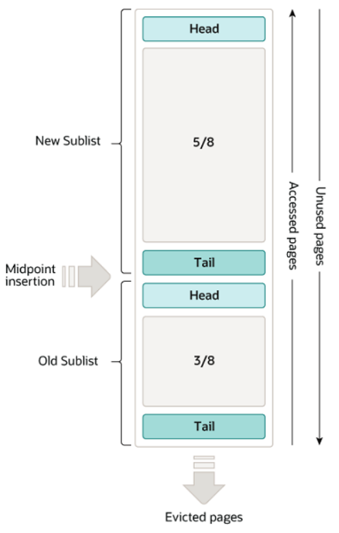

# MySQL

```
@author: suktae.choi
- https://dev.mysql.com/doc/refman/8.0/en/
- https://velog.io/@kmw89891/%EC%95%84%ED%82%A4%ED%85%8D%EC%B2%98
```

### Index
- [Data Type](datatype)
- [Optimizer](optimizer)
- [Execution Plan](execution-plan)
- [Isolation](isolation)
- [Locks](locks)
- [Index](index)
- [Join](join)
- [MMM](mmm)
- [Replication](replication)
- [Prepared statement](prepared-statement)
- [INSERT INTO SELECT](insert-into-select)
- [Duplicate Primary Key](duplicate-primary-key)

### Blog
- [https://use-the-index-luke.com/sql/preface](https://use-the-index-luke.com/sql/preface)
- [Index Dive 비용 최적화](https://medium.com/daangn/index-dive-%EB%B9%84%EC%9A%A9-%EC%B5%9C%EC%A0%81%ED%99%94-1a50478f7df8)
- [EXISTS vs IN](https://velog.io/@emawlrdl/Oracle-IN-vs-EXISTS)

***


- MySQL
  - 커넥션 관리 (foreground thread)
  - 쿼리 실행 (파싱/전처리/옵티마이저 -> 실행계획 작성)
- Storage (InnoDB)
  - MySQL 엔진의 명령에 의해 실제 데이터의 read/write 담당

## MySQL 엔진
### Thread 구조


종류

- foreground
  - 실제 client 요청을 받는 thread
- background
  - !foreground
  - log, buffer to disk(write), disk to buffer(read) ...
  
### 메모리 구조


- global
  - 모든 thread 가 공유
- local
  - 해당 session (foreground 단위) 에서만 사용하고 공유하지 않음
  - 조인버퍼, 소트버퍼
  
### 복제


- master
  - CRUD 단위 (모든 CUD 연산은 마스터에서만 수행)
  - binlog 생성
- slave
  - R 단위
  - 마스터 -- `pull` -- 슬레이브 로 데이터를 가져온 후 relaylog 생성
  - background thread 에서 relaylog 수행
  
```
binlog 형식은 2가지 방식이 있습니다.
- ROW 포맷
- STATEMENT 포맷

MySQL 8.x 부터 binlog 의 포맷이 ROW 가 기본값이 되었고 이해한 내용을 정리하면
- insert into select ... 처럼 동적인 결과로 insert 쿼리가 발생하면 (그리고 NOW() 문구도 포함해서)
- master/replicas 의 결과가 100% 동일하다고 보장할 수 없습니다 
```

### 쿼리캐시
쿼리의 결과를 캐시하는 기능 -> 8.x 에서 제거됨

> 필요하면 application 에서 직접 처리하는 방향성

## InnoDB 스토리지 엔진


record 기반 잠금을 제공합니다

### Clustering
모든 테이블은 기본적으로 clustering index 를 기준으로 정렬됩니다.
- PK
- or unique key
- or 자동생성 key

> secondary index 는 레코드의 주소 (== ROWID) 대신 primary key 를 저장합니다

```
그 이유는 아래와 같습니다:
-> insert/delete 이 실행되면 clustering index 기준으로 정렬된 ROWID 가 변경

- pros
 - secondary index 가 실제 ROWID 를 가지고 있다면 -> 모든 인덱스의 변경이 필요하므로 CUD 성능이 떨어집니다
 - ROWID 가 아닌 PK 를 저장하면 영향이 없습니다
- cons
 - select 시 secondary index -> clustering index 로의 2번탐색 비효율이 있습니다 
```

### MVCC (Multi Version Concurrency Control)
TBD

### 잠금 없는 일관된 읽기 (Non-Locking Consistent Read)
non-locking select (isolation: Serializable 이 아닌경우) 는 `현재 record lock 이 잡혀있더라도` UNDO 를 통해 대기없이 select 를 수행할 수 있습니다


## Buffer
read cache 및 delayed write 의 목적으로 사용합니다

### Read


Buffer 를 이용한 조회는 아래의 흐름으로 처리됩니다

- 버퍼검색
  - hash index 검색
  - B-Tree index 검색
  - 조회되었다면 MRU 방향으로 승급
- 디스크 조회후 LRU 에 추가
  - bulk 조회의 경우 Buffer 에는 올라가지만, MRU 로 승격은 되지않음
- 자주 조회 된다면, Hash index 에 추가

### Write
변경된 데이터는 buffer 와 redo log 에 저장됩니다 (Write-Ahead Log == WAL)

- buffer 에 저장된 데이터는 조회시 수정된 내용을 응답하기 위해 저장되고
- `Redo 는 복원을 위함` 입니다

## Redo (복원)
Redo 는 주기적인 checkpoint 이벤트가 발행되면 최종적으로 disk 에 저장됩니다.

> 즉 복원이 가능한 데이터는 마지막 checkpoint 까지의 데이터 입니다

## Undo (MVCC)


- A: 진행중
- B, C: commit 완료 및 undo 저장

이런 상황에서 (undo 로그에서) A 가 보는 TxID 는 오래전 데이터 이므로, old undo 는 정리되지 않습니다.

## Hash index
B-Tree 의 탐색 단점을 극복하기 위한 Hash-Table 인덱스 (자주 조회하는 page 의 키값으로 해시 인덱스 생성후 즉시 조회)

- pros
  - 단건 탐색에 특화
- cons
  - range scan 불가능 (B-Tree 는 leaf 에서 linked-list 로 스캔가능)
  - like, join 에도 적용 어려움

## Change buffer
인덱스의 변경이 발생했을때 (DML 쿼리)

- Buffer 에 인덱스가 있다면: 버퍼에 즉시반영
- 없다면: Change Buffer 에 기록 (쓰기지연) -> 이후 조회를 통해 page 가 버퍼에 저장된다면 change buffer 내용이 index 에 포함됨

대신 DISK 에 즉시반영 하지 않으므로 P.K or unique index 에는 change buffer 가 적용되지 않습니다

