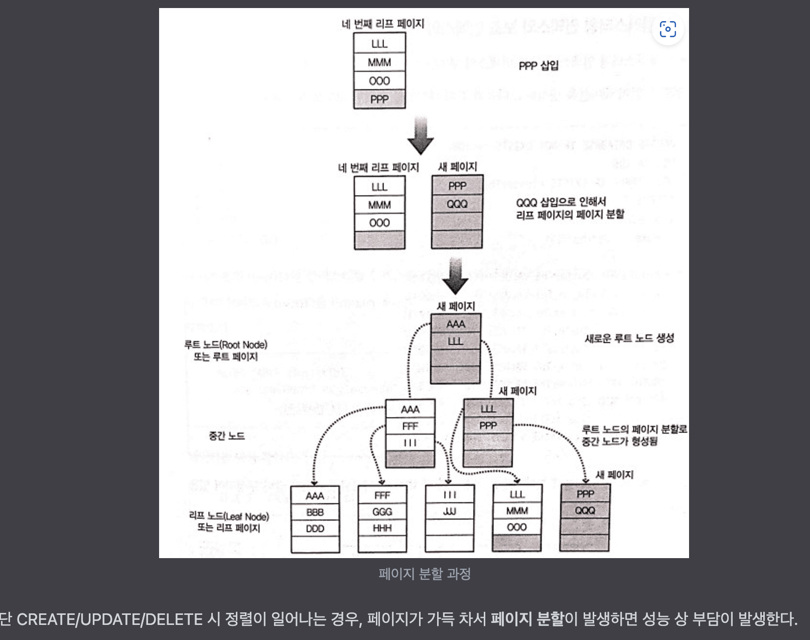

# Clustered Index

```
@author: suktae.choi
- https://wslog.dev/mysql-index#4c8551fdf047448290cb393ad7cd51c6
```

Mysql 은 데이터를 `페이지단위 (기본: 16KB)` 로 관리하고, RID 는 페이지의 주소이다.



- clustered-index
  - leaf node 는 RID (== ROWID) 를 가짐 (페이지의 시작주소)
- secondary-index
  - leaf node 는 primary-key 를 가짐

> Clustered index 로 지정한 컬럼에 맞춰서 실제 데이터를 정렬함

- CUD 발생
- 데이터의 정렬진행 (clustered-index 로 지정된 컬럼에 맞춰서)
- (CUD 된 데이터로 인해) `페이지 분할`이 발생하면, 각 데이터의 RID 가 변경됨
  - `a(rowid:1)-b(2)-x(3)-y(4)-z(5)` 로 정렬된 상태에서 c 가 들어오면 -> `a(rowid:1)-b(2)-c-(3)-x(4)-y(5)-z(6)`
- 그에 따라 clustered-index 가 가지고 있는 RID 도 전체 갱신 (즉 인덱스 갱신이 발생)

> 하지만 secondary-index 는 RID 가 아닌 primary-index 를 참조 하므로 갱신 스킵

즉 select 이득보다, craete/insert/delete 시 잃는 성능이 더 크므로 secondary-index 는 leaf node 에 p.k 를 참조합니다.