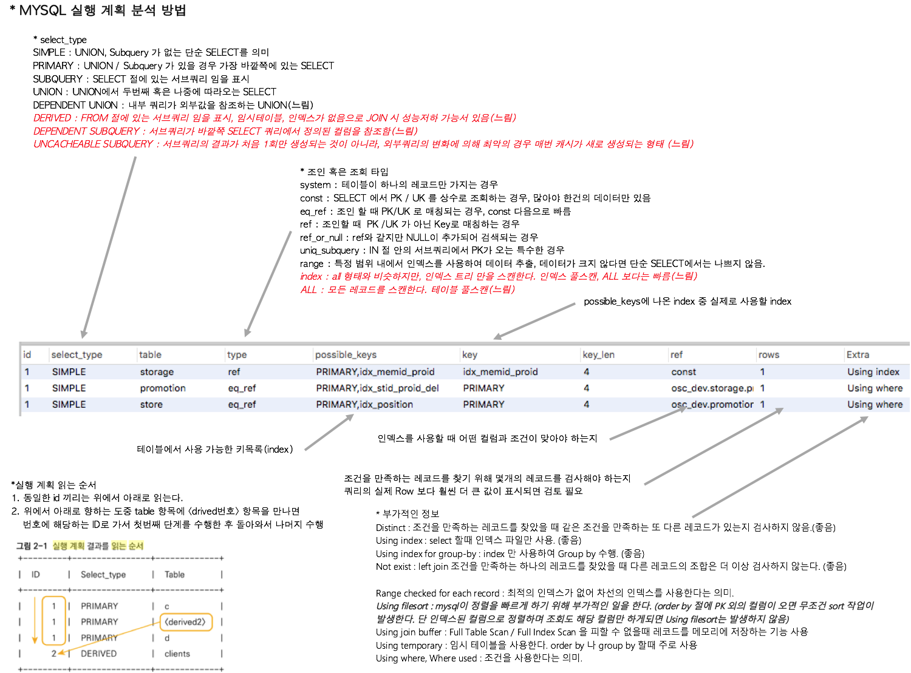

# Execution Plan

```
@author: suktae.choi
- http://devse.tistory.com/entry/MYSQL-%EC%8B%A4%ED%96%89%EA%B3%84%ED%9A%8D-%EB%B6%84%EC%84%9D-%EB%B0%A9%EB%B2%95-%EC%9A%94%EC%95%BD
- https://12bme.tistory.com/73?category=682920
```

## 통계 정보

MySQL 5.5 이전까지는 통계정보를 메모리에 저장했지만, 이후 부터는 테이블에 저장해서 영속적으로 통계정보를 관리합니다.

> 재시작시 통계가 초기화되서 실행계획이 잘못 선택되는 문제점 해결

다만 통계정보는 대략적인 정보만 저장합니다:

- 테이블의 `전체 record 개수`
- `인덱스의 유니크한 값의 개수` (== distinct 한 개수를 의미)

아래의 쿼리가 수행되면 통계정보 기반으로는 10개의 record 가 나올것으로 예측합니다.

```sql
# record: 1000개, uniqueness: 100개 (== last_name 인덱스의 group by 개수)
selct * from order where last_name = 'lee';
```

하지만 평균값이고 실제 데이터의 분포와는 다르므로 정확한 예측을 할 수 없습니다.

## 히스토그램

테이블의 표준분포를 알고 있어서 좀 더 정확한 예측이 가능합니다

> 정확히는 각 범위 (bucket) 구간마다 레코드개수/유니크개수 의 정보를 생성해서 대략적인 분포도를 만듬

## Index dive

실행계획을 생성할때 조건절에 있는 인덱스의 B-Tree 를 샘플링해서 보고 대략적인 레코드의 개수를 파악하는 것을 의미합니다.

위의 통계/히스토그램과는 다른 개념으로

- 통계/히스토그램: 이미 만들어진 정보 기반
- 인덱스 다이브: 실시간으로 B-Tree 를 샘플링해서 수집 및 활용

의 차이가 있습니다. 현재 MySQL 은 **인덱스컬럼이 조건에 있다면 항상 Index dive 로 동작**하고 인덱스가 없는 컬럼의 분포도를 참조할때는 히스토그램/통계를 사용합니다

> B-Tree 를 직접 보는게 좀 더 정확한 정보이기도 하고 샘플링하므로 performance impact 적음

## 실행계획

실행계획에 표시되는 각 칼럼의 의미는 [LINK](https://zzang9ha.tistory.com/436) 로 대체합니다.

- 통계/히스토그램 기반으로 예측된 실행계획
  - `EXPLAIN FORMAT=TREE ...` 으로 출력포맷을 변경하면 DEPTH 가 포함되어 실제 실행된 순서를 알 수 있습니다

```sql
EXPLAIN SELECT * FROM employee WHERE emp_no BETWEEN 100001 AND 200000;

# 결과
+----+-------------+--------+------------+-------+---------------+---------+---------+------+-------+----------+-------------+
| id | select_type | table  | partitions | type  | possible_keys | key     | key_len | ref  | rows  | filtered | Extra       |
+----+-------------+--------+------------+-------+---------------+---------+---------+------+-------+----------+-------------+
|  1 | SIMPLE      | employee   | NULL       | range | PRIMARY       | PRIMARY | 4       | NULL | 20080 |   100.00 | Using where |
+----+-------------+--------+------------+-------+---------------+---------+---------+------+-------+----------+-------------+
1 row in set, 1 warning (0.00 sec)
```

- 인덱스다이브 기반으로 실제 연산된 실행계획

```sql
EXPLAIN ANALYZE SELECT * FROM employee WHERE emp_no BETWEEN 100001 AND 200000;

+--------------------------------------------------------------------------------------------------------------------------------------------------------------------------------------------------------------------------------------------------------------------------------------------------------------+
| EXPLAIN                                                                                                                                                                                                                                                                                                      |
+--------------------------------------------------------------------------------------------------------------------------------------------------------------------------------------------------------------------------------------------------------------------------------------------------------------+
| -> Filter: (`employee`.`emp_no` between 100001 and 200000)  (cost=4021.24 rows=20080) (actual time=0.066..209.340 rows=10025 loops=1)
  -> Index range scan on employee using PRIMARY over (100001 <= emp_no <= 200000)  (cost=4021.24 rows=20080) (actual time=0.035..77.344 rows=10025 loops=1)|
+--------------------------------------------------------------------------------------------------------------------------------------------------------------------------------------------------------------------------------------------------------------------------------------------------------------+
```



