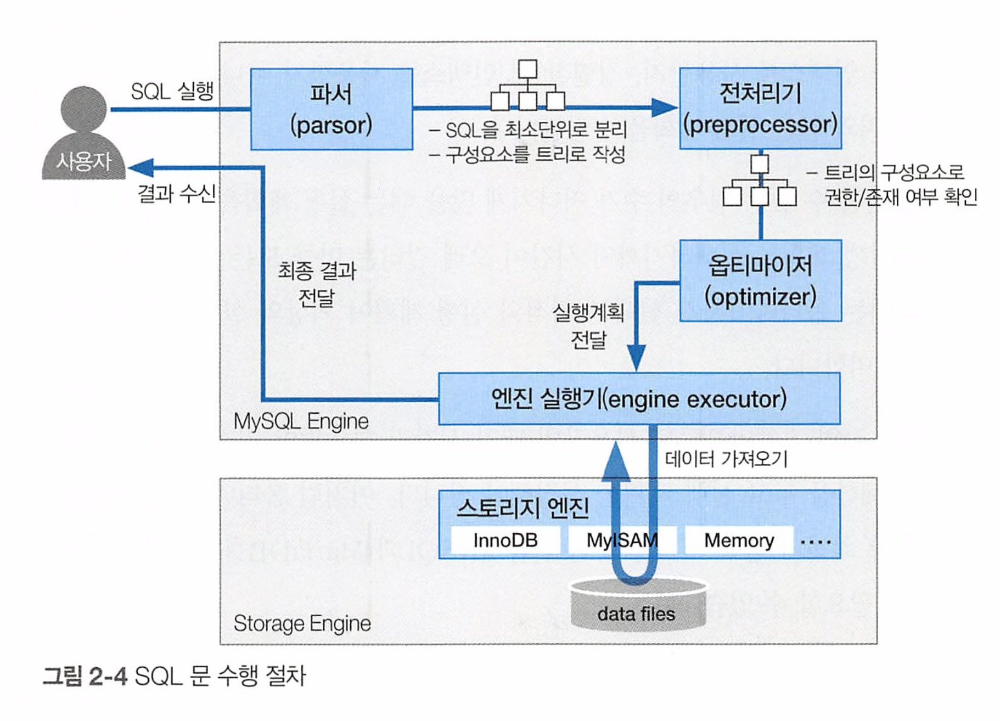
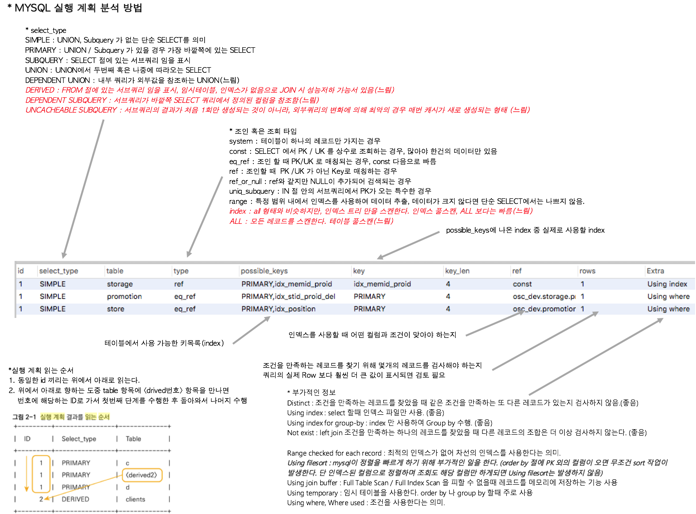

# Execution Plan

```
https://12bme.tistory.com/73?category=682920
```

## 쿼리 실행


- `파서`
  - 쿼리 구문을 토큰으로 분리해 트리 구조로 만드는 작업을 수행합니다. (문법 오류는 이 과정에서 발견)
- `전처리기`
  - 파서 트리의 구성요로 테이블/컬럼/권한 여부 등을 확인합니다
- `옵티마이저`
  - 입력된 SQL 을 가장 효율적으로 처리 할 수 있도록 방법을 결정합니다. 즉 `실행계획을 작성하는 단계` 입니다.
- `실행 엔진`
  - 핸들러와 통신하면서 실제 데이터 가져옵니다. 즉, `만들어진 실행 계획대로 핸들러에게 요청해서 받은 결과를 또 다른 핸들러 요청의 입력으로 연결하는 역할을 수행` 합니다.
- 스토리지 엔진 (핸들러. InnoDB)
  - MySQL 서버의 가장 밑단에서 실행 엔진의 요청에 따라 데이터를 디스크로 저장하고 디스크로부터 읽어옵니다. 즉 `실질적인 IO 를 수행합니다.`

## 결과 분석
각 칼럼의 의미는 [LINK](https://0soo.tistory.com/235) 로 대체합니다.



- key_len
    - key 칼럼에 표시된 인덱스의 길이를 표시합니다
    - compound-index 인 경우 key_len 을 통해 어디까지 인덱스가 사용됐는지 알 수 있습니다
    - 그리고 nullable 칼럼은 null 인지 아닌지 저장하기 위한 1 byte 가 추가로 사용됩니다 (인덱스 뿐만 아니라 모든 칼럼에 해당함)
- rows
    - 실행계획이 key 을 사용했을때 리턴 될거라고 `예측한 레코드 개수`
- filtered
    - rows 로 예측된 개수에서 실제 리턴된 레코드의 비율
    - rows=100, filtered=20 => 100 * (20 / 100) == 20개 가 실제 레코드 개수 입니다