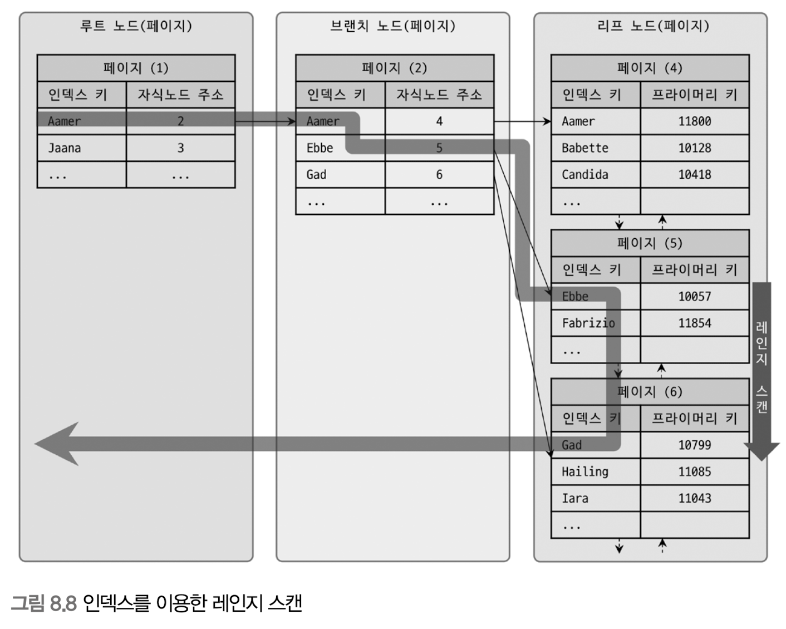

# Index

```
@author: suktae.choi
- https://12bme.tistory.com/138?category=682920
- https://wslog.dev/mysql-index#4c8551fdf047448290cb393ad7cd51c6
```

## Clustered Indexes
Mysql 은 데이터를 `페이지단위 (기본: 16KB)` 로 관리하고, RID 는 페이지의 주소이다.



- clustered-index
  - leaf node 는 RID (== ROWID) 를 가짐 (페이지의 시작주소)
- secondary-index
  - leaf node 는 primary-key 를 가짐

> Clustered index 로 지정한 컬럼에 맞춰서 실제 데이터를 정렬함

- CUD 발생
- 데이터의 정렬진행 (clustered-index 로 지정된 컬럼에 맞춰서)
- (CUD 된 데이터로 인해) `페이지 분할`이 발생하면, 각 데이터의 RID 가 변경됨
  - `a(rowid:1)-b(2)-x(3)-y(4)-z(5)` 로 정렬된 상태에서 c 가 들어오면 -> `a(rowid:1)-b(2)-c-(3)-x(4)-y(5)-z(6)`
- 그에 따라 clustered-index 가 가지고 있는 RID 도 전체 갱신 (즉 인덱스 갱신이 발생)

> 하지만 secondary-index 는 RID 가 아닌 primary-index 를 참조 하므로 갱신 스킵

즉 select 이득보다, craete/insert/delete 시 잃는 성능이 더 크므로 secondary-index 는 leaf node 에 p.k 를 참조합니다.

## [단일 vs 다중 인덱스](https://jojoldu.tistory.com/243)

```
INDEX A asc, B asc, C asc 
```

조회시 인덱스의 순서는 (ex. B A C) 크게 영향이 없다.

> Optimizer 가 인덱스를 보고 순서보정. (물론 순서를 보정하는 ops 가 들어가긴한다)

순서는 보정된다고 가정시, 조건의 누락은 아래처럼 영향이 있다:

- 두번째 컬럼은 첫번째에 의존
- 세번째 컬럼은 두번째에 의존
- ...

즉 첫번째 인덱스 컬럼 (A) 이 없으면, 해당 다중 인덱스는 타지 않는다.

대신 C A 가 조건이라면, A 를 타고 난 후 C 는 scan 해서 가져온다. (partially applied)

> b-tree 를 생각하면, 첫번째 인덱스를 기준으로 `A B C` 의 block 으로 트리가 구성되어 있다.

- A 컬럼이 조건에 없다면, 해당 트리는 사용불가
- C A 라면, A 로 우선 인덱스는 탄 후 나머지 트리의 full scan


## Why `IN` is not good

`=`, `in` 은 인덱스를 사용합니다.

- `in`은 결국 **= 을 여러번 실행**한 것이기 때문입니다.
- 단, `in`은 인자값으로 상수가 포함되면 문제 없지만, **서브쿼리를 넣게되면 성능상 이슈가 발생**합니다.
- `in`의 인자로 **서브쿼리가 들어가면 서브쿼리의 외부가 먼저 실행**되고, `in` 은 체크조건으로 실행되기 때문입니다.

## 자료구조
### B-Tree


- 범위 검색: 첫번째 범위의 left node 로 간 후, 리프노드만을 따라가며 검색
- 데이터블록: 노드에서 저장할수 있는 인덱스 크기
  - 추가: overflow 발생시, 새로운 블록 생성 및 깊이 증가. 한쪽으로 불균형 대칭이 되면 인덱스 재빌딩 (Full GC)
  - 삭제: 해당 인덱스에 flag 설정, 일정 이상되면 기존 블록과 병합 진행. 불균형 되면 인덱스 재빌딩

### Bitmap


- Data Structure: 2-dimensional array
- 검색: 해당 배열을 쭉 읽는다 (e.g. array[1]\[\])

### Why B-Tree is commonly used?

- 트리가 균형이 잡혔을다고 가정하면, 거의 대부분의 select 에서 동일한 응답 속도를 보장해 준다. (같은 Depth)
  - B-Tree 의 시간복잡도는 트리의 깊이(Depth) 에 결정됨, 균형잡힌 트리는 동일한 depth 로 구성되어 있음
  - 트리의 균형이 깨지는 경우 (특정 Leaf node 의 깊이가 다르다, 삽입/삭제가 많이 발생한 경우) 망가짐, 재구성 필요
- 우리가 인덱스 (pk) 로 주로 사용하는 키는 auto-increment 의 속성을 가진 (혹은 고루 넓은 범위의 숫자) id 인 경우가 대부분이므로 트리가 균형잡히게 구성된다. 그리고 변경이 거의 일어나지 않는다. 그래서 btree 가 대부분의 상황에서 적절
  - 최초 트리 구성시 균형 잡힘. 삽입/삭제가 거의 발생하지 않아 불균형하게 될 가능성 적음
