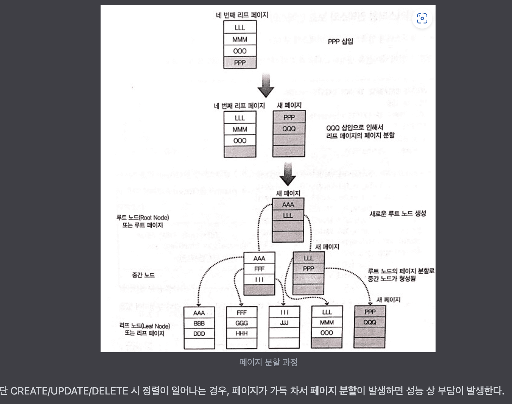
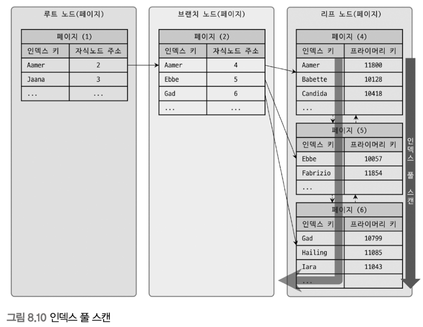
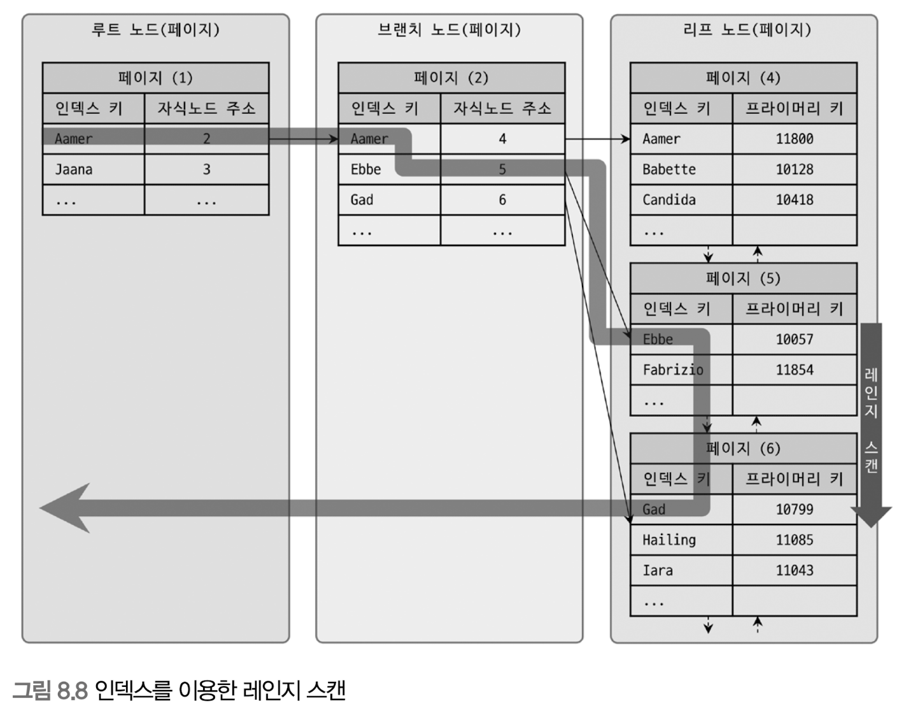
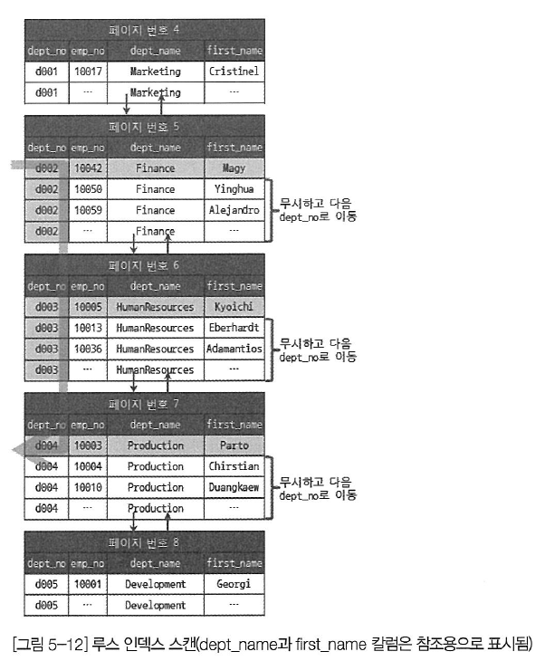
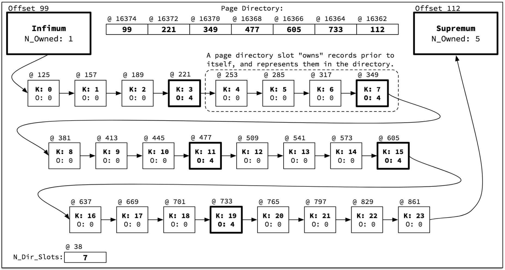

# Index
```
https://12bme.tistory.com/138?category=682920
https://wslog.dev/mysql-index#4c8551fdf047448290cb393ad7cd51c6
https://rebro.kr/167
https://rebro.kr/169
```

## 개요
인덱스는 수정 (CUD) 성능은 희생하고, 조회 (R) 속도를 높이는 기능입니다.

- like
  - 'xyz%' 는 인덱스 `사용` (xyz 까지 인덱스를 사용)
  - '%xyz' 는 인덱스 `미사용` (인덱스는 정의된 순서대로 조회하므로)
- 다중키 인덱스
  - 정의된 순서대로 조건 명시하면 인덱스 `사용`
  - 대신 Partial 도 가능 (a-b-c 로 정의된 인덱스에서 조건으로 a-b 사용)
- 비교 연산
  - =>, <= 인덱스 `사용`
- 부정 연산
  - NOT IN, != 또는 <>, 인덱스 `미사용`
- 동적인 결과 (함수, 계산식)
  - WHERE sum(col) == 10 의 함수는 동적인 값이므로 인덱스 `미사용` (인덱스 없음)
  - 인덱스 컬럼이 수정된 경우 인덱스 `미사용` (인덱스 없음)
  - `WHERE col + 1 = 10` 의 계산식도 동적인 값이므로 인덱스 `미사용` (인덱스 없음)
- 인덱스를 통한 랜덤 I/O는 순차적인 풀 스캔보다 훨씬 비용이 높으므로, 테이블의 많은 부분(예: 20-25% 이상)을 읽어야 할 때는 옵티마이저가 의도적으로 풀 스캔을 선택할수 있습니다
  - 즉 `전체 데이터에서 20-25% 이상` 조회할 경우 인덱스 사용은 비효율

## 방식
### B-Tree vs B+Tree vs [Hash](https://tech.kakao.com/posts/319)
B-Tree/B+Tree (Balanced Binary-Search Tree) 형태로 정렬해서 인덱스를 구성합니다.

본질적으로 [Balanced-Tree](https://rebro.kr/169) 이므로 불균형은 발생하지 않습니다:

> 삽입/삭제 시 항상 균형(balance) 을 유지하도록 노드 split/merge 수행

```
         [K20]            ← 루트 노드
      /         \
 [K10]         [K30]      ← 내부 노드
   |             |
[1,5,10] <-> [20,25,30]   ← 리프 노드 (양방향으로 연결됨. 데이터를 저장함)
```

| 항목    | B-Tree      | `B+Tree`                                 |
|-------|-------------|----------------------------------------|
| 저장 위치 | 중간/리프       | 리프                                     |
| 노드 연결 | X           | O (리프 노드 연결되어 있음. index range scan 가능) |
| 전체 탐색 | 트리 전체 재귀 탐색 | 리프 노드만 선형 탐색                           |
| 비고    | N/A         | 비슷한 응답 속도 보장                 |

Hash 인덱스는 Key 의 해싱값으로 인덱스를 구성합니다.

본질적으로 Hash 이므로 범위조회/정렬을 지원하지 않습니다: (단건 조회에 특화)

> InnoDB는 내부적으로 adaptive hash index 를 유지해, 자주 접근되는 B+Tree 경로를 해시로 캐싱

```
해시 함수
    |
    v
 +-----------+       +------------+
 |  "user1"  | --->  |  Bucket 1  | --> Record ID: 101, 102, 103, 104 ...
 +-----------+       +------------+
 |  "user2"  | --->  |  Bucket 2  | --> Record ID: 202, ...
 +-----------+       +------------+
 |  "user3"  | --->  |  Bucket 3  | --> Record ID: 303, ...
 +-----------+       +------------+
         ...         ...
```

## 종류
Mysql 은 데이터를 `페이지단위 (기본: 16KB)` 로 관리하고, RID (== ROWID) 는 페이지의 주소입니다

- clustered-index
  - leaf node 는 `페이지 주소를 가짐`
- secondary-index
  - leaf node 는 `clustered index 를 가짐`

### Clustered Indexes
기본적으로 P.K 가 clustered index 입니다. (P.K 가 없으면 unique-index or 묵시적 생성키)

Clustered index 의 `리프노드에 실제 데이터가 정렬되어 페이지 단위 (16KB)로 저장`됩니다.

> Clustered Index의 리프 노드가 바로 데이터가 저장된 데이터 페이지 그 자체

- 인덱스 변경이 발생한 경우
  - 인덱스 트리 갱신 발생
  - 클러스터링 인덱스는 리프에 페이지 (데이터) 자체를 정렬된 상태로 저장하므로, 데이터 이동 발생
- 특징
  - 장점: 범위탐색 성능이 좋음 (정렬되어 있으므로)
  - 단점: DML 발생시 인덱스갱신/데이터이동 모두 필요

```
-- employees 테이블에서 emp_no = 10050 인 직원 찾기 (emp_no가 PK)

        [루트 노드]
      (PK, 포인터)
      [10000, Ptr_A]
      [20000, Ptr_B]
            |
 (10050은 10000보다 크고 20000보다 작으므로 Ptr_A로 이동)
            ↓
        [브랜치 노드]
      (PK, 포인터)
      [10010, Ptr_C]
      [10080, Ptr_D]
            |
 (10050은 10010보다 크고 10080보다 작으므로 Ptr_C로 이동)
            ↓
    [리프 노드 == 데이터 페이지 (16KB)]
+-------------------------------------------------------------------+
|  [10048 | 'John' | 'Smith' | 'M' | '1990-01-01']  <-- 실제 데이터 행 |
|  [10049 | 'Jane' | 'Doe'   | 'F' | '1992-05-10']  <-- 실제 데이터 행 |
|  [10050 | 'Peter'| 'Jones' | 'M' | '1988-11-23']  <-- 찾았다!      |
|  ... (이 페이지에 들어갈 수 있는 만큼의 행들이 더 있음) ...         |
+-------------------------------------------------------------------+
```

DML 쿼리로 생성/변경된 경우 B+Tree 는 아래와 같이 갱신 됩니다:



- 생성
  - leaf node 의 page 사이즈 (16KB) 를 초과하면, 페이지 분할이 발생하고 상위까지 리밸런싱
- 수정
  - 리프노드의 재정렬이 발생하고, 이동된 페이지에서 사이즈 초과시 상위까지 리밸런싱 

### Secondary Indexes
Clustered Index 가 아닌 다른 모든 인덱스는 모두 Secondary Index 입니다
- 인덱스 변경이 발생한 경우
  - 인덱스 트리 갱신 발생
  - 세컨더리 인덱스는 리프에 P.K 를 참조하므로 데이터 정렬 미발생
- 특징
  - 장점: 인덱스 수정시 리프노드에 데이터 이동이 발생하지 않음 (리프노드는 P.K 만 저장)
  - 단점: 모든 조회는 secondary -> clustered 의 순서대로 2번 조회합니다

> 단점이 존재하지만 모든 인덱스가 데이터를 중복 저장하는 비효율 개선 (데이터 수정시 모든 인덱스의 리프를 수정하지 않아도 됨)

## 스캔 방식
### index full scan
- 인덱스의 시작 --- 종료까지 `전체 범위`를 traversal 하는 방식입니다
- 커버링인 경우 유효하지만 그게 아니라면 모든 row 의 랜덤 IO 가 발생합니다. (옵티마이저가 선택하지 않음)



### index range scan
- ```sql SELECT * FROM employees WHERE first_name BETWEEN 'Ebbe' AND 'Gad';```
- 인덱스의 시작 --- 종료까지 `특정 범위`를 traversal 하는 방식입니다
- 만약 row 가 버퍼에 없는 상태라면 각각 random IO 가 발생합니다



### index loose scan
- ```sql SELECT dept_no, MIN(emp_no) FROM dept_emp WHERE dep_no BETWEEN 'd002' AND 'd004' GROUP BY dept_no;```
- index range scan 을 수행하지만 불필요한 index 의 스캔은 SKIP 하는 방식입니다
- 해당 쿼리처럼 MIN, MAX, GROUP BY 등이 있을때의 최적화 입니다 



### index skip scan
- 복합키 인덱스를 사용하려면 정의된 순서대로 조건을 넣어야 합니다. (2번째 컬럼은 1번째 컬럼에 의존해서 정렬되어 있으므로 -> 첫번째 컬럼이 반드시 존재해야함)
- ```sql SELECT gender, birth_day FROM employee WHERE birth_day >= '1990-01-01'; ```
  - 인덱스는 [gender, birth_day] 복합키
- 옵타마이저는 아래의 최적화를 수행합니다:
  - 첫번째 인덱스를 묵시적으로 넣어줘서 복합키 인덱스를 사용할수 있도록 처리
  - ```sql SELECT gender, birth_day FROM employee WHERE gender = 'M' and birth_day >= '1990-01-01';```
  - ```sql SELECT gender, birth_day FROM employee WHERE gender = 'F' and birth_day >= '1990-01-01';```
- 장점
  - 개별 인덱스를 만들지 않아도됨
- 단점
  - 첫번째 컬럼에 중복이 많다면 (cardinality 낮음) 불필요한 드라이빙 데이터 조회가 발생하므로 비효율

## [스캔 방향](https://tech.kakao.com/posts/351)
MySQL 8.x 부터 DESC 인덱스의 생성을 지원합니다. (기존에도 DESC 는 문법적으로 허용지만 인덱스는 ASC 로 생성되고, 조회시 반대로 읽어야 했음)

> `ORDER BY AGE DESC;` 처럼 ASC 정렬된 인덱스를 역방향으로 읽어야 할때 필요

인덱스 자체를 역방향으로 생성하는 것과, 정방향 인덱스를 역방향으로 읽는 것은 성능의 차이가 있습니다:
- `페이지 내부의 레코드는 단방향으로만 연결`된 구조
  - 인덱스 자체는 양방향으로 연결되어 있으므로 (B+Tree) 역순으로 읽을때 성능 차이는 없습니다
  - 페이지 내부에 있는 인덱스 레코드는 단방향으로 생성되어 조회시 성능저하가 발생합니다
  
그래서 인덱스 생성 자체를 역방향으로 하면 해당 단점을 해결할 수 있습니다

