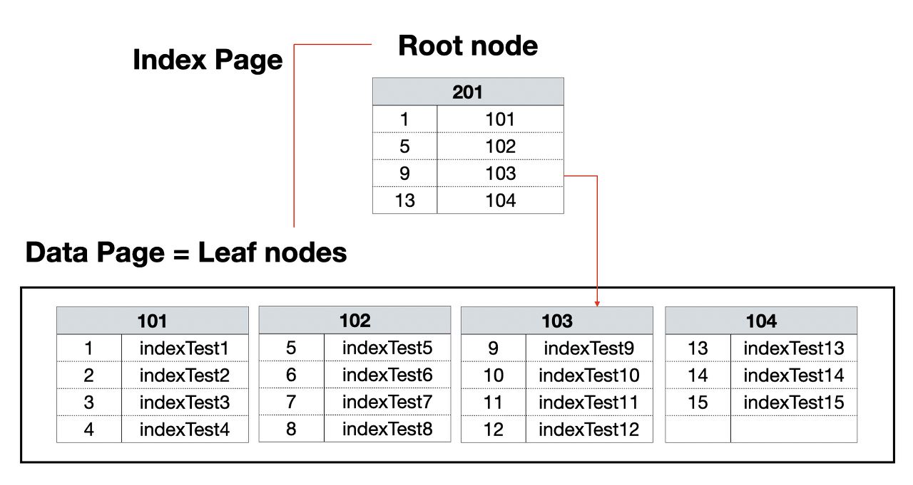
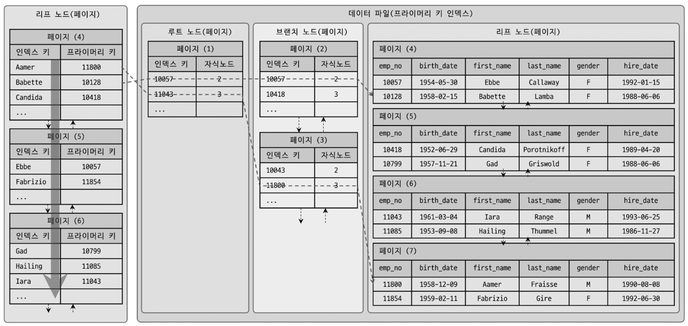
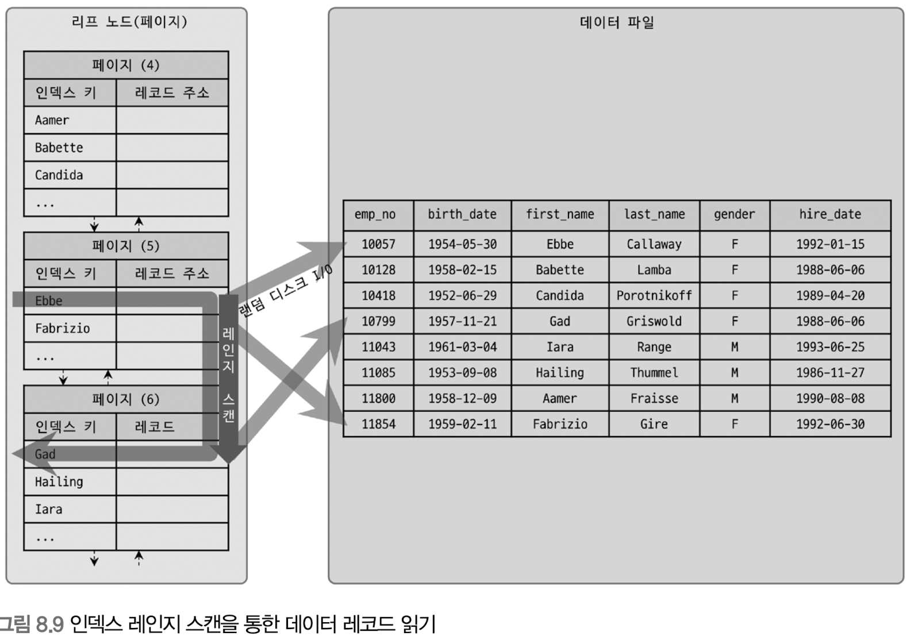

# Index
```
https://12bme.tistory.com/138?category=682920
https://wslog.dev/mysql-index#4c8551fdf047448290cb393ad7cd51c6
https://velog.io/@hyunrrr/%EC%9D%B8%EB%8D%B1%EC%8A%A4Index-%EC%A0%95%EB%B3%B5%EA%B8%B0-%EC%9E%91%EC%84%B1%EC%A4%91
```

## 개요
인덱스는 수정 (CUD) 성능은 희생하고, 조회 (R) 속도를 높이는 기능입니다.

- like
  - 'xyz%' 는 인덱스 `사용` (xyz 까지 인덱스를 사용)
  - '%xyz' 는 인덱스 `미사용` (인덱스는 정의된 순서대로 조회하므로)
- 다중키 인덱스
  - 정의된 순서대로 조건 명시하면 인덱스 `사용`
  - 대신 Partial 도 가능 (a-b-c 로 정의된 인덱스에서 조건으로 a-b 사용)
- 비교 연산
  - \>, < 인덱스 `사용`
- 부정 연산
  - NOT IN, !=, IS NOT NULL 인덱스 `미사용`
- 동적인 결과
  - sum(), avg() 등은 동적으로 생성된 값이므로 인덱스 `미사용` (인덱스 없음)
  - 인덱스 컬럼이 수정된 경우 인덱스 `미사용` (인덱스 없음)
- 인덱스 조회후 레코드를 읽는 과정은 대체적으로 4-5배 정도의 비용이 발생합니다
  - 즉 `전체 데이터에서 20-25% 이상` 조회할 경우 인덱스 사용은 비효율 입니다

## 방식
### B-Tree vs B+Tree vs Hash
B-Tree/B+Tree 인덱스는 트리형태로 정렬해서 인덱스를 구성합니다.

본질적으로 Balaned-Tree 이므로 불균형은 발생하지 않습니다:

> 삽입/삭제 시 항상 균형(balance) 을 유지하도록 노드 split/merge 수행

```
         [K20]            ← 루트 노드
      /         \
 [K10]         [K30]      ← 내부 노드
   |             |
[1,5,10] <-> [20,25,30]   ← 리프 노드 (양방향으로 연결됨. 데이터를 저장함)
```

| 항목    | B-Tree      | B+Tree                                 |
|-------|-------------|----------------------------------------|
| 저장 위치 | 중간/리프       | 리프                                     |
| 노드 연결 | X           | O (리프 노드 연결되어 있음. index range scan 가능) |
| 전체 탐색 | 트리 전체 재귀 탐색 | 리프 노드만 선형 탐색                           |
| 비고    | N/A         | 비슷한 응답 속도 보장                 |

Hash 인덱스는 Key 의 해싱값으로 인덱스를 구성합니다.

본질적으로 Hash 이므로 범위조회/정렬을 지원하지 않습니다: (단건 조회에 특화)

> InnoDB는 해시 인덱스를 직접 지원하지 않지만 내부적으로 adaptive hash index 를 유지해, 자주 접근되는 B+Tree 경로를 해시로 캐싱

```
해시 함수
    |
    v
 +-----------+       +------------+
 |  "user1"  | --->  |  Bucket 1  | --> Record ID: 101, 102, 103, 104 ...
 +-----------+       +------------+
 |  "user2"  | --->  |  Bucket 2  | --> Record ID: 202, ...
 +-----------+       +------------+
 |  "user3"  | --->  |  Bucket 3  | --> Record ID: 303, ...
 +-----------+       +------------+
         ...         ...
```

## 종류
Mysql 은 데이터를 `페이지단위 (기본: 16KB)` 로 관리하고, RID (== ROWID) 는 페이지의 주소입니다

- clustered-index
  - leaf node 는 `페이지 주소를 가짐`
- secondary-index
  - leaf node 는 `clustered index 를 가짐`

### Clustered Indexes
기본적으로 P.K 가 clustered index 입니다. P.K 가 없는 경우 unique-index -> (없으면) 묵시적으로 생성하는 키의 순서대로 지정됩니다.

실제 데이터는 `Clustered index 로 지정한 컬럼에 맞춰서 정렬되어 저장`됩니다:

- 테이블에 CUD 발생 (업데이트는 클러스터링 인덱스가 변경되었다고 가정하면)
- (물리적인) `데이터 재정렬 발생`
- (재정렬로 인해) `페이지 분할` 발생시, 각 데이터의 RID 변경
  - `a(rowid:1)-b(2)-x(3)-y(4)-z(5)` 로 정렬된 상태에서 c 가 들어오면 -> `a(rowid:1)-b(2)-c-(3)-x(4)-y(5)-z(6)`
- 그에 따라 RID 도 전체 갱신
  - `인덱스 갱신 발생`




### Secondary Indexes
Clustered Indexes 가 아닌 다른 모든 인덱스는 모두 Secondary Indexes 입니다

데이터의 변경이 발생해도, Clustered Indexes 를 값으로 가지므로 성능에 영향이 없습니다

- 테이블에 CUD 발생
- 리프노드는 clustered index 를 참조 하므로 영향 없음
  - 장점: CUD 시 영향을 받지 않습니다
  - 단점: 모든 조회는 secondary -> clustered 의 순서대로 2번 조회합니다
- 단점이 존재하지만 데이터 변경시 모든 인덱스를 갱신하는 비용이 크므로 해당 구조로 구성 

> Unique indexes 도 Secondary Indexes 의 일부 지만 인덱스 갱신시 change buffer (쓰기지연) 를 사용하지 않음

### DML 발생시
- 생성
  - leaf node 의 page 사이즈 (16KB) 를 초과하면, 페이지 분할이 발생하고 (상위) branch node 까지 리밸런싱이 발생합니다
  - change buffer 를 통해 지연처리 가능하지만, 중복체크가 필요한 (pk or unique index) 는 즉시 IO 발생합니다
- 조회
  - 리프노드는 two-way 로 traversal 가능
  - DML 쿼리도 인덱스를 통해 조회 -> lock (record, next-key, gap 등) 을 수행합니다


## 스캔 방식
### index range scan
- ```sql SELECT * FROM employees WHERE first_name BETWEEN 'Ebbe' AND 'Gad';```
- 인덱스의 시작 --- 종료까지 `특정 범위`를 traversal 하는 방식입니다
- 만약 row 가 버퍼에 없는 상태라면 각각 random IO 가 발생합니다




### index full scan
- 인덱스의 시작 --- 종료까지 `전체 범위`를 traversal 하는 방식입니다
- 커버링인 경우 유효하지만 그게 아니라면 모든 row 의 랜덤 IO 가 발생합니다. (옵티마이저가 선택하지 않음)


### index loose scan
- ```sql SELECT dept_no, MIN(emp_no) FROM dept_emp WHERE dep_no BETWEEN 'd002' AND 'd004' GROUP BY dept_no;```
- index range scan 을 수행하지만 불필요한 index 의 스캔은 SKIP 하는 방식입니다
- 해당 쿼리처럼 MIN, MAX, GROUP BY 등이 있을때의 최적화 입니다 


### index skip scan
- compound-index 가 있을경우 조건은 순서대로 명시되야 합니다. (2번째 컬럼은 1번째 컬럼에 의존해서 정렬되어 있으므로 -> 첫번째 컬럼이 반드시 존재해야함)
- ```sql SELECT gender, birth_day FROM employee WHERE birth_day >= '1990-01-01'; # 인덱스는 [gender, birth_day] 의 복합키```
- 해당 쿼리일때 복합키 인덱스를 사용하기 위해 옵타마이저는 아래의 최적화를 수행합니다
- ```sql SELECT gender, birth_day FROM employee WHERE gender = 'M' and birth_day >= '1990-01-01'; SELECT gender, birth_day FROM employee WHERE gender = 'F' and birth_day >= '1990-01-01';```
  - 첫번째 인덱스를 묵시적으로 넣어줘서 복합키 인덱스를 사용할수 있도록 처리
- 장/단점이 존재합니다
  - pros
    - 개별 인덱스를 만들지 않아도됨
  - cons
    - 첫번째 컬럼이 다양하다면 (cardinality 높음) 너무 많은 쿼리가 (내부저긍로) 수행되므로 비효율


## [스캔 방향](https://tech.kakao.com/posts/351)
MySQL 8.x 부터 DESC 인덱스의 생성을 지원합니다. (기존에도 DESC 는 문법적으로 허용지만 인덱스는 ASC 로 생성되고, 조회시 반대로 읽어야 했음)

> `ORDER BY AGE DESC;` 처럼 ASC 정렬된 인덱스를 역방향으로 읽어야 할때 필요

인덱스 자체를 역방향으로 생성하는 것과, 정방향 인덱스를 역방향으로 읽는 것은 성능의 차이가 있습니다:
- `페이지 내부의 인덱스 레코드는 단방향으로만 연결`된 구조
  - 인덱스 자체는 양방향으로 연결되어 있으므로, 역순으로 읽었을때 성능의 차이는 없습니다
  - 페이지 내부에 있는 인덱스 레코드는 단방향으로만 생성되어 (기존 Mysql 기준) 조회시 성능저하가 발생합니다
  
그래서 인덱스 생성 자체를 역방향으로 하면 해당 단점을 해결할 수 있습니다

