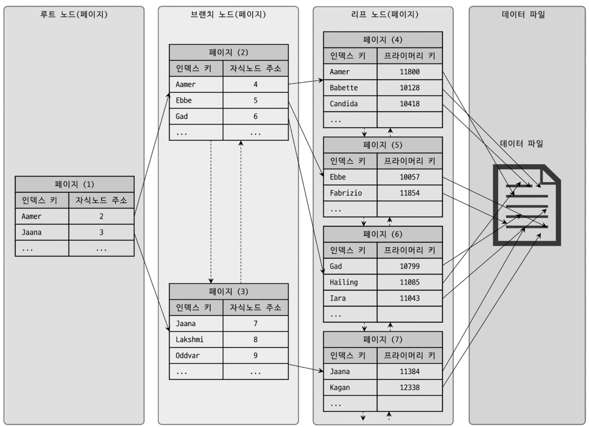

# Index

```
@author: suktae.choi
- https://12bme.tistory.com/138?category=682920
- https://wslog.dev/mysql-index#4c8551fdf047448290cb393ad7cd51c6
- https://velog.io/@hyunrrr/%EC%9D%B8%EB%8D%B1%EC%8A%A4Index-%EC%A0%95%EB%B3%B5%EA%B8%B0-%EC%9E%91%EC%84%B1%EC%A4%91
```

인덱스는 수정 (CUD) 성능은 희생하고, 조회 (R) 속도를 높이는 기능입니다.

## 알고리즘
### B-Tree
B-Tree 는 불균형이 아니라면 대부분의 select 에 비슷한  응답 속도를 보장합니다.

> 즉 Tree depth deeper means 조회속도가 느려짐을 의미합니다. (일반적으로 5-depth 미만 ) 

#### 구조


- secondary index 의 leaf node 는 clustering index 을 가지고 있습니다.
- secondary index 를 통해 range-scan 할 경우 각 row 는 random IO 로 가져와야 합니다. (정렬되어 있지 않음) 해당 사이즈가 `전체의 20-25%` 를 넘는다면 table full-scan 이 유리합니다


- clustering index 의 leaf node 는 실제 row 가 정렬되어 있습니다 (조회시 버퍼를 통해 메모리에 올라감)

#### DML
- 생성
  - leaf node 의 page 사이즈 (16KB) 를 초과하면, 페이지 분할이 발생하고 (상위) branch node 까지 리밸런싱이 발생합니다
  - change buffer 를 통해 지연처리 가능하지만, 중복체크가 필요한 (pk or unique index) 는 즉시 IO 발생합니다
- 조회
  - 리프노드는 two-way 로 traversal 가능
  - DML 쿼리도 인덱스를 통해 조회 -> lock (record, next-key, gap 등) 을 수행합니다


#### 스캔 방식
- index range scan
  - ```sql SELECT * FROM employees WHERE first_name BETWEEN 'Ebbe' AND 'Gad';```
  - 인덱스의 시작 --- 종료까지 `특정 범위`를 traversal 하는 방식입니다
  - 만약 row 가 버퍼에 없는 상태라면 각각 random IO 가 발생합니다


- index full scan
  - 인덱스의 시작 --- 종료까지 `전체 범위`를 traversal 하는 방식입니다
  - 커버링인 경우 유효하지만 그게 아니라면 모든 row 의 랜덤 IO 가 발생합니다. (옵티마이저가 선택하지 않음)


- index loose scan
  - ```sql SELECT dept_no, MIN(emp_no) FROM dept_emp WHERE dep_no BETWEEN 'd002' AND 'd004' GROUP BY dept_no;```
  - index range scan 을 수행하지만 불필요한 index 의 스캔은 SKIP 하는 방식입니다
  - 해당 쿼리처럼 MIN, MAX, GROUP BY 등이 있을때의 최적화 입니다 


- index skip scan
  - compound-index 가 있을경우 조건은 순서대로 명시되야 합니다. (2번째 컬럼은 1번째 컬럼에 의존해서 정렬되어 있으므로 -> 첫번째 컬럼이 반드시 존재해야함)
  - ```sql SELECT gender, birth_day FROM employee WHERE birth_day >= '1990-01-01'; # 인덱스는 [gender, birth_day] 의 복합키```
  - 해당 쿼리일때 복합키 인덱스를 사용하기 위해 옵타마이저는 아래의 최적화를 수행합니다
  - ```sql SELECT gender, birth_day FROM employee WHERE gender = 'M' and birth_day >= '1990-01-01'; SELECT gender, birth_day FROM employee WHERE gender = 'F' and birth_day >= '1990-01-01';```
    - 첫번째 인덱스를 묵시적으로 넣어줘서 복합키 인덱스를 사용할수 있도록 처리
  - 장/단점이 존재합니다
    - pros
      - 개별 인덱스를 만들지 않아도됨
    - cons
      - 첫번째 컬럼이 다양하다면 (cardinality 높음) 너무 많은 쿼리가 (내부저긍로) 수행되므로 비효율


#### 스캔 방향
MySQL 8.x 부터 DESC 인덱스를 지원합니다. (인덱스 자체가 DESC 로 정렬되어 생성되는 방식을 의미)

> 기존에도 DESC 는 문법적으로 허용지만 인덱스 자체는 ASC 로 정렬되고, 반대로 읽는 형식으로 처리했습니다

하지만 인덱스의 스캔은 ASC 가 더 효율적입니다.
- 페이지 (16KB) 단위로 leaf node 는 양방향으로 순회 가능하지만
- 페이지 `내부에 들어가 있는 데이터 (== index) 는 단방향 (== ASC) 로만` 연결되어 있습니다.


#### 사용 방법
- like 'xyz%' 는 인덱스 사용 (xyz 까지 인덱스를 사용할 수 있음)
  - like '%xyz' 는 앞을 특정할 수 없으므로 불가
- 다중키 인덱스는 컬럼이 순서대로 정렬되므로 모든 조건에 명시 필요
- ...

### Hash
key 를 hashing 해서 그 결과값으로 인덱스를 구성합니다
- pros
  - 트리의 탐색과정 없이 key -- hashing -- result 로 한번에 결과가 나오므로 단건 조회가 빠릅니다 (depth 가 깊어질 염려가 없음)
    - 물론 hash collision 발생하면 그 내부에서의 순차탐색은 존재 
- cons
  - range-scan 을 할 수 없습니다. (tree 의 leaf 에서 단/양방향 순차탐색을 할 수 없기때문)
  - 즉 단건조회에 특화되어 있습니다

## 종류
### Clustered Indexes
Mysql 은 데이터를 `페이지단위 (기본: 16KB)` 로 관리하고, RID 는 페이지의 주소입니다

- clustered-index
  - leaf node 는 RID (== ROWID) 를 가짐 (페이지의 시작주소)
- secondary-index
  - leaf node 는 primary-key 를 가짐

> Clustered index 로 지정한 컬럼에 맞춰서 실제 데이터를 정렬함

- CUD 발생
- 데이터의 정렬진행 (clustered-index 로 지정된 컬럼에 맞춰서)
- (CUD 된 데이터로 인해) `페이지 분할`이 발생하면, 각 데이터의 RID 가 변경됨
  - `a(rowid:1)-b(2)-x(3)-y(4)-z(5)` 로 정렬된 상태에서 c 가 들어오면 -> `a(rowid:1)-b(2)-c-(3)-x(4)-y(5)-z(6)`
- 그에 따라 clustered-index 가 가지고 있는 RID 도 전체 갱신 (즉 인덱스 갱신이 발생)

> 하지만 secondary-index 는 RID 가 아닌 primary-index 를 참조 하므로 갱신 스킵

즉 select 이득보다, craete/insert/delete 시 잃는 성능이 더 크므로 secondary-index 는 leaf node 에 clustered index 를 참조합니다.

### Secondary Indexes
clustered index 가 아닌 다른 모든 인덱스는 모두 secondary index 입니다.

### Unique Indexes
secondary index 이지만 중복이 허용되지 않는 인덱스 입니다. (기본적으로는 중복허용)

큰 차이점은 없지만 중복미허용을 위해 인덱스 갱신시 change buffer (쓰기지연) 를 사용하지 못합니다