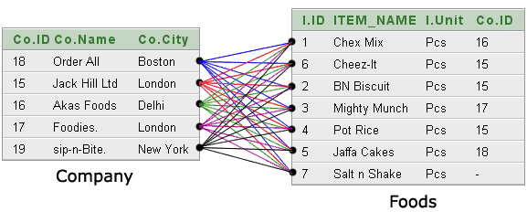
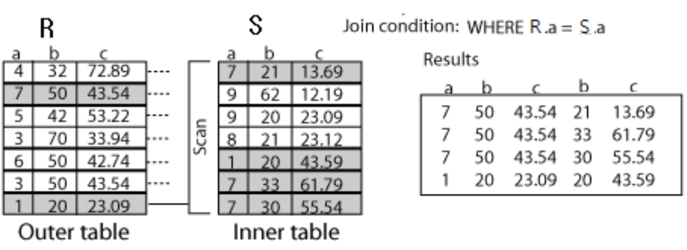
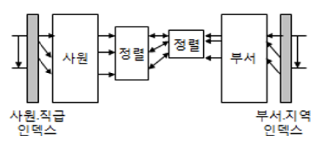
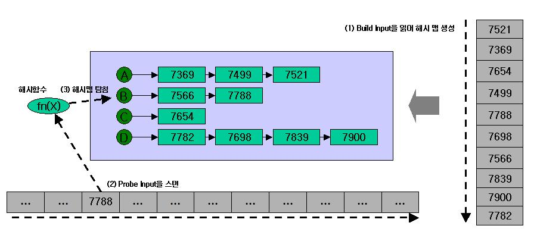

# Join

```
@author: suktae.choi
- http://rapapa.net/?p=311
- http://blog.naver.com/PostView.nhn?blogId=ssayagain&logNo=90036001354
- http://www.jidum.com/jidums/view.do?jidumId=167
- http://wiki.gurubee.net/pages/viewpage.action?pageId=26744652
- http://wiki.gurubee.net/pages/viewpage.action?pageId=4948020
```


## Join Types

### `Inner Join` (== Join)

**Intersection** of both tables

```sql
-- Explicit Inner Join
mysql>
select name, phone, selling
from demo_people
         inner join demo_property on (demo_people.pid = demo_property.pid);

+———–+————–+———————-+
| name | phone | selling |
+———–+————–+———————-+
| Mr Brown | 01225 708225 | Old House Farm
| Mr Pullen | 01380 724040 | The Willows
| Mr Pullen | 01380 724040 | Tall Trees
| Mr Pullen | 01380 724040 | The Melksham Florist
+———–+————–+———————-+

-- Implicit Inner Join
mysql>
select name, phone, selling
from demo_people,
     demo_property
where demo_people.pid = demo_property.pid;
```

### Left Outer Join (== `Left Join`)

All **left table's row must present** and fill-out with right table's column

```sql
mysql>
select name, phone, selling
from demo_people
         left join demo_property on (demo_people.pid = demo_property.pid);

+————+————–+———————-+
| name | phone | selling |
+————+————–+———————-+
| Mr Brown | 01225 708225 | Old House Farm
| Miss Smith | 01225 899360 | NULL
| Mr Pullen | 01380 724040 | The Willows
| Mr Pullen | 01380 724040 | Tall Trees
| Mr Pullen | 01380 724040 | The Melksham Florist
+————+————–+———————-+
```

### Right Outer Join (== `Right Join`)

All **right table's row must present** and fill-out with left table's column

```sql
mysql>
select name, phone, selling
from demo_people
         right join demo_property on (demo_people.pid = demo_property.pid);

+———–+————–+———————-+
| name | phone | selling |
+———–+————–+———————-+
| Mr Brown | 01225 708225 | Old House Farm
| Mr Pullen | 01380 724040 | The Willows
| Mr Pullen | 01380 724040 | Tall Trees
| Mr Pullen | 01380 724040 | The Melksham Florist
| NULL | NULL | Dun Roamin
+———–+————–+———————-+
```

### Outer Join (== Left + Right join)

**Combination** of both right and left join

```sql
mysql>
select name, phone, selling
from demo_people outer join demo_property
on (demo_people.pid = demo_property.pid);

+———–+————–+———————-+
| name | phone | selling |
+———–+————–+———————-+
| Mr Brown | 01225 708225 | Old House Farm
| Miss Smith | 01225 899360 | NULL
| Mr Pullen | 01380 724040 | The Willows
| Mr Pullen | 01380 724040 | Tall Trees
| Mr Pullen | 01380 724040 | The Melksham Florist
| NULL | NULL | Dun Roamin
+———–+————–+———————-+
```

### Cross Join

**Multiply** table A and B. The result set is N * M

**Join key** clauses are **not specified** in cross join



```sql
-- Explicit Cross Join
mysql>
select name, phone, selling
from demo_people
         cross join demo_property +———–+————–+———————-+
| name | phone | selling |
+———–+————–+———————-+
| Mr Brown | 01225 708225 | Old House Farm
| Mr Brown | 01225 708225 | The Willows
| Mr Brown | 01225 708225 | Tall Trees
| Mr Brown | 01225 708225 | The Melksham Florist
| Mr Brown | 01225 708225 | Dun Roamin
| Miss Smith | 01225 899360 | Old House Farm
| Miss Smith | 01225 899360 | The Willows
| Miss Smith | 01225 899360 | Tall Trees
| Miss Smith | 01225 899360 | The Melksham Florist
| Miss Smith | 01225 899360 | Dun Roamin
| Mr Pullen | 01380 724040 | Old House Farm
| Mr Pullen | 01380 724040 | The Willows
| Mr Pullen | 01380 724040 | Tall Trees
| Mr Pullen | 01380 724040 | The Melksham Florist
| Mr Pullen | 01380 724040 | Dun Roamin
+———–+————–+———————-+

-- Implicit Cross Join
mysql>
select name, phone, selling
from demo_people,
     demo_property
```

### Theta Join

조인에 참여하는 두 릴레이션의 속성값을 비교하여 조건을 만족하는 투플만 반환

- exists
  - exists 는 where 절에 조인 조건을 넣으므로, inner join 으로만 동작합니다

```sql
SELECT p.*
FROM post p
WHERE EXISTS (
    SELECT 1
    FROM post_comment pc
    WHERE
        pc.post_id=p.id AND
        pc.score > ?
)
ORDER BY p.id
```

- inner

```sql
SELECT p.*
FROM post p
inner join post_comment pc on (pc.post_id = p.id and pc.score > ?) 
ORDER BY p.id
```

### Semi Join

조인시 두 릴레이션 중 한쪽 릴레이션의 결과만 반환하는 방식

```
SQL의 LEFT JOIN은 왼쪽 테이블의 모든 레코드와 오른쪽 테이블의 일치하는 레코드를 가져오는 것을 의미합니다.
이 때, 왼쪽 테이블의 모든 레코드에 대해서 오른쪽 테이블과의 일치 여부를 확인하기 위해 오른쪽 테이블의 데이터를 실제로 읽어와야 합니다. (인덱스 컬럼으로 조인해야함)

따라서 LEFT JOIN에서 오른쪽 테이블의 레코드를 보지 않더라도 실제로 디스크에서 데이터를 읽어와야 합니다.
```

## [Join Methods](http://blog.naver.com/PostView.nhn?blogId=ssayagain&logNo=90036001354)

### Nested Loops



- 선행 테이블 기준으로, 후행 테이블을 랜덤 액세스 하며 조인
  - 선행 (Driving) 테이블의 크기가 작거나, Where 절 통해 결과 집합을 작게해야함
  - 후행 (Driven) 테이블 `랜덤 액세스`
- OLTP 에서 적합한 방식의 조인 (서비스는 일부의 조인결과를 사용하므로)

> Driven 을 index search 하며 1개씩 가져옴 (조인키는 인덱스여야함)

```java
// equivalent in code
for(i=0;i<100;i++){--driving
    for(j=0;j<100;j++){--driven
    // ...
    }
    }
```

```sql
select /*+ use_nl(b,a) */ a.dname, b.ename, b.sal
from emp b,
     dept a
where a.loc = 'NEW YORK'
  and b.deptno = a.deptno
```

### Sort Merge



- 선/후행 테이블을 조인키에 따라 정렬하고, 순차검색 하면서 같은 값 머지
  - 결과집합의 크기가 차이가 많이 나는 경우에는 비효율 (완료시까지 기다려야함)
    - 조인 연결고리의 `비교 연산자` 일 경우 유리
  - 선/수행 테이블 순차 검색

```java
List<String> a=new ArrayList<>();
    List<String> b=new ArrayList<>();

    a.sort();
    b.sort();

// ...
```

```sql
select /*+ use_merge(a b) */ a.dname, b.empno, b.ename
from dept a,
     emp b
where a.deptno = b.deptno
  and b.sal > 1000;
```

### Hash Join



- 작은 테이블 기준으로, 조인키의 hash bucket 생성
  - 큰 테이블은 조인키의 hash 값으로 검색
  - `해시충돌`시, 순차탐색이 필요하므로 최대한 unique 가 보장되는 키의 선택필요
- OLAP 에서 적합 (전체 테이블이 대상이면, random access 할 필요 없음)
- 조인키가 index 가 아닐 경우 적합 (NL 을 쓰면 안됨)

```sql
select /*+ use_hash(a b) */ a.dname, b.empno, b.ename
from dept a,
     emp b
where a.deptno = b.deptno
  and a.deptno between 10 and 20;
```

### Union vs Join

```sql
Table1
    (1, 2, 3, 4)
    Table2
    (3, 4, 5, 6)
```

- Union

```sql
Table1 UNION Table2

id
---
1
2
3
4
5
6
```

- Union all

```sql
Table1 UNION ALL Table2

id
---
1
2
3
4
3
4
5
6
```

- Outer Join

```sql
Table1 t1 OUTER JOIN Table2 t2 ON t1.id = t2.id

id    id
---------
1    NULL
2    NULL
3     3
4     4
NULL  5
NULL  6
```

- Inner Join

```sql
Table1 t1 INNER JOIN Table2 t2 ON t1.id = t2.id

id    id
---------
3     3
4     4
```
