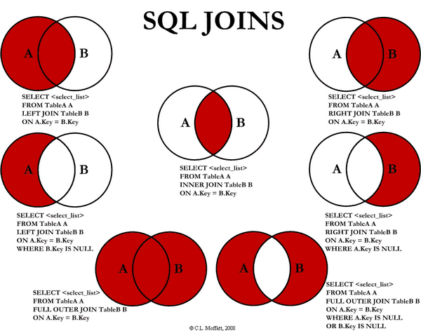
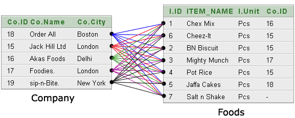
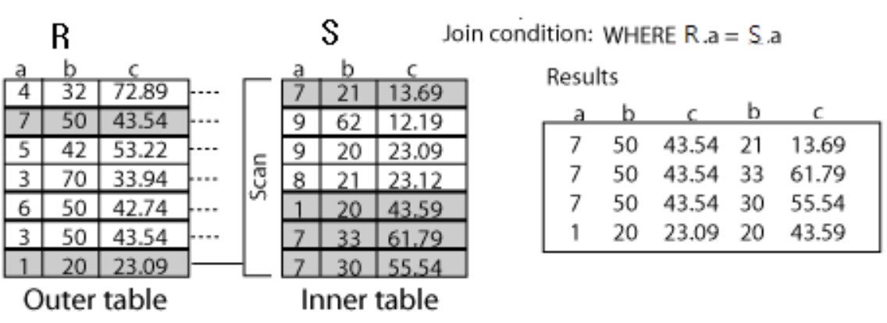
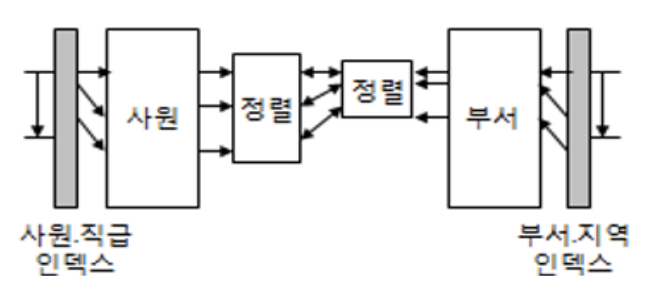
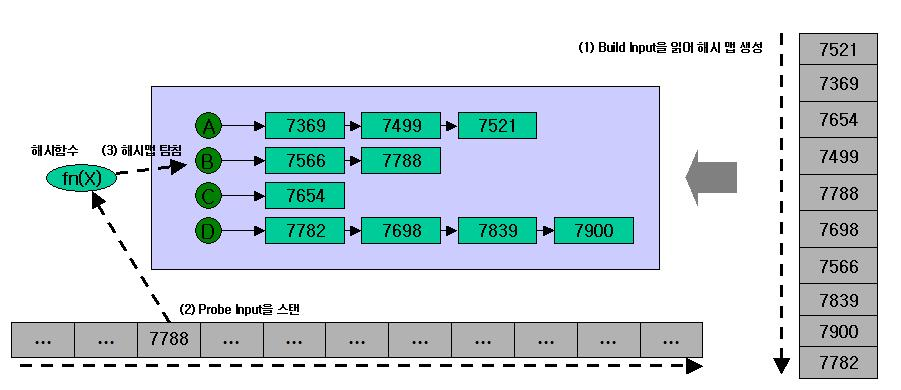

# Join
```
https://blog.naver.com/PostView.nhn?blogId=ssayagain&logNo=90036001354
```



## Join Types
### `Inner Join` (== Join)
**Intersection** of both tables

```sql
-- Explicit Inner Join
mysql>
select name, phone, selling
from demo_people
         inner join demo_property on (demo_people.pid = demo_property.pid);

+———–+————–+———————-+
| name | phone | selling |
+———–+————–+———————-+
| Mr Brown | 01225 708225 | Old House Farm
| Mr Pullen | 01380 724040 | The Willows
| Mr Pullen | 01380 724040 | Tall Trees
| Mr Pullen | 01380 724040 | The Melksham Florist
+———–+————–+———————-+

-- Implicit Inner Join
mysql>
select name, phone, selling
from demo_people,
     demo_property
where demo_people.pid = demo_property.pid;
```

### Left Outer Join (== `Left Join`)
All **left table's row must present** and fill-out with right table's column

```sql
mysql>
select name, phone, selling
from demo_people
         left join demo_property on (demo_people.pid = demo_property.pid);

+————+————–+———————-+
| name | phone | selling |
+————+————–+———————-+
| Mr Brown | 01225 708225 | Old House Farm
| Miss Smith | 01225 899360 | NULL
| Mr Pullen | 01380 724040 | The Willows
| Mr Pullen | 01380 724040 | Tall Trees
| Mr Pullen | 01380 724040 | The Melksham Florist
+————+————–+———————-+
```

### Right Outer Join (== `Right Join`)
All **right table's row must present** and fill-out with left table's column

```sql
mysql>
select name, phone, selling
from demo_people
         right join demo_property on (demo_people.pid = demo_property.pid);

+———–+————–+———————-+
| name | phone | selling |
+———–+————–+———————-+
| Mr Brown | 01225 708225 | Old House Farm
| Mr Pullen | 01380 724040 | The Willows
| Mr Pullen | 01380 724040 | Tall Trees
| Mr Pullen | 01380 724040 | The Melksham Florist
| NULL | NULL | Dun Roamin
+———–+————–+———————-+
```

### Outer Join (== Left + Right join)
**Combination** of both right and left join

```sql
mysql>
select name, phone, selling
from demo_people outer join demo_property
on (demo_people.pid = demo_property.pid);

+———–+————–+———————-+
| name | phone | selling |
+———–+————–+———————-+
| Mr Brown | 01225 708225 | Old House Farm
| Miss Smith | 01225 899360 | NULL
| Mr Pullen | 01380 724040 | The Willows
| Mr Pullen | 01380 724040 | Tall Trees
| Mr Pullen | 01380 724040 | The Melksham Florist
| NULL | NULL | Dun Roamin
+———–+————–+———————-+
```

### Cross Join
**Multiply** table A and B. The result set is N * M

**Join key** clauses are **not specified** in cross join



```sql
-- Explicit Cross Join
mysql>
select name, phone, selling
from demo_people
         cross join demo_property +———–+————–+———————-+
| name | phone | selling |
+———–+————–+———————-+
| Mr Brown | 01225 708225 | Old House Farm
| Mr Brown | 01225 708225 | The Willows
| Mr Brown | 01225 708225 | Tall Trees
| Mr Brown | 01225 708225 | The Melksham Florist
| Mr Brown | 01225 708225 | Dun Roamin
| Miss Smith | 01225 899360 | Old House Farm
| Miss Smith | 01225 899360 | The Willows
| Miss Smith | 01225 899360 | Tall Trees
| Miss Smith | 01225 899360 | The Melksham Florist
| Miss Smith | 01225 899360 | Dun Roamin
| Mr Pullen | 01380 724040 | Old House Farm
| Mr Pullen | 01380 724040 | The Willows
| Mr Pullen | 01380 724040 | Tall Trees
| Mr Pullen | 01380 724040 | The Melksham Florist
| Mr Pullen | 01380 724040 | Dun Roamin
+———–+————–+———————-+

-- Implicit Cross Join
mysql>
select name, phone, selling
from demo_people,
     demo_property
```

### Semi Join
다른 Join 처럼 두 테이블을 합쳐서 새로운 결과를 만드는 것이 아닌 한 테이블을 기준으로 (Driving) 다른 테이블에 존재유무만 확인하여 필터링하는 역할을 합니다

> 필터링의 역할만 수행하므로 Driven 테이블의 필드가 결과에 포함되지 않음

Inner Join 및 다른 Outer Join 과 비교하면 아래의 차이점이 존재합니다:
- Inner
  - 조건에 맞는 Driving 존재
  - 중복 가능
- Left
  - Driving 항상 존재
  - 중복 가능
- Semi
  - 조건에 맞는 Driving 존재
  - `중복 제거 (일치되는 1개의 ROW 발견시 즉시 리턴)`

아래의 SQL 을 보면 즉시리턴의 의미를 알수 있습니다:
- Inner
  - 매칭되는 Driven 테이블의 모든 데이터 조인. 즉 1-N 관계 
  - Alice - Keyboard
  - Alice - Mouse
- Semi
  - 매칭되는 Driven 테이블의 최초 데이터만 조인. 즉 1-1 관계 
  - Alice

```
"주문을 한 번이라도 한 사용자의 정보를 조회"
  ┌────┬─────────┐
  │ id │ name    │
  ├────┼─────────┤
  │ 1  │ Alice   │
  │ 2  │ Bob     │
  │ 3  │ Charlie │
  └────┴─────────┘
  ┌──────────┬─────────┬──────────┐
  │ order_id │ user_id │ item     │
  ├──────────┼─────────┼──────────┤
  │ 101      │ 1       │ Keyboard │
  │ 102      │ 1       │ Mouse    │
  │ 103      │ 3       │ Monitor  │
  └──────────┴─────────┴──────────┘

SELECT u.id, u.name2
FROM users u
INNER JOIN orders o ON u.id = o.user_id;

| 1   | Alice   |  <-- Alice가 2번 주문해서 중복 발생
| 1   | Alice   |
| 3   | Charlie |
```

Inner Join 을 사용하면 중복제거를 위해 distinct 를 사용해야 합니다.

Semi Join 은 문법적으로 키워드는 없지만 In or Exists 를 통해 사용할 수 있습니다 (중복 없음)

## [Join Methods](http://blog.naver.com/PostView.nhn?blogId=ssayagain&logNo=90036001354)
### Nested Loops


- 선행 테이블 `먼저 조회`후, 후행 테이블을 `랜덤 액세스` 하며 조인
  - 선행 (Driving) 테이블의 크기가 작거나, Where 절 통해 결과 집합을 작게해야함
  - 후행 (Driven) 테이블 `랜덤 액세스`
- OLTP 에서 적합한 방식의 조인 (서비스는 일부의 조인결과를 사용하므로)

> 조회된 Driving 을 기준으로 B+Tree 탐색을 통해 건별로 가져옴 (조인키로 인덱스 탐색하므로 인덱스가 잡혀있어야함)

```java
// 드라이빙 테이블
for (var index : indexes) {
    // 드리븐 테이블
    var result = index.get(index);
}
```
```sql
SELECT /*+ USE_NL(a b) */ a.*
FROM dept a
LEFT JOIN emp b ON b.deptno = a.deptno
WHERE a.loc = 'NEW YORK';
```

### Sort Merge


- 선/후행 테이블을 조인키에 따라 정렬하고, 순차검색 하면서 같은 값 머지
- 결과집합의 크기가 차이가 많이 나는 경우에는 비효율 (skew 발생)
- NL 은 driven 을 랜덤조회 해야 하는데, 그 대상이 많은 경우 (범위 탐색 같은) sort-merge 가 나을수 있다

```java
List<String> a=new ArrayList<>();
List<String> b=new ArrayList<>();

a.sort(joinKey);
b.sort(joinKey);

for (var element : a) {
    var result = b.getby(element.joinKey);
}
```
```sql
SELECT /*+ USE_MERGE(a b) */ a.*
FROM dept a
LEFT JOIN emp b ON b.deptno = a.deptno
WHERE b.sal > 1000;
```

### Hash Join


- 작은 테이블 기준으로, 조인키의 hash bucket 생성
  - 큰 테이블은 조인키의 hash 값으로 검색
  - `해시충돌`시, 순차탐색이 필요하므로 최대한 unique 가 보장되는 키의 선택필요
- OLAP 에서 적합 (전체 테이블이 대상이면, random access 할 필요 없음)
- 조인키가 index 가 아닐 경우 적합 (NL 을 쓰면 안됨)

```sql
select /*+ USE_HASH(a b) */ a.dname, b.empno, b.ename
from dept a, emp b
where a.deptno = b.deptno
  and a.deptno between 10 and 20;
```

### Union vs Join
```sql
Table1
    (1, 2, 3, 4)
    Table2
    (3, 4, 5, 6)
```

- Union

```sql
Table1 UNION Table2

id
---
1
2
3
4
5
6
```

- Union all

```sql
Table1 UNION ALL Table2

id
---
1
2
3
4
3
4
5
6
```

- Outer Join

```sql
Table1 t1 OUTER JOIN Table2 t2 ON t1.id = t2.id

id    id
---------
1    NULL
2    NULL
3     3
4     4
NULL  5
NULL  6
```

- Inner Join

```sql
Table1 t1 INNER JOIN Table2 t2 ON t1.id = t2.id

id    id
---------
3     3
4     4
```
