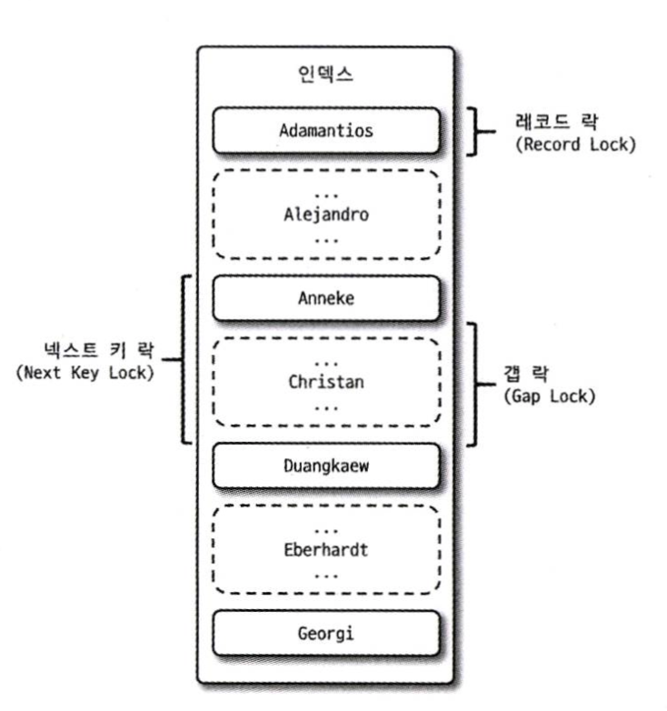

# Locks

```
@author: suktae.choi
- https://dev.mysql.com/doc/refman/8.0/en/innodb-locking.html
- https://suhwan.dev/2019/06/09/transaction-isolation-level-and-lock/
```

### Blog

- [Select 쿼리는 S락이 아니다. (X락과 S락의 차이)](https://velog.io/@soongjamm/Select-%EC%BF%BC%EB%A6%AC%EB%8A%94-S%EB%9D%BD%EC%9D%B4-%EC%95%84%EB%8B%88%EB%8B%A4.-X%EB%9D%BD%EA%B3%BC-S%EB%9D%BD%EC%9D%98-%EC%B0%A8%EC%9D%B4)

***



## Shared Locks

read lock 입니다.

- 다른 shared lock 허용 (== 다른 조회는 허용)
- 다른 exclusive lock 미허용 (== 다른 DML 은 미허용)

> select ... for share

## Exclusive Locks

write lock 입니다.

- 다른 shared lock 미허용 (== 다른 조회는 미허용)
- 다른 exclusive lock 미허용 (== 다른 DML 은 미허용)

> select ... for update

## Record Locks

레코드 (정확히는 index) 자체만을 잠그는 lock 입니다.

```
update record [2]

[1]--------[2]---------[3]---------[4]
       record-lock
```

```text
why innodb record lock actually locks index?

InnoDB uses index locks to lock records because InnoDB uses indexes to reference records.
Record locks are locks on index records. For example, SELECT c1 FROM t WHERE c1 = 10 FOR UPDATE; prevents any other transaction from inserting, updating, or deleting rows where the value of t.c1 is 10.
Record locks always lock index records, even if a table is defined with no indexes1.

```

## Gap Locks

레코드와 인접한 prev/next 레코드의 사이의 lock 입니다.

```
update record [2]

[1]--------[2]---------[3]---------[4]
               gap-lock
```

> phantom read 를 방지하기 위함

## Next-key Locks

record lock + gap lock 입니다.

```
update record [2]

[1]--------[2]---------[3]---------[4]
      record-lock
   gap-lock   gap-lock
   ~~~next-key lock~~~~
```

DML 쿼리가 어떤 인덱스를 사용하냐에 따라 사용되는 lock 의 종류도 달라집니다

- P.K or unique index
  - record lock
- secondary index
  - gap lock or next-key lock

중복되는 record 가 존재하는지에 따른 동작 차이입니다

- 중복이 없다면 -> 해당 record 에만 lock 을 잡아도 이슈없음
- 중복이 있다면 (secondary index) -> DML 도중에 phantom 발생 가능하므로, gap lock 을 잡아서 방지함

## Auto increment Locks

테이블 수준의 lock 이지만 트랙잭션과 관계없이 INSERT 쿼리에서 `AUTO_INCREMENT 값을 가져오는 순간`만 락이 걸렸다가 즉시 해제됩니다