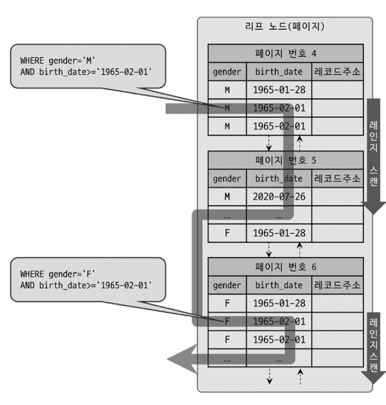
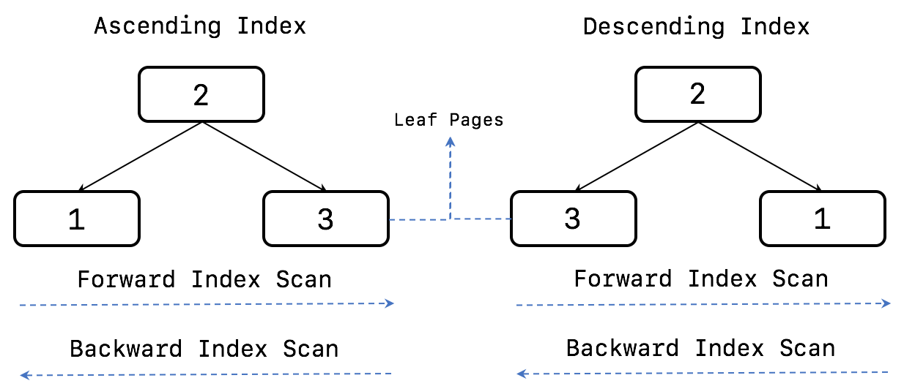

# MVCC (Multi Version Concurrency Control)
```
https://mangkyu.tistory.com/288
https://dkswnkk.tistory.com/718
```

MVCC는 하나의 레코드에 대해 여러 버전을 유지함으로써, 트랜잭션 간 충돌 없이 읽기와 쓰기가 병행되도록 합니다.



- A: 진행중
- B, C: commit 완료 및 undo 저장

이런 상황에서 (undo 로그에서) A 가 보는 TxID 는 오래전 데이터 이므로, old undo 는 정리되지 않습니다.

## Undo
- Update/Delete 쿼리 수행시 시스템 장애를 대응하기 위해(시스템 복구를 위해) Redo 로그에 요청 내용 기록
- 버퍼 풀에 요청에 대한 내용을 기록
- 변경되기 전 데이터는 index와 함께 Undo 로그에 복사
- 종료
  - 트랜잭션 정상 종료 및 커밋 시 버퍼 풀에 있는 내용을 디스크에 저장
  - 트랜잭션 롤백 시 Undo 로그에 기록된 내용을 다시 복원

InnoDB는 이와 같이 버퍼 풀, Undo 로그를 통해서 MVCC를 지원한다.

### Redo (복원)
Redo 는 주기적인 checkpoint 이벤트가 발행되면 최종적으로 disk 에 저장됩니다.

> 즉 복원이 가능한 데이터는 마지막 checkpoint 까지의 데이터 입니다
> 
### 잠금 없는 일관된 읽기 (Non-Locking Consistent Read)
non-locking select (isolation: Serializable 이 아닌경우) 는 `현재 record lock 이 잡혀있더라도` UNDO 를 통해 `대기없이` select 를 수행할 수 있습니다

