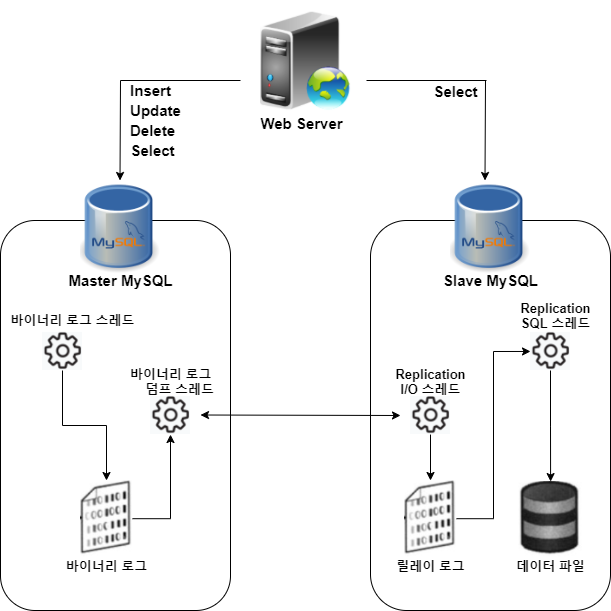
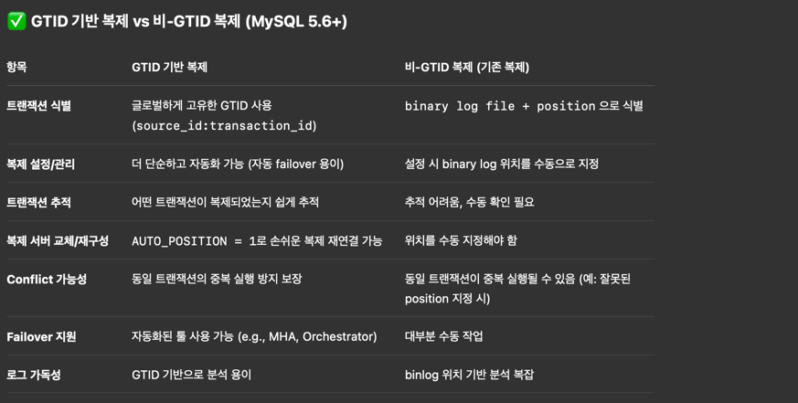
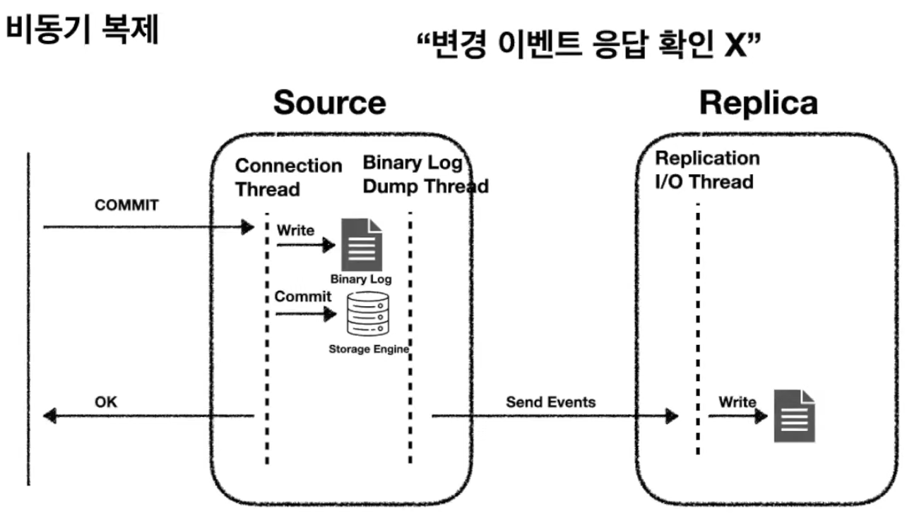
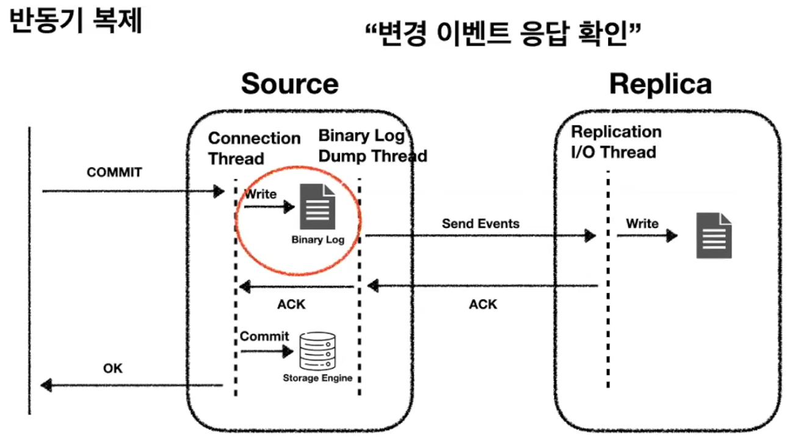
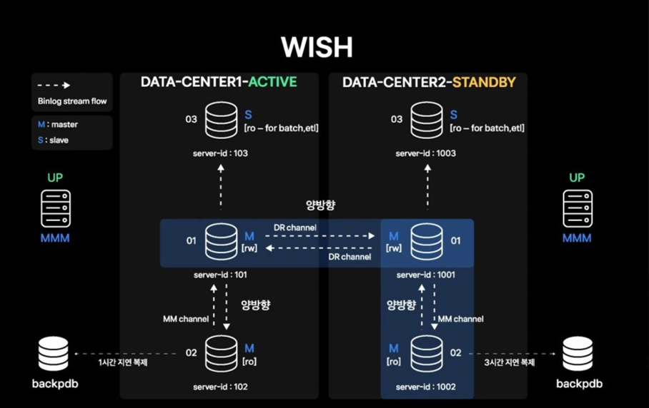

# Replication
```
https://velog.io/@dangdang/MySQL-%EB%B3%B5%EC%A0%9C
```
- 바이너리 로그(Binary Log): MySQL 서버에서 발생하는 모든 변경 사항이 기록되는 곳
- 릴레이 로그(Relay Log): 레플리카 서버에서 소스 서버의 바이너리 로그를 읽어 들여 로컬 디스크에 저장해둔 파일



## 식별자 타입
즉 어디까지 수행했어? 를 tid 기반으로 구분 필요한데 식별자로 어떤 값을 사용할지에 대한 고민



### GTID (== Global Transaction ID)
GTID 활성화 전, binlog_format = ROW 추천

## 바이너리 로그 포맷
### 1. Statement 기반
실행된 SQL 이 Binlog 에 저장되어 복제됩니다. 대신 복제DB 와 값이 불일치 할수 있습니다 (ex. P.K 가 다르게 생성되거나 NOW() 의 결과 등이 다름)
- insert into select ... 처럼 동적인 결과로 insert 쿼리가 발생하면 (그리고 NOW() 문구도 포함해서)
- master/replicas 의 결과가 100% 동일하다고 보장할 수 없으므로

### 2. Row 기반
데이터 자체가 복제되어 불일치가 발새하지 않습니다.
MySQL 8.x 부터 `binlog 의 포맷은 ROW 가 기본값` 입니다:

**Binlog:offset**

ROW 기반 바이너리 로그 포맷을 사용시 데이터 자체가 복제되므로 해당 방식도 이슈없지만 아래의 단점이 존재합니다:
- 각 서버마다 binlog:offset 기반은 file rotation 정책 등에 따라 다를 수 있는데 source 의 값을 replica 에서 그대로 사용 할 수 없음
- 따라서 어느 트랜잭션까지 수행되었는지는 알기 어려움 (MM2 처럼 각자의 offset 은 다를수 있으므로 그 GAP 을 관리하는 별도의 토픽(관리)가 필요함)

## 동기화 방식
### Asynchronous


### Semi-Synchronous


### Synchronous
실제 relay 받고 replica 에서 commit 완료 까지 대기

## MSR (Multi Source Replication)
샤딩을 해서 source 가 여러개인 경우를 의미 (N개의 source -> 1개의 replica)

그런데 각각의 샤딩 source 에 각 replication 이 존재하는게 낫지않나?

> A. 여러 프로덕션 샤드 서버의 데이터를 하나의 분석용/백업용 서버로 통합할 때 사용성 필요

## MMM (Mysql Multi-master replication Manager) & DNS
- MMM Agent
  - 각 DB 서버에서 MMM 모니터와 통신하여 서버 상태 정보를 전송하고, MMM 모니터의 지시에 따라 작업을 수행
- MMM Monitor
  - 각 서버의 상태를 모니터링하고, 장애 발생 시 자동 복구 프로세스를 실행
- VIP (DNS)
  - MMM Monitor 를 통해 복구 프로세스 실행되어 VIP 변경이 필요한 경우 DNS 를 갱신
- 클라이언트
  - DNS 를 통해 VIP 획득하여 DB 접속
  - Java 의 경우 `networkaddress.cache.ttl=?` 옵션으로 JVM DNS 캐시시간 설정 (DNS 부하와 failover 시간을 고려하여 설정)

