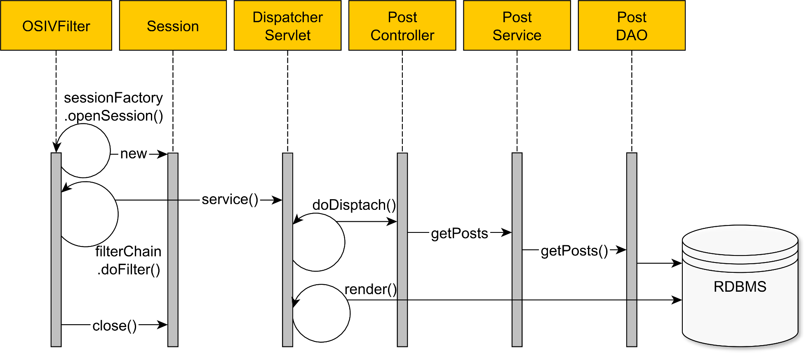

# OSIV

```
@author: suktae.choi
- https://vladmihalcea.com/the-open-session-in-view-anti-pattern/
```

### Blog

- [OSIV](http://pds19.egloos.com/pds/201106/28/18/Open_Session_In_View_Pattern.pdf)

***



- OpenSessionInViewFilter (servlet-filter) 진입에서 hibernate#openSession
  - dispatcher-servlet -- controller -- service -- repository 까지 수행
  - controller 에서 return
- OpenSessionInViewFilter (servlet-filter) 에서 hibernate#closeSession

```java
@Override
protected void doFilterInternal(
    HttpServletRequest request, HttpServletResponse response, FilterChain filterChain)
    throws ServletException, IOException {

    ​    if (TransactionSynchronizationManager.hasResource(sessionFactory)) {
    ​       participate = true;
    ​    }
    ​    else {
    ​       boolean isFirstRequest = !isAsyncDispatch(request);
    ​       if (isFirstRequest || !applySessionBindingInterceptor(asyncManager, key)) {
    ​          // open session
    ​          logger.debug("Opening Hibernate Session in OpenSessionInViewFilter");
    ​          Session session = openSession(sessionFactory);
    ​          SessionHolder sessionHolder = new SessionHolder(session);
    ​          TransactionSynchronizationManager.bindResource(sessionFactory, sessionHolder);

    ​          AsyncRequestInterceptor interceptor = new AsyncRequestInterceptor(sessionFactory, sessionHolder);
    ​          asyncManager.registerCallableInterceptor(key, interceptor);
    ​          asyncManager.registerDeferredResultInterceptor(key, interceptor);
    ​       }
    ​    }

    ​    try {
    ​       filterChain.doFilter(request, response);
    ​    }

    ​    finally {
    ​       if (!participate) {
    ​          // close session
    ​          SessionHolder sessionHolder =
    ​                (SessionHolder) TransactionSynchronizationManager.unbindResource(sessionFactory);
    ​          if (!isAsyncStarted(request)) {
    ​             logger.debug("Closing Hibernate Session in OpenSessionInViewFilter");
    ​             SessionFactoryUtils.closeSession(sessionHolder.getSession());
    ​          }
    ​       }
    ​    }
    }
```