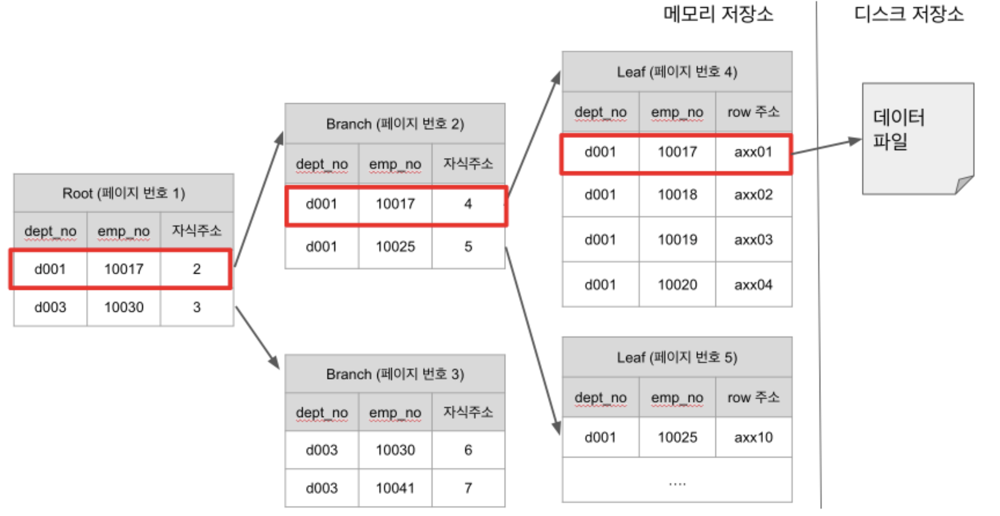

## Index

```
ㅁ Author: suktae.choi
ㅁ References:
 - https://dev.mysql.com/doc/refman/5.7/en/mysql-indexes.html
 - http://choko11.tistory.com/entry/%EC%9D%B8%EB%8D%B1%EC%8A%A4-1-%EA%B0%9C%EB%85%90%EC%A2%85%EB%A5%98%EC%A3%BC%EC%9D%98%EC%82%AC%ED%95%AD
 - http://www.dba-oracle.com/t_difference_between_btree_and_bitmap_index.htm
 - http://mikyung.net/451
```

### Overview

#### [단일 vs 다중 인덱스](https://jojoldu.tistory.com/243)

```
INDEX A asc, B asc, C asc 
```

조회시 인덱스의 순서는 (ex. B A C) 크게 영향이 없다.

> Optimizer 가 인덱스를 보고 순서보정. (물론 순서를 보정하는 ops 가 들어가긴한다)

순서는 보정된다고 가정시, 조건의 누락은 아래처럼 영향이 있다:

- 두번째 컬럼은 첫번째에 의존
- 세번째 컬럼은 두번째에 의존
- ...

즉 첫번째 인덱스 컬럼 (A) 이 없으면, 해당 다중 인덱스는 타지 않는다.

대신 C A 가 조건이라면, A 를 타고 난 후 C 는 scan 해서 가져온다. (partially applied)

> b-tree 를 생각하면, 첫번째 인덱스를 기준으로 `A B C` 의 block 으로 트리가 구성되어 있다.

- A 컬럼이 조건에 없다면, 해당 트리는 사용불가
- C A 라면, A 로 우선 인덱스는 탄 후 나머지 트리의 full scan



### Discussion

#### Why `IN` is not good

`=`, `in` 은 인덱스를 사용합니다.

- `in`은 결국 **= 을 여러번 실행**한 것이기 때문입니다.
- 단, `in`은 인자값으로 상수가 포함되면 문제 없지만, **서브쿼리를 넣게되면 성능상 이슈가 발생**합니다.
- `in`의 인자로 **서브쿼리가 들어가면 서브쿼리의 외부가 먼저 실행**되고, `in` 은 체크조건으로 실행되기 때문입니다.

### 자료구조

#### B-Tree


- 범위 검색: 첫번째 범위의 left node 로 간 후, 리프노드만을 따라가며 검색
- 데이터블록: 노드에서 저장할수 있는 인덱스 크기
  - 추가: overflow 발생시, 새로운 블록 생성 및 깊이 증가. 한쪽으로 불균형 대칭이 되면 인덱스 재빌딩 (Full GC)
  - 삭제: 해당 인덱스에 flag 설정, 일정 이상되면 기존 블록과 병합 진행. 불균형 되면 인덱스 재빌딩

#### Bitmap


- Data Structure: 2-dimensional array
- 검색: 해당 배열을 쭉 읽는다 (e.g. array[1]\[\])

#### Why B-Tree is commonly used?

- 트리가 균형이 잡혔을다고 가정하면, 거의 대부분의 select 에서 동일한 응답 속도를 보장해 준다. (같은 Depth)
  - B-Tree 의 시간복잡도는 트리의 깊이(Depth) 에 결정됨, 균형잡힌 트리는 동일한 depth 로 구성되어 있음
  - 트리의 균형이 깨지는 경우 (특정 Leaf node 의 깊이가 다르다, 삽입/삭제가 많이 발생한 경우) 망가짐, 재구성 필요
- 우리가 인덱스 (pk) 로 주로 사용하는 키는 auto-increment 의 속성을 가진 (혹은 고루 넓은 범위의 숫자) id 인 경우가 대부분이므로 트리가 균형잡히게 구성된다. 그리고 변경이 거의 일어나지 않는다. 그래서 btree 가 대부분의 상황에서 적절
  - 최초 트리 구성시 균형 잡힘. 삽입/삭제가 거의 발생하지 않아 불균형하게 될 가능성 적음
