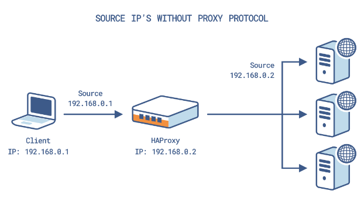
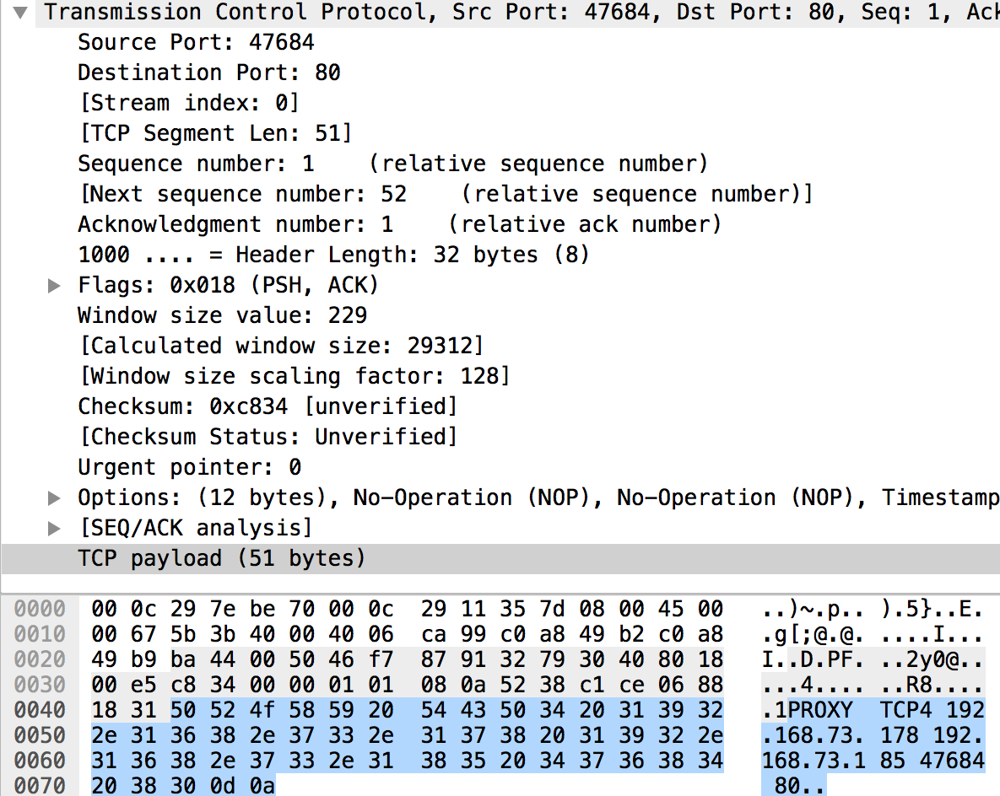

## Proxy Protocol

```
ㅁ Author: suktae.choi
- http://www.haproxy.org/download/1.7/doc/proxy-protocol.txt
- https://www.haproxy.com/blog/using-haproxy-with-the-proxy-protocol-to-better-secure-your-database/
- https://www.haproxy.com/blog/preserve-source-ip-address-despite-reverse-proxies/
- https://stackoverflow.com/questions/48394661/sending-proxy-protocol-to-server-that-doesnt-support-proxy-protocol
```

`Proxy Protocol` is used between proxies (hence its name) or between a proxy and a server which could understand it. <br>
Source IP is changed in each hop of network routing, so it is not possible to understand origin (client) IP of sender.



If proxy protocol is enabled, `PROXY TCPx {src ip} {dest ip} {src port} {dest port}` prefix is attached in start of TCP payload. (generally starts of HTTP protocol)

```
|----- TCP Header -----||--------- TCP Payload ---------||- Checksum -|
  src port : dest port   PROXY TCP4 {}{}{}{}} {HTTP ...}

// tcp payload (HTTP start)
PROXY TCP4 192.168.0.2 192.168.0.5 56487 443\r\n
GET / HTTP 2.0\r\n
Host: 192.168.0.5\r\n ....
```



> Prefix `PROXY TCPx` is not a spec of HTTP protocol, so It will fail whether both proxies are enable proxy protocol.
