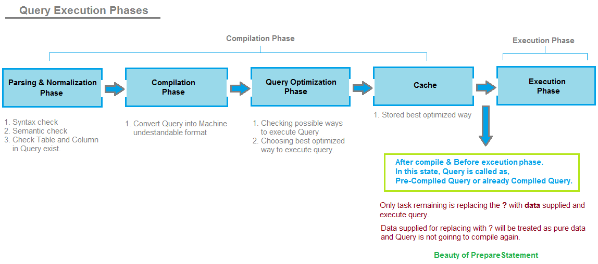

## Prepared statement

```
@author: suktae.choi
- http://www.technowlogeek.com/programming/java/jdbc/the-jdbc-preparedstatement-object/
- http://stackoverflow.com/questions/1582161/how-does-a-preparedstatement-avoid-or-prevent-sql-injection
```

### Phases of SQL Query execution


- Compilation phase
  - parse & compile & optimize (execution plan) & cache
- Execution phase
  - execute stored execution plan

#### Behavior of PreparedStatement
- PreparedStatement are not complete SQL query and contains placeholder, which at run time is replaced by actual user data.
- Whenever any PreparedStatment containing placeholders is passed in to SQL Server engine, It passes through below phases
  - Parsing and Normalization Phase
  - Compilation Phase
  - Query Optimization Plan
  - Cache (Compiled Query with placeholders are stored in Cache)
  ```
    UPDATE user set username = ? and password = ? WHERE id = ?
  ```
- We can say that Query stored in cache is Pre-Compiled means already compiled and only placeholders need to be replaced with user data using setter.
- Now at run-time when user data comes in, Pre-Compiled Query is picked up from Cache and placeholders are replaced with user data. It can **avoid** to calculate ``Compilation phase`` again.


#### Additional: How to avoid SQL Injection?
PreparedStatment is already compiled and stored in cache with unique execution plan. The placeholders are only replaced with input data.

Any input data can't affect SQL statement itself. It is only replaced as input in ``?``.

#### Another solution to avoid SQL injection?
Convert special characters of input to prevent it from affecting SQL statement:
- / -> %64%
- & -> %76%
