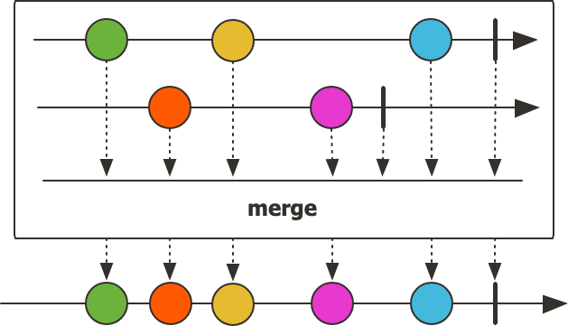

# Reactor Operator

```
@author: suktae.choi
- https://luvstudy.tistory.com/100
- https://d2.naver.com/helloworld/2771091
```

## doOn**
주로 디버깅이나 hooks 이 필요할때 사용합니다

- `doOnSubscribe` 메서드는 구독이 시작 될 트리거 된다. 위 메서드 중 가장 먼저 실행 된다. 파라미터로는 Subscription 가 넘어 온다.
- `doOnRequest` 메서드는 요청 받을 떄 트리거 된다. 기본적으로 파라미터는 Long의 Long.MAX_VALUE 값이 넘어온다.
- `doOnNext`는 성공적으로 데이터가 방출 될 때 트리거 된다. 파라미터로는 해당 T 타입이 넘어 온다.
- `doOnCancel` 메서드는 구독이 취소 됐을 때 넘어오는 이벤트다 파라미터로는 아무것도 넘어오지 않는다.
- `doOnTerminate` 메서드는 완료 혹은 에러가 났을 떄 트리거 된다. 이벤트시기는 완료, 에러 이벤트 전에 트리거 된다. 이 역시 파라미터로는 아무것도 넘어오지 않는다.
- `doAfterTerminate` 메서드는 doOnTerminate 와 동일하게 트리거 되지만 시점이 조금 다르다. 완료, 에러 이벤트 후에 트리거 된다. 역시 파라미터는 없다.
- `doOnSuccess` 완료 되면 트리거 된다. 파라미터는 해당 T 타입이 넘어 온다.
- `doOnError` 에러가 났을 때 트리거 된다. 파라미터로는 Throwable 가 넘어 온다.
- `doFinally` 에러, 취소, 완료 될 때 트리거 된다. 모노가 종료되면 무슨 일이든 트리거 된다. 파라미터로는 SignalType이 넘어와 종료 이벤트 타입을 받을 수 있다. 자바의 try catch finally의 finally 과 동일한 느낌이다.
- `doOnEach` 메서드는 데이터를 방출 할 때, 혹은 완료 에러가 발생했을 때의 고급 이벤트다. 파라미터로 Signal 이 넘어온다. 이 신호에는 context 도 포함되어 있다. 주로 모니터링으로 사용한다고 한다. 위의 코드에서는 doOnEach 가 두번 출력된다. 데이터를 방출 할때 한번, 완료 되었을 때 한번.

## Create
- generate
- create
- sinks

## Filter
- filter

```java
.filter(a -> a % 2 == 0)
```

- filterWhen

```java
.filterWhen(a -> Mono.just(a < 10))
```

## Error

- onErrorReturn
- onErrorResume

## Transform
- map
- flatmap

flatten 의 차이점 존재
sync/async 차이점 존재 (대신 Scheulder 선언필요)


## Merge
- merge
  - 여러개의 publisher 의 element 를 emit 순서대로 병합



- concat
  - 여러개의 publisher 를 병합


- zip
  - Flux.zip(flux1, flux2)
- zipWith
  - flux1.zipWith(flux2) 

> 각 publisher 의 element 가 pair 로 합쳐질때 까지 대기

## Collect
- collectList
- collectMap

> blocking operation

## Reduce