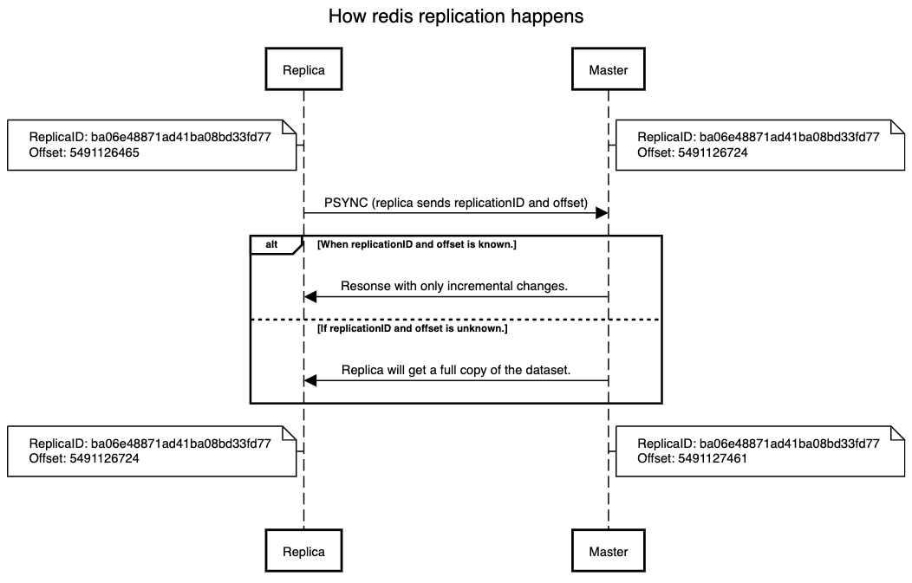

# Redis

```
@author: suktae.choi
- https://github.com/redis-study/redis-summary
- https://redis.io/docs/
```

### Index

- [Persistence](persistence)

### Blog

- [레디스 클러스터 Mget 명령은 어떻게 동작하는가?](https://brunch.co.kr/@springboot/359)
- [\[우아한테크세미나\] 191121 우아한레디스 by 강대명님](https://www.youtube.com/watch?v=mPB2CZiAkKM)

***


redis cluster 는 key 의 hash 값으로 `slots: 16384` 에 분리해서 저장합니다. (hashmap 의 구조로 보면됨) 

물리장비 node 는 slot-range 를 담당하고 범위를 벗어나는 데이터의 요청 (CURD) 은 Move 라는 에러를 리턴합니다. (client 는 해당 에러를 받으면 다른 서버로 요청을 다시합니다)

> 단순한 GET/SET 요청은 10만/s 정도를 처리할 수 있습니다

## 저장


- AOF
  - 커맨드를 받을 때마다 파일에 추가
  - 실시간성 보장 (always/everysec)
  - [Log rewriting](https://redis.io/docs/management/persistence/#log-rewriting)
    - kafka log compact 와 동일처리 (copy-on-write 방식)
- RDB
  - 주기적으로 스냅샷을 통채로 저장
  - 큰 데이터 집합을 복구할 때, 복구 속도는 RDB가 AOF보다 빠르다. RDB는 전체 데이터베이스에서 발생하는 모든 변경을 재실행할 필요가 없기 때문이다.

RDB 으로 해당 시점까지의 스냅샷으로 복구후, 이후 데이터는 AOF 를 사용하는 방식으로 응용 가능합니다

## [복제](https://redis.io/docs/reference/cluster-spec/#write-safety)



- (CUD 요청을 받았을때) replica 에 복제 ack 을 기다리지 않고 바로 성공처리 합니다
  - 즉 `비동기 방식`입니다
  - WAIT 명령으로 응답을 기다릴수 있지만 ...
- master 는 1s 단위로 AOF 에 기록된 command 를 replica 에 전달합니다
  - 일반적인 RDB 쓰기지연 (기본값: 1s) excuse 수치 입니다  

## [트랜잭션](https://redis.io/docs/interact/transactions/)

```
> MULTI (== begin)
OK
> INCR foo
QUEUED
> INCR bar
QUEUED
> EXEC (== commit) or DISCARD (== rollback)
1) (integer) 1
2) (integer) 1
```

- tx 에서 실행되는 명령은 sequential 하게 실행됩니다
  - 즉 다른 명령이 중간에 실행 될 수 없습니다
- EXEC 명령은 queueing 된 명령의 실행을 트리거링 합니다
  - tx 실행도중 client-connection 이 끊어져도 (큐잉된) command 는 서버에서 실행됩니다
  - tx 실행도중 일부 커맨드가 실패해도 나머지 명령은 실행됩니다
- 레디스는 롤백을 지원하지 않습니다
- [클러스터 환경에서는 tx 를 지원하지 않습니다](https://sauravomar01.medium.com/transactions-in-redis-cluster-muti-nodes-721da4919f66#46e3)
  - 모든 node 를 global-lock 잡아야해서, 몽고DB 에서도 지양합니다

### 레디스 클러스터

https://backtony.github.io/redis/2021-09-03-redis-3/ 


여러 대의 서버에 분산 저장할 때 각 슬롯 당 데이터를 일정한 단위로 분류하여 저장할 때 사용됩니다. 

3대의 Redis 서버가 구축되어 있는 환경에서 node1: 0 - 5460, node2: 5461 - 10922, nod3: 10923 - 16384 으로 분산되어 저장합니다

### 레디스 센티널

https://backtony.github.io/redis/2021-09-02-redis-2/

