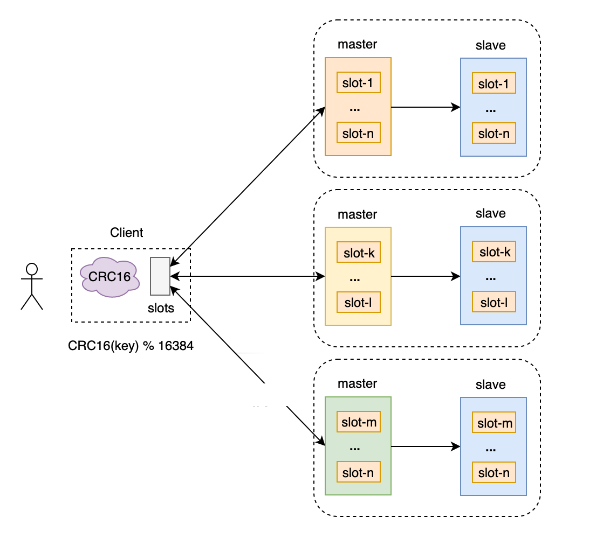
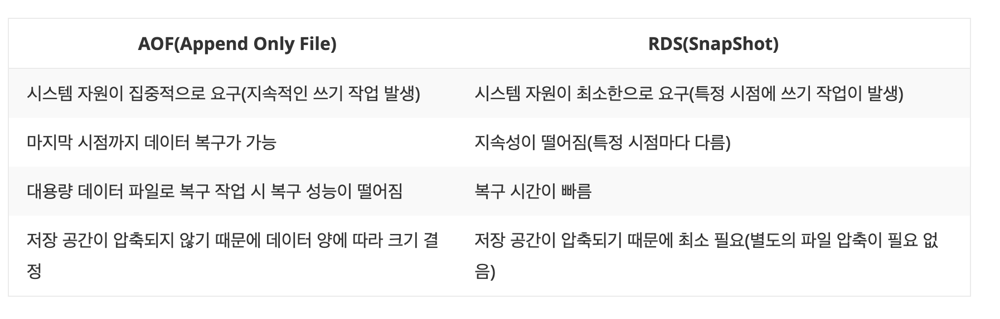
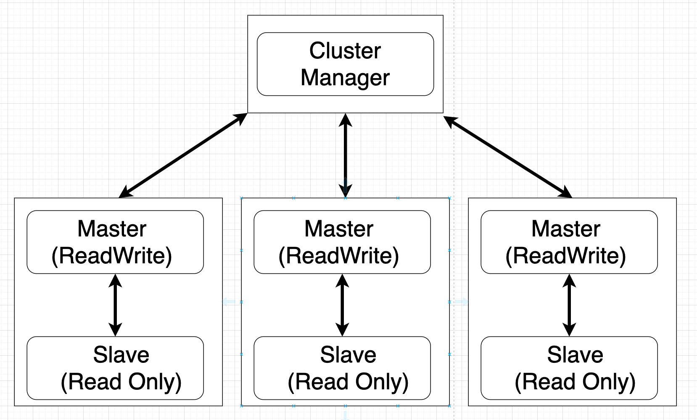
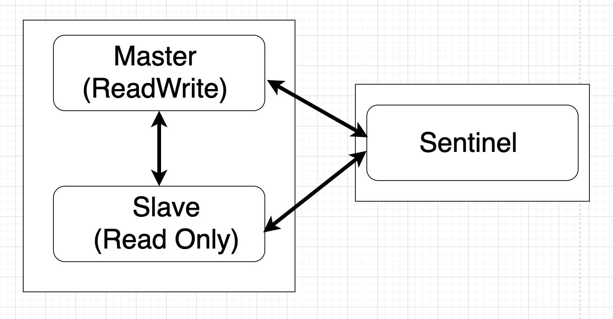

# Redis

```
@author: suktae.choi
- https://github.com/redis-study/redis-summary
- https://redis.io/docs/
```

### Index

- [Persistence](persistence)

### Blog

- [Transactions in Redis Cluster (Multi Nodes)](https://sauravomar01.medium.com/transactions-in-redis-cluster-muti-nodes-721da4919f66)
- [레디스 클러스터 Mget 명령은 어떻게 동작하는가?](https://brunch.co.kr/@springboot/359)

***



node 물리장비
slots 16384

단순한 get/set의 경우 초당 10만 TPS 이상 가능

Redis 서버는 slot range를 가지고 있기때문에 slot 단위로 데이터를 다른 서버로 전달하게 된다.
자기 slot 외에 데이터가 들어오면 -Moved {서버} 에러를 보낸다. 라이브러리는 이 에러를 받고 해당하는 서버로 옮겨 줘야한다.

## 저장



- AOF
  - 커맨드를 받을 때마다 파일에 추가
  - 실시간성 보장 (always/everysec)
- RDB
  - 주기적으로 스냅샷을 통채로 저장
  - 큰 데이터 집합을 복구할 때, 복구 속도는 RDB가 AOF보다 빠르다. RDB는 전체 데이터베이스에서 발생하는 모든 변경을 재실행할 필요가 없기 때문이다.

RDB 으로 해당 시점까지의 스냅샷을 모두 복구한후, 그 이후는 AOF 를 사용하는 방식으로 응용 가능합니다

## 복제

## 파티셔닝

## 구성

### 레디스 클러스터

https://backtony.github.io/redis/2021-09-03-redis-3/ 



- 여러 대의 서버에 분산 저장할 때 각 슬롯 당 데이터를 일정한 단위로 분류하여 저장할 때 사용됩니다. 예를 들어, 3대의 Redis 서버가 구축되어 있는 환경에서 첫 번째 서버에는 0~5460, 두 번째 서버에는 5461~10922, 세번째는 10923~16384 슬롯 정보가 분산될 것입니다.

### 레디스 센티널

https://backtony.github.io/redis/2021-09-02-redis-2/

