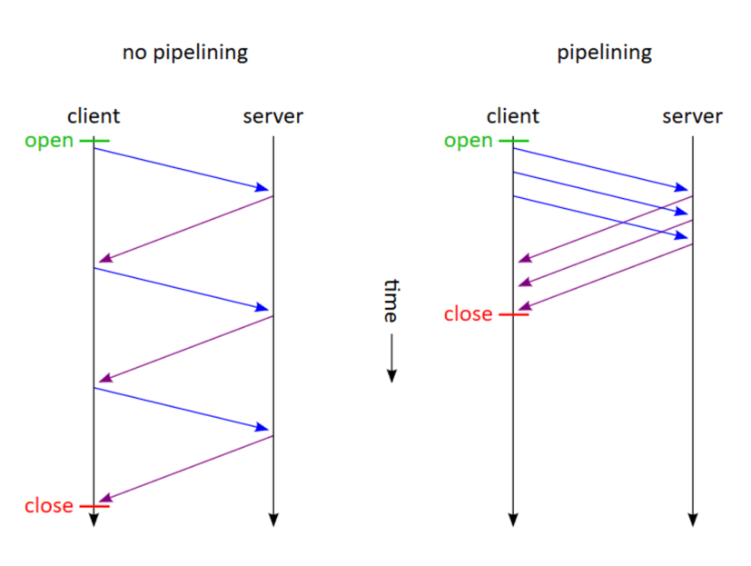
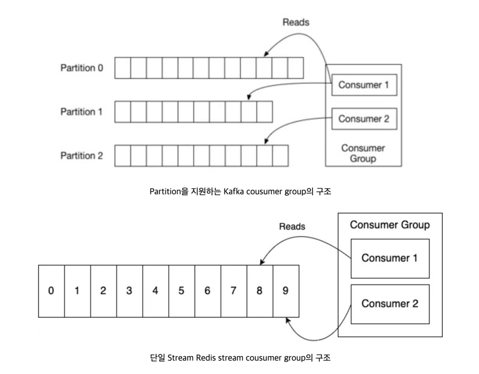
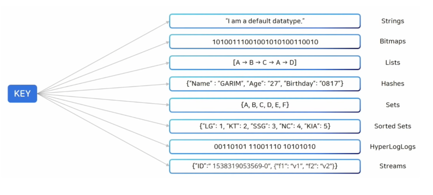

# Redis
```
https://github.com/redis-study/redis-summary
https://redis.io/docs/
https://dev.gmarket.com/113
```

### Blog
- [레디스 클러스터 Mget 명령은 어떻게 동작하는가?](https://brunch.co.kr/@springboot/359)
- [\[우아한테크세미나\] 191121 우아한레디스 by 강대명님](https://www.youtube.com/watch?v=mPB2CZiAkKM)

***


```
[Client]
   │
   │ (key)
   ▼
[슬롯 계산: HASH(key) % 16384]
   │
   ▼
[슬롯 → 담당 노드 확인]
   │
   ▼
[선택된 Redis 노드]
   │
   └─> 해당 노드의 해시 테이블에 접근
         ├── key1 → value1, value1-1, value1-2  (LinkedList)
         ├── key2 → value2                     (LinkedList)
         └── ...
```
클라이언트에서 KEY 를 기반으로 SLOT > NODE 를 계산해서 해당 노드에 명령을 전달합니다.

서버는 잘못된 명령이 온다면 (해당 SLOT 을 저장하지 않은 노드) MOVED 명령을 보내고 > 클라이언트는 캐시 갱신후 다른 노드에 요청을 다시 합니다

> 단순한 GET/SET 요청은 100,000/s 정도를 처리할 수 있습니다

## 영속화
IN-MEMORY DB 이지만 주기적으로 영속화 합니다:


- AOF
  - CUD 커맨드를 받을 때마다 `실시간으로` append 하여 저장 (appendonly.aof)
    - [Log rewriting](https://redis.io/docs/management/persistence/#log-rewriting)
    - kafka 의 `cleanup.policy=compact` 처럼 최신1개만 유지
- RDB
  - `일정 시간 간격`으로 메모리 전체 스냅샷 저장 (dump.rdb)

큰 데이터를 복구할 때, RDB 가 AOF 보다 빠릅니다. (스냅샷을 그대로 올리면 되므로)

> RDB 으로 해당 시점까지 스냅샷 복구후, 이후 변경사항은 AOF 를 사용하는 방식으로 응용 가능

## [복제](https://redis.io/docs/reference/cluster-spec/#write-safety)


- master 는 1s 단위로 AOF 에 기록된 command 를 replica 에 전달합니다
  - 일반적인 RDB 쓰기지연: (기본값) 1s

> nbasearc https://d2.naver.com/helloworld/614607

## [파이프라이닝](https://redis.io/docs/latest/develop/use/pipelining/)
Redis pipelining is a technique for improving performance by `issuing multiple commands at once` without waiting for the response to each individual command.

```java
redisTemplate.execute(connection -> {
    try {
        for (int i = 0; i < keys.size(); i++) {
            redisTemplate.opsForValue().set(keys.get(i), values.get(i));
        }
        return null; // 결과 반환
    } finally {
        connection.flush(); // 파이프라인에 담긴 명령 실행
    }
});
```



## [트랜잭션](https://redis.io/docs/interact/transactions/)
```
> MULTI (== begin)
OK
> INCR foo
QUEUED
> INCR bar
QUEUED
> EXEC (== commit) or DISCARD (== rollback)
1) (integer) 1
2) (integer) 1
```

- tx 에서 실행되는 명령은 `순차적으로 실행` 됩니다
  - 즉 `다른 명령이 중간에 실행 될 수 없음`
- EXEC 명령은 queueing 된 명령의 실행을 트리거링 합니다
  - tx 실행도중 client-connection 이 끊어져도 (큐잉된) command 는 서버에서 실행됩니다
  - tx 실행도중 일부 커맨드가 실패해도 나머지 명령은 실행됩니다
- 레디스는 `롤백을 지원하지 않습니다`
  - 해당 명령을 순차적으로 (중간에 다른 커맨드를 실행하지 않고) 실행한다는 의미입니다
  - RDB 의 트랜잭션처럼 롤백을 지원하지는 않습니다
- [클러스터 환경에서는 tx 를 지원하지 않습니다](https://sauravomar01.medium.com/transactions-in-redis-cluster-muti-nodes-721da4919f66#46e3)
  - 모든 node 를 global-lock 잡아야해서, 몽고DB 에서도 지양

## 클러스터링
### `클러스터`
https://backtony.github.io/redis/2021-09-03-redis-3/ 


여러 대의 서버에 분산 저장할 때 각 슬롯 당 데이터를 일정한 단위로 분류하여 저장할 때 사용됩니다. 

3대의 Redis 서버가 구축되어 있는 환경에서 node1: 0 - 5460, node2: 5461 - 10922, nod3: 10923 - 16384 으로 분산되어 저장합니다

### 센티널 (HA)
https://backtony.github.io/redis/2021-09-02-redis-2/


## [실시간 메세지 (PUSH)](https://techblog.lycorp.co.jp/ko/building-a-messaging-queuing-system-with-redis-streams)
### [Pub/Sub](https://docs.spring.io/spring-data/redis/reference/redis/pubsub.html)
- 영속성
  - Broadcasting 기반으로 `fire-and-forget`
  - 유실된 메세지의 replay 불가능
- 수신단위
  - 개별 subscriber
  - 각 개별 subscriber 로 동작하므로 중복 메세지 수신됨
- 정합성
  - 발행된 메세지는 replay 되지 않고 `유실`

### [Streams](https://docs.spring.io/spring-data/redis/reference/redis/redis-streams.html)
- 영속성
  - `영속적`으로 가지고 있음
  - 저장된 메세지는 컨슈머그룹 마다 관리되는 offset 을 이용해서 replay 가능
  - 단 카프카와 다르게 파티션 개념은 없음
- 수신단위
  - consumer group
  - group 으로 묶을수 있어서 동일 그룹에는 중복 메세지 방지가능
- 정합성
  - XACK 를 통해 수신여부 확인
  - 일정기간 동안 XACK 가 오지 않으면 저장하고 있던 마지막 offset 기반으로 재전송




```
> redis stream 는 kafka 와 다르게 파티션 개념이 없나.

   1. 여러 컨슈머가 동일한 그룹 이름으로 같은 스트림을 구독합니다.
   2. 한 컨슈머가 스트림에서 메시지를 읽으면(XREADGROUP), 해당 메시지는 해당 컨슈머만 처리하도록 '대기 중인 항목 목록(Pending Entries List, PEL)'에 등록됩니다.
   3. 다른 컨슈머들은 이 메시지를 가져갈 수 없습니다.
   4. 처리를 완료한 컨슈머는 XACK 명령어로 스트림에 완료되었음을 알리고, 메시지는 PEL에서 제거됩니다.
   5. 만약 특정 컨슈머가 오랫동안 XACK을 보내지 않으면(장애 발생), 다른 컨슈머가 XCLAIM 명령어로 해당 메시지의 소유권을 가져와 대신 처리할 수 있습니다.
   
  이 방식은 Kafka처럼 파티션을 컨슈머에 고정 할당하는 것이 아니라, 메시지 단위로 작업을 분배하는 방식에 가깝습니다. (ForkJoin 같이 경쟁적으로 처리)
  
   * Redis Streams가 적합한 경우:
       * 실시간 알림, 채팅, 이벤트 전송 등 낮은 지연 시간(Low Latency)이 매우 중요한 경우
       * Kafka처럼 거대한 시스템은 부담스럽고, 더 가볍고 간단한 메시지 큐가 필요한 경우
       * 이미 Redis를 사용하고 있어 인프라를 단순하게 유지하고 싶은 경우
       * 메시지의 전체 순서 보장이 필요한 경우

   * Kafka가 적합한 경우:
       * 로그 수집, 빅데이터 파이프라인 등 매우 높은 처리량(High Throughput)이 필요한 대규모 시스템
       * 수신한 데이터를 장기간 안정적으로 보관하고 분석해야 하는 경우 (Event Sourcing 등)
       * 파티션을 통한 수평적 확장이 필수적인 경우
```
```
> 한번 stream 에 등록된 메세지는 카프카처럼 7일 정도 이후 정리되는지. 아니면 수동으로 제거를 해야하는지

  1. XADD의 MAXLEN 옵션: 추가 시 자동 정리 (Capped Stream)

  XADD 명령어로 메시지를 추가할 때 MAXLEN 옵션을 함께 사용하면, 메시지 추가와 동시에 스트림의 길이를 제한할 수 있습니다. 새 메시지가 추가될 때 스트림의 길이가
  MAXLEN을 초과하면 가장 오래된 메시지가 자동으로 제거됩니다.

   1 # mystream에 메시지를 추가하되, 스트림의 길이를 약 1000개로 유지
   2 # 새 메시지가 추가되어 1000개를 넘으면 가장 오래된 메시지가 자동으로 삭제됨
   3 XADD mystream MAXLEN ~ 1000 * field1 value1

  이 방법은 스트림의 크기를 항상 일정하게 유지하고 싶을 때 매우 유용하며, 별도의 XTRIM 호출이 필요 없어 편리합니다.
```
```
> redis stream 사용시 consumer group 을 따로 제거하거나 하지 않으면 메세지 lag 이 쌓이는 구조인가

사용하지 않는 컨슈머 그룹이 방치될 경우 발생하는 문제

  만약 특정 컨슈머 그룹에 더 이상 연결된 컨슈머가 없거나, 컨슈머가 메시지를 읽어가기만 하고 XACK을 보내지 않는다면 어떻게 될까요?

   * 해당 컨슈머 그룹의 PEL은 무한정 커지게 됩니다.
   * 스트림에 XTRIM을 사용해 오래된 메시지를 삭제하더라도, PEL에 등록된 메시지는 삭제되지 않습니다. Redis는 누군가에게 작업을 할당한 상태이므로, 그 작업이 완료되기
     전까지는 원본 메시지를 마음대로 지울 수 없기 때문입니다.
   * 이 거대한 PEL은 모두 Redis 서버의 메모리를 차지합니다.
   * 결과적으로, 방치된 컨슈머 그룹 하나가 Redis 서버 전체의 메모리를 고갈시켜 장애를 유발하는 "시한폭탄"이 될 수 있습니다.
   
   
  해결 및 관리 방안

   1. 반드시 `XACK` 하기: 컨슈머 로직에서 메시지 처리가 성공하면 반드시 XACK을 호출해야 합니다. try...finally 구문 등을 사용해 예외가 발생하더라도 XACK을 하거나,
      실패한 메시지를 다른 곳으로 옮긴 후 XACK하는 로직이 필수적입니다.

   2. `XPENDING`으로 모니터링하기: 주기적으로 XPENDING 명령어를 사용해 각 컨슈머 그룹의 대기 중인 메시지(PEL)가 얼마나 쌓여있는지 확인해야 합니다.

   1     # mystream의 group-A에 얼마나 많은 메시지가 대기중인지 확인
   2     XPENDING mystream group-A
      만약 특정 그룹의 대기 메시지 수가 비정상적으로 많다면 즉시 조치해야 합니다.

   3. 장애 처리 (`XCLAIM`): 특정 컨슈머가 오랫동안 XACK 없이 멈춰있다면, 다른 활성 컨슈머가 XCLAIM 명령어로 해당 메시지의 소유권을 가져와 대신 처리하고 XACK 할 수
      있습니다.

   4. 불필요한 컨슈머 그룹 제거 (`XGROUP DESTROY`): 더 이상 사용하지 않는 컨슈머 그룹은 반드시 `XGROUP DESTROY` 명령어로 명시적으로 삭제해야 합니다. 이 명령은 해당
      그룹과 관련된 모든 상태 정보(PEL 포함)를 깨끗하게 제거합니다.

   1     # mystream에서 더 이상 사용하지 않는 old-group을 완전히 삭제
   2     XGROUP DESTROY mystream old-group
```

## [자료구조](https://inpa.tistory.com/entry/REDIS-%F0%9F%93%9A-%EB%8D%B0%EC%9D%B4%ED%84%B0-%ED%83%80%EC%9E%85Collection-%EC%A2%85%EB%A5%98-%EC%A0%95%EB%A6%AC)


- string
- list
- set
- sorted set
- hash

## [Spin-Lock](https://hdbstn3055.tistory.com/271)
SET command 를 통해 (timeout 설정하면서) 값을 세팅하고, 적절한 interval 로 체크하는 구현방식 입니다.

```java
// 사용방법
public T submit(Callable<T> callable) {
    if (tryLock()) {
        try {
            return callable.call();
        } catch (Exception e) {
            // logging
            throw new Exception();
        } finally {
            unlock(cacheName, key);
        }
    }
}

// 간단한 구현체
private boolean tryLock() {
  try {
    while (true) {
      boolean acquired = redisTemplate.opsForValue().setIfAbsent("KEY", "VALUE", "TIMEOUT");
      // acquired?
      if (acquired) {
        return true;
      }
      // timeout
      if (isTimeout(startTime, acquireTimeoutInMillis)) {
        return false;
      }
      // interval
      TimeUnit.MILLISECONDS.sleep(DEFAULT_TIMEOUT_MILLIS);
    }
  } catch (Exception e) {
    return false;
  }
}
```