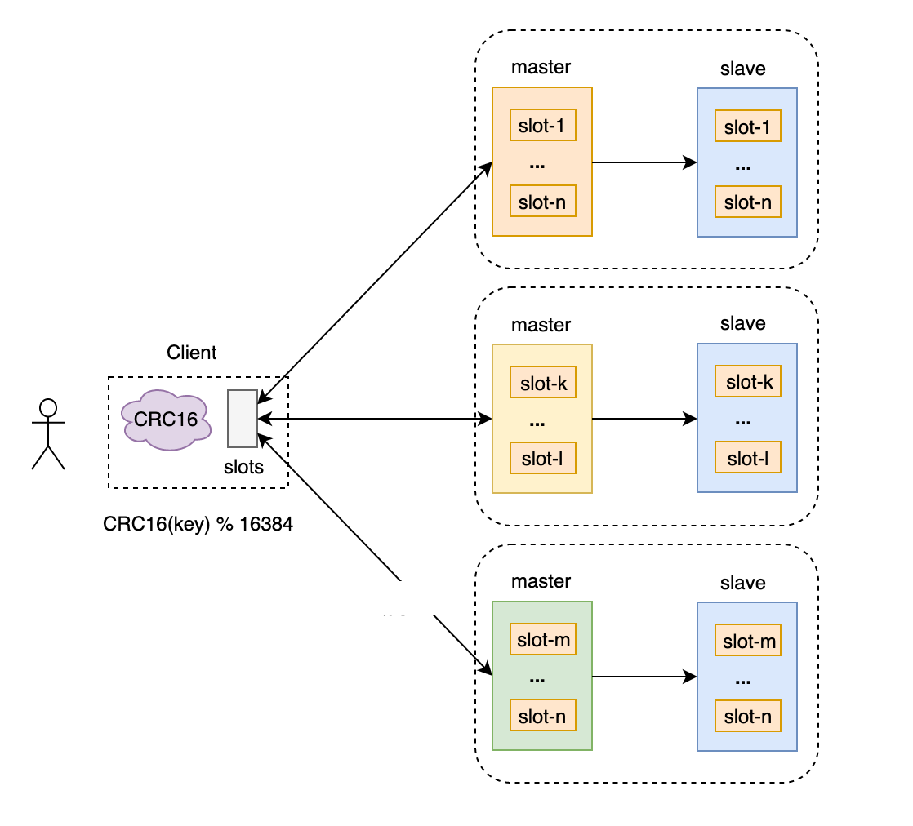
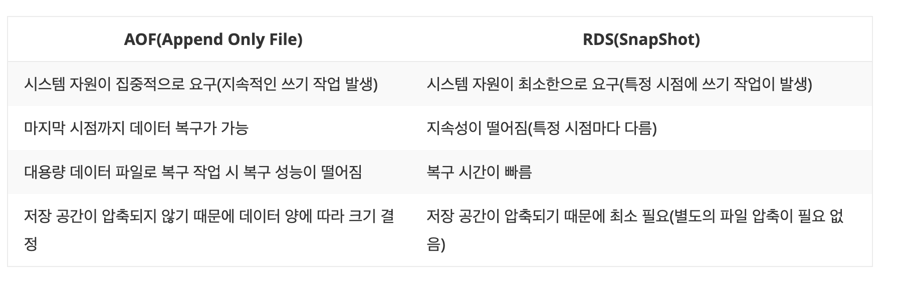
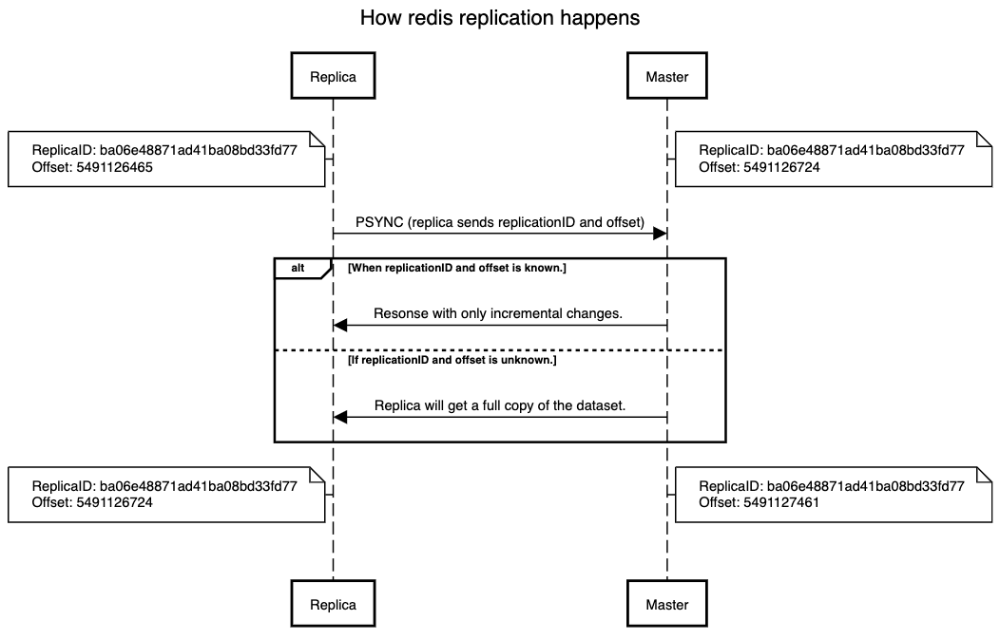
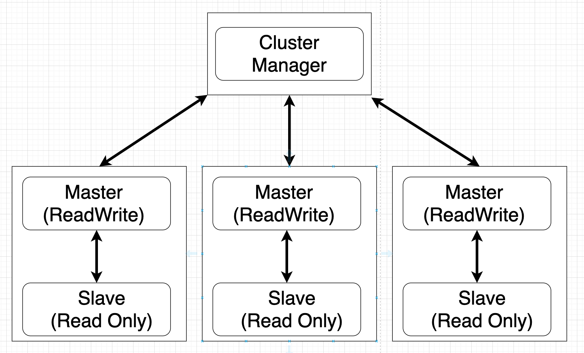
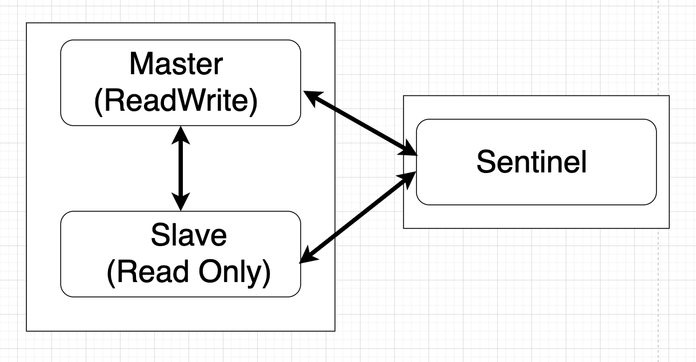

# Redis
```
https://github.com/redis-study/redis-summary
https://redis.io/docs/
```
### Index
- [Persistence](persistence)

### Blog
- [레디스 클러스터 Mget 명령은 어떻게 동작하는가?](https://brunch.co.kr/@springboot/359)
- [\[우아한테크세미나\] 191121 우아한레디스 by 강대명님](https://www.youtube.com/watch?v=mPB2CZiAkKM)

***

```
[Client] ──(key)───────────────────[Redis Cluster]
              │                                           ↑   └── [선택된 노드의 해시 테이블에 조회/저장]
              └─[슬롯 계산: HASH(key) % 16384]           │          ├── key1 → value1, value1-1, value1-2 (LinkedList)
                                ↓                         │          ├── key2 → value2 (LinkedList)
                  [해당 슬롯을 저장하는 노드 계산]         │          └── ...
                                │                         │                       
                                └─────────────
```
클라이언트에서 KEY 를 기반으로 SLOT > NODE 를 계산해서 해당 노드에 명령을 전달합니다.

서버는 잘못된 명령이 온다면 (해당 SLOT 을 저장하지 않은 노드) MOVED 명령을 보내고 > 클라이언트는 캐시 갱신후 다른 노드에 요청을 다시 합니다

> 단순한 GET/SET 요청은 100,000/s 정도를 처리할 수 있습니다

## 저장


- AOF
  - 커맨드를 받을 때마다 파일에 추가
  - 실시간성 보장 (always/everysec)
  - [Log rewriting](https://redis.io/docs/management/persistence/#log-rewriting)
    - kafka log compact 와 동일처리 (copy-on-write 방식)
- RDB
  - 주기적으로 스냅샷을 통채로 저장
  - 큰 데이터 집합을 복구할 때, 복구 속도는 RDB가 AOF보다 빠르다. RDB는 전체 데이터베이스에서 발생하는 모든 변경을 재실행할 필요가 없기 때문이다.

RDB 으로 해당 시점까지의 스냅샷으로 복구후, 이후 데이터는 AOF 를 사용하는 방식으로 응용 가능합니다

## [복제](https://redis.io/docs/reference/cluster-spec/#write-safety)

  - WAIT 명령으로 응답을 기다릴수 있지만 ...
- master 는 1s 단위로 AOF 에 기록된 command 를 replica 에 전달합니다
  - 일반적인 RDB 쓰기지연 (기본값: 1s) excuse 수치 입니다  

## [트랜잭션](https://redis.io/docs/interact/transactions/)
```
> MULTI (== begin)
OK
> INCR foo
QUEUED
> INCR bar
QUEUED
> EXEC (== commit) or DISCARD (== rollback)
1) (integer) 1
2) (integer) 1
```

- tx 에서 실행되는 명령은 sequential 하게 실행됩니다
  - 즉 다른 명령이 중간에 실행 될 수 없습니다
- EXEC 명령은 queueing 된 명령의 실행을 트리거링 합니다
  - tx 실행도중 client-connection 이 끊어져도 (큐잉된) command 는 서버에서 실행됩니다
  - tx 실행도중 일부 커맨드가 실패해도 나머지 명령은 실행됩니다
- 레디스는 롤백을 지원하지 않습니다
- [클러스터 환경에서는 tx 를 지원하지 않습니다](https://sauravomar01.medium.com/transactions-in-redis-cluster-muti-nodes-721da4919f66#46e3)
  - 모든 node 를 global-lock 잡아야해서, 몽고DB 에서도 지양합니다

## 클러스터
https://backtony.github.io/redis/2021-09-03-redis-3/ 



여러 대의 서버에 분산 저장할 때 각 슬롯 당 데이터를 일정한 단위로 분류하여 저장할 때 사용됩니다. 

3대의 Redis 서버가 구축되어 있는 환경에서 node1: 0 - 5460, node2: 5461 - 10922, nod3: 10923 - 16384 으로 분산되어 저장합니다

## 센티널
https://backtony.github.io/redis/2021-09-02-redis-2/



## 메세지
### [Streams](https://docs.spring.io/spring-data/redis/reference/redis/redis-streams.html)
- 영속성
  - `영속적`으로 가지고 있음
  - 그에 따라 offset 을 이용해서 특정 시점부터 읽을 수 있음
- 전달 방식
  - `Polling`

### [Pub/Sub](https://docs.spring.io/spring-data/redis/reference/redis/pubsub.html)
- 영속성
  - Broadcasting 기반으로 동작하고 `유실`
- 전달 방식
  - (구독을 통한) `Push`

## [Spin-Lock](https://hdbstn3055.tistory.com/271)
SET command 를 통해 (timeout 설정하면서) 값을 세팅하고, 적절한 interval 로 체크하는 구현방식 입니다.

```java
// 사용방법
public T submit(Callable<T> callable) {
    if (tryLock()) {
        try {
            return callable.call();
        } catch (Exception e) {
            // logging
            throw new Exception();
        } finally {
            unlock(cacheName, key);
        }
    }
}

// 간단한 구현체
private boolean tryLock() {
  try {
    while (true) {
      boolean acquired = redisTemplate.opsForValue().setIfAbsent("KEY", "VALUE", "TIMEOUT");
      // acquired?
      if (acquired) {
        return true;
      }
      // timeout
      if (isTimeout(startTime, acquireTimeoutInMillis)) {
        return false;
      }
      // interval
      TimeUnit.MILLISECONDS.sleep(DEFAULT_TIMEOUT_MILLIS);
    }
  } catch (Exception e) {
    return false;
  }
}
```