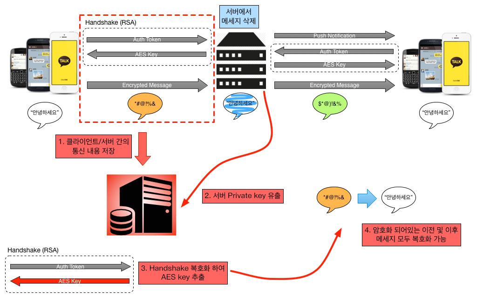

## Perfect Forward Secrecy
forward secrecy (FS; also known as perfect forward secrecy[1]) is a property of secure communication protocols.

>###### Compromise of long-term keys does not compromise past session keys in cryptography.

```
ㅁ Author: suktae.choi
- https://en.wikipedia.org/wiki/Forward_secrecy
- http://blogs.technet.com/b/erezs_iis_blog/archive/2013/08/22/perfect-secrecy-in-an-imperfect-world.aspx
- https://www.bpak.org/blog/2014/10/%EA%B7%B8%EA%B2%83%EC%9D%B4-%EC%95%8C%EA%B3%A0%EC%8B%B6%EB%8B%A4-e2e-pfs/
```



현재 RSA를 사용하여 AES 키를 공유하는 상황이다.

이런 설정에서 공격자 (혹은 검열자)가 클라이언트/서버 간의 통신내용을 저장한다. 물론, 이 내용만 가지고는 RSA를 부실 수 있지 않은 이상 내용을 복호화 할 수 없다. 하지만, 유출된 private key가 존재한다면 저장해둔 이전 클라/서버간의 대화에서 (특히, handshake 부분) AES 키를 복호화해 추출해낼 수 있다. 이 AES key로 그 키를 이용하여 암호화된 메세지들 모두 해독해 볼 수 있다.

여기서 심각한 점은, 앞으로의 메세지들 뿐만이 아니라 이전에 저장해둔 (암호화 되어있던) 메세지들도 풀 수 있다는 점이다. 서버에 저장되있는 메세지는 물론이고, 서버에서 삭제되었다고 해도 이전에 이미 암호화된 통신 내용을 저장해놓았다면 다시 돌아가서 복호화해볼 수 있게 된 셈이다.

Forward Secrecy는 ‘long-term key’ (e.g. RSA pub/priv key)를 통해 만들어지거나 보호된 ‘session key’ (e.g. AES key)들이 long-term key가 유출된 이후에도 복호화되는 위협을 받지 않는다는 암호학적 성질을 나타낸다.
